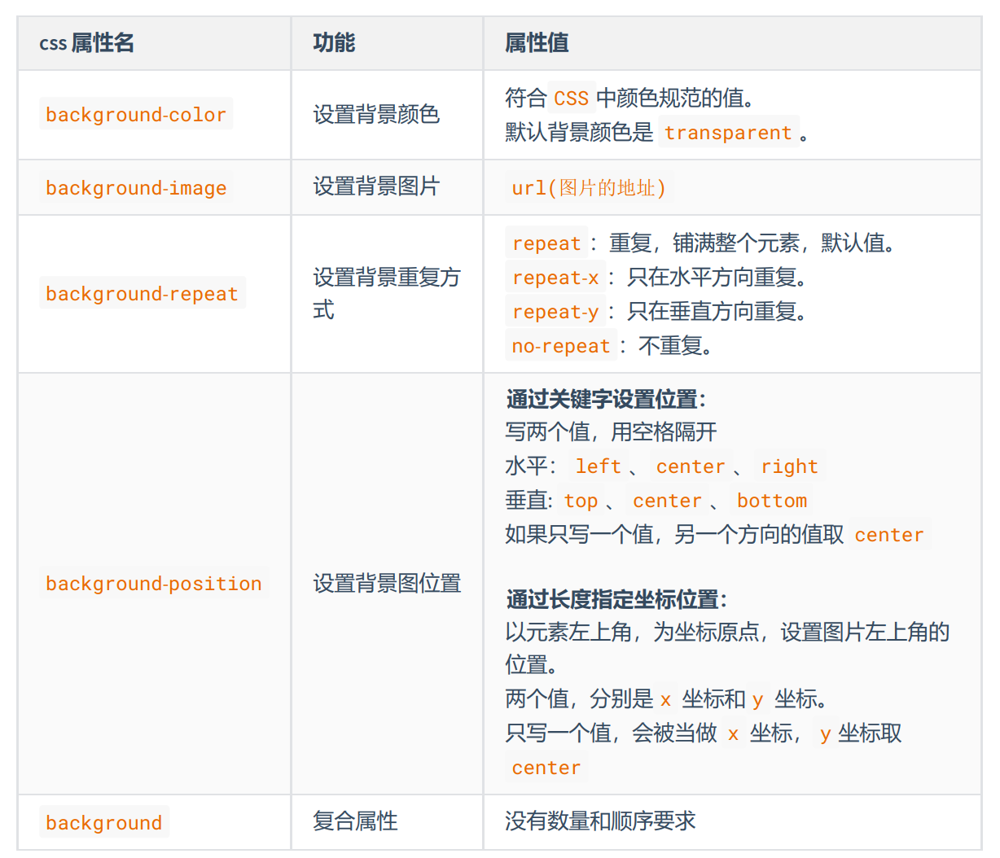

# CSS

CSS 的全称为：层叠样式表 ( Cascading Style Sheets ) 。CSS 也是一种标记语言，用于给 HTML 结构设置样式

## 优先级

行内样式 > 内部样式 = 外部样式

## 语法规范

CSS 语法规范由两部分构成：

- 选择器：找到要添加样式的元素。
- 声明块：设置具体的样式（声明块是由一个或多个声明组成的），声明的格式为： 属性名: 属性
值

**备注1：**

最后一个声明后的分号理论上能省略，但最好还是写上。

**备注2：**

选择器与声明块之间，属性名与属性值之间，均有一个空格，理论上能省略，但最好
还是写上


## 元素间关系

- 父元素：直接包裹某个元素的元素，就是该元素的父元素。
- 子元素：被父元素直接包含的元素（简记：儿子元素）。
- 祖先元素：父亲的父亲......，一直往外找，都是祖先。
- 后代元素：儿子的儿子......，一直往里找，都是后代。
- 兄弟元素：具有相同父元素的元素，互为兄弟元素。


## 选择器

**基本选择器**

- 通配选择器 `* {}`
- 元素选择器 `h1 {}`
- 类选择器 `.title {}`
- ID 选择器 `#title {}`

**复合选择器**

>复合选择器建立在基本选择器之上，由多个基础选择器，通过不同的方式组合而成。复合选择器可以在复杂结构中，快速而准确的选中元素。

### 交集选择器 

选中同时符合多个条件的元素 `.rich.beauty {...}`，选中类名包含rich和beauty的元素

### 并集选择器 

选中多个选择器对应的元素，又称分组选择器。 `#peiqi,.rich,.beauty {...}`，选中id为peiqi，或类名为rich，或类名为beauty的元素

### 后代选择器 

选中指定元素中，符合要求的后代元素。`.subject li.front-end {...}`，选中类名为subject元素中的所有类名为front-end的li

### 子元素选择器 

选中指定元素中，符合要求的子元素`persons>a{}`，类名为persons的元素中的子代a元素

### 兄弟选择器

相邻兄弟选择器：选中指定元素后，符合条件的相邻兄弟元素。所谓相邻，就是紧挨着他的下一个，简记：睡在我下铺的兄弟。

```css
/* 选中div后相邻的兄弟p元素 */
div+p {
  color:red;
}

<div>尚硅谷</div>
<p>前端</p>
<p>Java</p>
<p>大数据</p>
<p>UI</p>
```

通用兄弟选择器：选中指定元素后，符合条件的所有兄弟元素。（简记：睡在我下铺的所有兄弟）

```css
/* 选中div后所有的兄弟p元素（睡在我下铺的所有兄弟）—— 通用兄弟选择器 */
div~p {
    color: red;
}

<div>尚硅谷</div>
<p>前端</p>
<p>Java</p>
<p>大数据</p>
<p>UI</p>

```

```css
ul li~li {
  color: orange;
}

<ul>
    <li>主页</li>
    <li>秒杀</li>
    <li>订单</li>
    <li>我的</li>
</ul>
```

### 属性选择器

选中属性值符合一定要求的元素

- [属性名] 选中具有某个属性的元素。
- [属性名="值"] 选中包含某个属性，且属性值等于指定值的元素。
- [属性名^="值"] 选中包含某个属性，且属性值以指定的值开头的元素。
- [属性名$="值"] 选中包含某个属性，且属性值以指定的值结尾的元素。
- [属性名*="值"] 选择包含某个属性，属性值包含指定值的元素。

```css
/* 选中具有title属性的元素 */
div[title]{color:red;}

/* 选中title属性值为atguigu的元素 */
div[title="atguigu"]{color:red;}

/* 选中title属性值以a开头的元素 */
div[title^="a"]{color:red;}

/* 选中title属性值以u结尾的元素 */
div[title$="u"]{color:red;}

/* 选中title属性值包含g的元素 */
div[title*="g"]{color:red;}
```

### 伪类选择器

选中特殊状态的元素。

#### 动态伪类

1. :link 超链接未被访问的状态。
2. :visited 超链接访问过的状态。
3. :hover 鼠标悬停在元素上的状态。
4. :active 元素激活的状态。
5. :focus 获取焦点的元素。

[查看示例](https://kt3xj5-3000.csb.app/2_CSS2/06_CSS_%E5%A4%8D%E5%90%88%E9%80%89%E6%8B%A9%E5%99%A8/08_%E4%BC%AA%E7%B1%BB%E9%80%89%E6%8B%A9%E5%99%A8_%E5%8A%A8%E6%80%81%E4%BC%AA%E7%B1%BB)

**注意：** 遵循 LVHA 的顺序，即： link 、 visited 、 hover 、 active 。

**注意：** 表单类元素才能使用 :focus 伪类。当用户：点击元素、触摸元素、或通过键盘的 “ tab ” 键等方式，选择元素时，就是获得焦点。

#### 结构伪类

1. :first-child 所有兄弟元素中的第一个。
2. :last-child 所有兄弟元素中的最后一个。
3. :nth-child(n) 所有兄弟元素中的第 n 个。
4. :first-of-type 所有同类型兄弟元素中的第一个。
5. :last-of-type 所有同类型兄弟元素中的最后一个。
6. :nth-of-type(n) 所有同类型兄弟元素中的 第n个 。

:::tip n的值
 0 或 不写 ：什么都选不中 —— 几乎不用。

 n ：选中所有子元素 —— 几乎不用。
 
 1~正无穷的整数 ：选中对应序号的子元素。

 2n 或 even ：选中序号为偶数的子元素。

 2n+1 或 odd ：选中序号为奇数的子元素。

 -n+3 ：选中的是前 3 个。
:::

[:first-child示例](https://kt3xj5-3000.csb.app/2_CSS2/06_CSS_%E5%A4%8D%E5%90%88%E9%80%89%E6%8B%A9%E5%99%A8/09_%E4%BC%AA%E7%B1%BB%E9%80%89%E6%8B%A9%E5%99%A8_%E7%BB%93%E6%9E%84%E4%BC%AA%E7%B1%BB_1)

[:nth-child(n)和:nth-of-type(n)示例](https://kt3xj5-3000.csb.app/2_CSS2/06_CSS_%E5%A4%8D%E5%90%88%E9%80%89%E6%8B%A9%E5%99%A8/10_%E4%BC%AA%E7%B1%BB%E9%80%89%E6%8B%A9%E5%99%A8_%E7%BB%93%E6%9E%84%E4%BC%AA%E7%B1%BB_2)

**了解：**
1. :nth-last-child(n) 所有兄弟元素中的倒数第 n 个。
2. :nth-last-of-type(n) 所有同类型兄弟元素中的 倒数第n个 。
3. :only-child 选择没有兄弟的元素（独生子女）。
4. :only-of-type 选择没有同类型兄弟的元素。
5. :root 根元素。
6. :empty 内容为空元素（空格也算内容）。

[查看示例](https://kt3xj5-3000.csb.app/2_CSS2/06_CSS_%E5%A4%8D%E5%90%88%E9%80%89%E6%8B%A9%E5%99%A8/11_%E4%BC%AA%E7%B1%BB%E9%80%89%E6%8B%A9%E5%99%A8_%E7%BB%93%E6%9E%84%E4%BC%AA%E7%B1%BB_3)


#### 否定伪类

:not(选择器) 排除满足括号中条件的元素。

#### UI伪类

1. :checked 被选中的复选框或单选按钮。
2. :enable 可用的表单元素（没有 disabled 属性）。
3. :disabled 不可用的表单元素（有 disabled 属性）。

#### 目标伪类（了解）

:target 选中锚点指向的元素。

#### 语言伪类（了解）

:lang() 根据指定的语言选择元素（本质是看 lang 属性的值）。

### 伪元素选择器

选中元素中的一些特殊位置。

::first-letter 选中元素中的第一个文字。
::first-line 选中元素中的第一行文字。
::selection 选中被鼠标选中的内容。
::placeholder 选中输入框的提示文字。
::before 在元素最开始的位置，创建一个子元素（必须用 content 属性指定内容）。
::after 在元素最后的位置，创建一个子元素（必须用 content 属性指定内容）。

## 选择器优先级

行内样式 > ID选择器 > 类选择器 > 元素选择器 > 通配选择器。

:::tip 权重计算方式
计算方式：每个选择器，都可计算出一组权重，格式为： (a,b,c)

a : ID 选择器的个数。

b : 类、伪类、属性 选择器的个数。

c : 元素、伪元素 选择器的个数。
:::


:::tip 比较规则

按照从左到右的顺序，依次比较大小，当前位胜出后，后面的不再对比

(1,0,0) > (0,2,2); (1,1,0) > (1,0,3); (1,1,3) > (1,1,2)
:::

:::tip 特殊规则
行内样式权重大于所有选择器。

!important 的权重，大于行内样式，大于所有选择器，权重最高！
:::

## 三大特性

### 层叠性

如果发生了样式冲突，那就会根据一定的规则（选择器优先级），进行样式的层叠（覆
盖）。

### 继承性

元素会自动拥有其父元素、或其祖先元素上所设置的某些样式。优先继承离得近的。常见的可继承属性通常是一些文本属性，比如：

```css
text-?? ， font-?? ， line-?? 、 color 
```

### 优先级

!important > 行内样式 > ID选择器 > 类选择器 > 元素选择器 > * > 继承的样
式

## 颜色

### 方式一

直接使用[颜色对应的英文单词](https://developer.mozilla.org/en-US/docs/Web/CSS/named-color)，编写比较简单。

### 方式二

rgb 或 rgba，使用 红、黄、蓝 这三种光的三原色进行组合。r 表示 红色；g 表示 绿色；b 表示 蓝色；a 表示 透明度

```css
/* 使用 0~255 之间的数字表示一种颜色 */
color: rgb(255, 0, 0);/* 红色 */
color: rgb(0, 255, 0);/* 绿色 */
color: rgb(0, 0, 255);/* 蓝色 */
color: rgb(0, 0, 0);/* 黑色 */
color: rgb(255, 255, 255);/* 白色 */

/* 混合出任意一种颜色 */
color:rgb(138, 43, 226) /* 紫罗兰色 */
color:rgba(255, 0, 0, 0.5);/* 半透明的红色 */

/* 也可以使用百分比表示一种颜色（用的少） */
color: rgb(100%, 0%, 0%);/* 红色 */
color: rgba(100%, 0%, 0%,50%);/* 半透明的红色 */
```

:::tip 小规律
若三种颜色值相同，呈现的是灰色，值越大，灰色越浅。

rgb(0, 0, 0) 是黑色， rgb(255, 255,255) 是白色。

对于 rbga 来说，前三位的 rgb 形式要保持一致，要么都是 0~255 的数字，要么都是
百分比 。
:::

### 方式三
HEX 或 HEXA，HEX 的原理同与 rgb 一样，依然是通过：红、绿、蓝 进行组合，只不过要用 6位（分成3组） 来表达，格式为：`#rrggbb`

每一位数字的取值范围是： `0 ~ f` ，即：（ 0, 1, 2, 3, 4, 5, 6, 7, 8, 9, a, b, c,
d, e, f ），所以每一种光的最小值是： `00` ，最大值是： `ff`

```css
color: #ff0000;/* 红色 */
color: #00ff00;/* 绿色 */
color: #0000ff;/* 蓝色 */
color: #000000;/* 黑色 */
color: #999999;/* 浅灰色 */
color: #333333;/* 深灰色 */
color: #ffffff;/* 白色 */

/* 如果每种颜色的两位都是相同的，就可以简写*/
color: #ff9988;/* 可简为：#f98 */

/* 但要注意前三位简写了，那么透明度就也要简写 */
color: #ff998866;/* 可简为：#f986 */
```

**注意点：** IE 浏览器不支持 HEXA ，但支持 HEX 。

### 方式四
HSL 或 HSLA，HSL 是通过：色相、饱和度、亮度，来表示一个颜色的，格式为： hsl(色相,饱和度,亮度)，HSLA 其实就是在 HSL 的基础上，添加了透明度。

**色相：** 取值范围是 0~360 度，具体度数对应的颜色如下图：


**饱和度：** 取值范围是 0%~100% 。（向色相中对应颜色中添加灰色， 0% 全灰， 100% 没有
灰）

**亮度：** 取值范围是 0%~100% 。（ 0% 亮度没了，所以就是黑色。 100% 亮度太强，所以就是
白色了）

[查看示例](https://kt3xj5-3000.csb.app/2_CSS2/09_CSS_%E5%83%8F%E7%B4%A0_%E9%A2%9C%E8%89%B2/%E9%A2%9C%E8%89%B2_%E7%AC%AC4%E7%A7%8D%E8%A1%A8%E7%A4%BA_HSL%E6%88%96HSLA)

## 字体属性

### 字体大小

```css
div {
  font-size: 40px;
}
```

1. Chrome 浏览器支持的最小文字为 12px ，默认的文字大小为 16px ，并且 0px 会自动消失。
2. 不同浏览器默认的字体大小可能不一致，所以最好给一个明确的值，不要用默认大小。
3. 通常以给 body 设置 font-size 属性，这样 body 中的其他元素就都可以继承了。


### 字体族
```css
div {
font-family: "STCaiyun","Microsoft YaHei",sans-serif
}
```

1. 使用字体的英文名字兼容性会更好，具体的英文名可以自行查询，或在电脑的设置里去寻找。
2. 如果字体名包含空格，必须使用引号包裹起来。
3. 可以设置多个字体，按照从左到右的顺序逐个查找，找到就用，没有找到就使用后面的，且通常在最后写上 serif （衬线字体）或 sans-serif （非衬线字体）。衬线字体有笔锋，非衬线字体没有笔锋。
4. windows 系统中，默认的字体就是微软雅黑（非衬线字体）。

###  字体风格

```css
div {
  font-style: italic;
}
```

1. normal ：正常（默认值）
2. italic ：斜体（使用字体自带的斜体效果）
3. oblique ：斜体（强制倾斜产生的斜体效果）

### 字体粗细

```css
div {
  font-weight: bold;
}
```

**关键词**
1. lighter ：细
2. normal ： 正常
3. bold ：粗
4. bolder ：很粗 （多数字体不支持）
**数值：**
1. 100~1000 且无单位，数值越大，字体越粗 （或一样粗，具体得看字体设计时的精确程度）。
2. 100~300 等同于 lighter ， 400~500 等同于 normal ， 600 及以上等同于bold 。

### 复合写法

将上述所有字体相关的属性复合在一起编写。

**编写规则：**

1. 字体大小、字体族必须都写上。
2. 字体族必须是最后一位、字体大小必须是倒数第二位。
3. 各个属性间用空格隔开。

```css
body {
  font: bold italic 100px "STCaiyun","STHupo",sans-serif;
}
```


## 文本属性

### 文本颜色

```css
div {
color: rgb(112,45,78);
}
```

开发中常用的是： rgb/rgba 或 HEX/HEXA （十六进制）。

### 文本间距

- 字母间距： letter-spacing
- 单词间距： word-spacing （通过空格识别词）
- 属性值为像素（ px ），正值让间距增大，负值让间距缩小。

###  文本修饰

```css
a {
text-decoration: none;
}
```

1. none ： 无装饰线（常用）
2. underline ：下划线（常用）
3. overline ： 上划线
4. line-through ： 删除线

可搭配如下值使用：
1. dotted ：虚线
2. wavy ：波浪线
3. 也可以指定颜色

```css
a {
  text-decoration: underline wavy red;
}
```

### 文本缩进

```css
div {
  text-indent:40px;
}
```

控制文本首字母的缩进。

### 行高

line-height，控制一行文字的高度。鼠标选中一行文字时，背景色显示的就是当前的行高。

```css
div {
  line-height: 60px;
  line-height: 1.5;
  line-height: 150%;
}
```
1. normal ：由浏览器根据文字大小决定的一个默认值。
2. 像素( px )。
3. 数字：参考自身 font-size 的倍数（很常用）。
4. 百分比：参考自身 font-size 的百分比。

**注意事项:**
1. line-height 过小会怎样？—— 文字产生重叠，且最小值是 0 ，不能为负数。
2. line-height 是可以继承的，且为了能更好的呈现文字，最好写数值。
3. line-height 和 height 是什么关系？
    - 设置了 height ，那么高度就是 height 的值。
    - 不设置 height 的时候，会根据 line-height 计算高度。

**应用场景：**

1. 对于多行文字：控制行与行之间的距离。
2. 对于单行文字：让 height 等于 line-height ，可以实现文字垂直居中。


:::tip 备注
由于字体设计原因，靠上述办法实现的居中，并不是绝对的垂直居中（文本基于x的基线对齐的，x在字体框中通常是偏下的），但如果一行中都是文字，不会太影响观感。
:::


### 文本对齐

由于字体设计原因，文字最终呈现的大小，并不一定与 font-size 的值一致，可能大，也可能小。

例如： font-size 设为 40px ，最终呈现的文字，可能比 40px 大，也可能比 40px小。通常情况下，文字相对字体设计框，并不是垂直居中的，通常都靠下一些。

font-size设置的是字体的高度，字体宽度是根据高度自适应的。

#### 水平方向

text-align，控制文本的水平对齐方式。

```css
p {
  text-align: center;
}
```
1. left ：左对齐（默认值）
2. right ：右对齐
3. center ：居中对齐

#### 垂直方向

vertical-align，用于指定**同一行元素**之间，或 **表格单元格** 内文字的 垂直对齐方式。

**特别注意：** vertical-align 不能控制块元素

1. baseline （默认值）：使元素的基线与父元素的基线（字母x）对齐。
2. top ：使元素的顶部与其所在行的顶部对齐。
3. middle ：使元素的中间与父元素的中线（字母x的中间）对齐。
4. bottom ：使元素的底部与其所在行的底部对齐。

[查看示例](https://kt3xj5-3000.csb.app/2_CSS2/11_CSS_%E5%B8%B8%E7%94%A8%E6%96%87%E6%9C%AC%E5%B1%9E%E6%80%A7/10_vertical-align)

## 列表属性

列表相关的属性，可以作用在 ul 、 ol 、 li 元素上。


[查看示例](https://kt3xj5-3000.csb.app/2_CSS2/12_CSS_%E5%88%97%E8%A1%A8%E7%9B%B8%E5%85%B3%E5%B1%9E%E6%80%A7/%E5%88%97%E8%A1%A8%E7%9B%B8%E5%85%B3%E5%B1%9E%E6%80%A7)

## 表格属性

**边框相关属性（其他元素也能用）**


[查看示例](https://kt3xj5-3000.csb.app/2_CSS2/13_CSS_%E8%A1%A8%E6%A0%BC%E7%9B%B8%E5%85%B3%E5%B1%9E%E6%80%A7/01_%E8%BE%B9%E6%A1%86%E7%9B%B8%E5%85%B3%E5%B1%9E%E6%80%A7)

**表格独有属性（只有 table 标签才能使用）：**


[查看示例](https://kt3xj5-3000.csb.app/2_CSS2/13_CSS_%E8%A1%A8%E6%A0%BC%E7%9B%B8%E5%85%B3%E5%B1%9E%E6%80%A7/02_%E8%A1%A8%E6%A0%BC%E7%8B%AC%E6%9C%89%E5%B1%9E%E6%80%A7)

## 背景属性



[查看示例](https://kt3xj5-3000.csb.app/2_CSS2/14_CSS_%E8%83%8C%E6%99%AF%E7%9B%B8%E5%85%B3%E5%B1%9E%E6%80%A7/%E8%83%8C%E6%99%AF%E7%9B%B8%E5%85%B3%E5%B1%9E%E6%80%A7)

## 鼠标属性


[查看示例](https://kt3xj5-3000.csb.app/2_CSS2/15_CSS_%E9%BC%A0%E6%A0%87%E7%9B%B8%E5%85%B3%E5%B1%9E%E6%80%A7/%E9%BC%A0%E6%A0%87%E7%9B%B8%E5%85%B3%E5%B1%9E%E6%80%A7)

```css
/* 自定义鼠标光标 */
cursor: url("./arrow.png"),pointer;
```

## 盒子模型

### 长度单位

1. px ：像素。
2. em ：相对元素 font-size 的倍数。
3. rem ：相对根字体大小，html标签就是根。
4. % ：相对父元素计算。

### 元素显示模式

#### 块元素（block）

1. 在页面中独占一行，不会与任何元素共用一行，是从上到下排列的。
2. 默认宽度：撑满父元素。
3. 默认高度：由内容撑开。
4. 可以通过 CSS 设置宽高。

```
1. 主体结构标签： <html> 、 <body>
2. 排版标签： <h1> ~ <h6> 、 <hr> 、 <p> 、 <pre> 、 <div>
3. 列表标签： <ul> 、 <ol> 、 <li> 、 <dl> 、 <dt> 、 <dd>
4. 表格相关标签： <table> 、 <tbody> 、 <thead> 、 <tfoot> 、 <tr> 、<caption>
5. <form> 与 <option>
```

#### 行内元素（inline）

1. 在页面中不独占一行，一行中不能容纳下的行内元素，会在下一行继续从左到右排列。
2. 默认宽度：由内容撑开。
3. 默认高度：由内容撑开。
4. 无法通过 CSS 设置宽高。

```
1. 文本标签： <br> 、 <em> 、 <strong> 、 <sup> 、 <sub> 、 <del> 、 <ins>
2. <a> 与 <label>
```

#### 行内块元素（inline-block）

1. 在页面中不独占一行，一行中不能容纳下的行内元素，会在下一行继续从左到右排列。
2. 默认宽度：由内容撑开。
3. 默认高度：由内容撑开。
4. 可以通过 CSS 设置宽高。

```
1. 图片： 
2. 单元格： <td> 、 <th>
3. 表单控件： <input> 、 <textarea> 、 <select> 、 <button>
4. 框架标签： <iframe>
```

**注意：** 元素早期只分为：行内元素、块级元素，区分条件也只有一条："是否独占一行"，如果按照这种分类方式，行内块元素应该算作行内元素。

#### 修改显示模式

通过 CSS 中的 display 属性可以修改元素的默认显示模式，常用值如下：

```css
span {
  display: inline-block;
}
```

- none 元素会被隐藏。
- block 元素将作为块级元素显示。
- inline 元素将作为内联元素显示。
- inline-block 元素将作为行内块元素显示。

###  盒子模型的组成

CSS 会把所有的 HTML 元素都看成一个盒子，所有的样式也都是基于这个盒子。

1. margin（外边距）： 盒子与外界的距离。
2. border（边框）： 盒子的边框。
3. padding（内边距）： 紧贴内容的补白区域。
4. content（内容）：元素中的文本或后代元素都是它的内容。


> 盒子的大小 = content + 左右 padding + 左右 border 

> **注意：** 外边距 margin 不会影响盒子的大小，但会影响盒子的位置

:::tip 默认宽度
子元素宽度 = 父的 content — 子元素自身的左右 margin 。

子元素内容区的宽度 = 父的 content — 子元素自身的左右 margin — 子元素自身的左右 border — 子元素自身的左右padding 。
:::

#### 盒子内边距（padding）

1. padding 的值不能为负数。
2. 行内元素 的 左右内边距是没问题的，上下内边距不能完美的设置（上下边距不占文档位置，但可以有背景色）。
3. 块级元素、行内块元素，四个方向内边距都可以完美设置。

#### 盒子外边距（margin）

1. 子元素的 margin ，是参考父元素的 content 计算的。（因为是父亲的 content 中承装着子元素）
2. 上 margin 、左 margin ：影响自己的位置；下 margin 、右 margin ：影响后面兄弟元素的位置。
3. 块级元素、行内块元素，均可以完美地设置四个方向的 margin ；但行内元素，左右margin 可以完美设置，上下 margin 设置无效。
4. margin 的值也可以是 auto ，如果给一个块级元素设置左右 margin 都为 auto ，该块级元素会在父元素中水平居中。
5. margin 的值可以是负值。

#### margin 塌陷问题

第一个子元素的上 margin 会作用在父元素上，最后一个子元素的下 margin 会作用在父元素上

[查看示例](https://kt3xj5-3000.csb.app/2_CSS2/16_CSS_%E7%9B%92%E5%AD%90%E6%A8%A1%E5%9E%8B/16_margin%E5%A1%8C%E9%99%B7%E9%97%AE%E9%A2%98)

**解决方法：**

方案一： 给父元素设置不为 0 的 padding 。
方案二： 给父元素设置宽度不为 0 的 border 。
方案三： 给父元素设置 css 样式 overflow:hidden（BFC）

#### margin合并

上面兄弟元素的下外边距和下面兄弟元素的上外边距会合并，取一个最大的值，而不是相加。

[查看示例](https://kt3xj5-3000.csb.app/2_CSS2/16_CSS_%E7%9B%92%E5%AD%90%E6%A8%A1%E5%9E%8B/17_margin%E5%90%88%E5%B9%B6%E9%97%AE%E9%A2%98)

**解决方法：**

无需解决，布局的时候上下的兄弟元素，只给一个设置上下外边距就可以了

### 处理内容溢出


### 隐藏元素的方式

**方式一：visibility 属性**
visibility 属性默认值是 show ，如果设置为 hidden ，元素会隐藏。元素看不见了，还占有原来的位置（元素的大小依然保持）。

**方式二： display 属性**
设置 display:none ，就可以让元素隐藏。彻底地隐藏，不但看不见，也不占用任何位置，没有大小宽高。

### 元素之间的空白问题

**产生的原因：**
行内元素、行内块元素，彼此之间的换行会被浏览器解析为一个空白字符

**解决方案：**
给父元素设置 font-size:0 ，再给需要显示文字的元素，单独设置字体大小（推
荐）。

### 行内块的幽灵空白问题

**产生原因：**
行内块元素与文本的基线对齐，而文本的基线与文本最底端之间是有一定距离的。

[查看示例](https://kt3xj5-3000.csb.app/2_CSS2/16_CSS_%E7%9B%92%E5%AD%90%E6%A8%A1%E5%9E%8B/26_%E8%A1%8C%E5%86%85%E5%9D%97%E7%9A%84%E5%B9%BD%E7%81%B5%E7%A9%BA%E7%99%BD%E9%97%AE%E9%A2%98)
**解决方案：**
方案一： 给行行内块设置 vertical ，值不为 baseline 即可，设置为 middel 、 bottom 、
top 均可。

方案二： 若父元素中只有一张图片，设置图片为 display:block 。

方案三： 给父元素设置 font-size: 0 （x不存在，基线就不存在了）。如果该行内块内部还有文本，则需单独设置 font-size 。

## 浮动

在最初，浮动是用来实现文字环绕图片效果的，元素浮动后文字就会环绕这个元素。现在浮动是主流的页面布局方式之一。

### 元素浮动后的特点

1. 🤢脱离文档流。
2. 😊不管浮动前是什么元素，浮动后：默认宽与高都是被内容撑开（尽可能小），而且可以设置宽
高。
3. 😊不会独占一行，可以与其他元素共用一行。
4. 😊不会 margin 合并，也不会 margin 塌陷，能够完美的设置四个方向的 margin 和 padding 。
5. 😊不会像行内块一样被当做文本处理（没有行内块的空白问题）。

### 浮动产生的影响

**对父元素的影响：** 不能撑起父元素的高度，导致父元素高度塌陷；但父元素的宽度依然束缚浮动的元素。

**对兄弟元素的影响：** 后面的兄弟元素，会占据浮动元素之前的位置，在浮动元素的下面；对前面的兄弟无影响。

###  解决浮动产生的影响

1. 方案一： 给父元素指定高度。
2. 方案二： 给父元素也设置浮动，带来其他影响。
3. 方案三： 给父元素设置 overflow:hidden 。(开启BFC)
4. 方案四： 在所有浮动元素的最后面，添加一个块级元素，并给该块级元素设置 clear:both 。
5. 方案五： 给浮动元素的父元素，设置伪元素，通过伪元素清除浮动，原理与方案四相同。(推荐使用)

```css
.parent::after {
  content: "";
  display: block;
  clear:both;
  }
```

> 布局中的一个原则：设置浮动的时候，兄弟元素要么全都浮动，要么全都不浮动

## 定位

### 相对定位

给元素设置 position:relative 即可实现相对定位。可以使用 left 、 right 、 top 、bottom 四个属性调整位置

相对定位的参考点是相对自己原来的位置，不会脱离文档流，元素位置的变化，只是视觉效果上的变化，不会对其他元素产生任何影响

left 不能和 right 一起设置， top 和 bottom 不能一起设置。

相对定位的元素，也能继续浮动，但不推荐这样做。

相对定位的元素，也能通过 margin 调整位置，但不推荐这样做。


### 绝对定位

给元素设置 position: absolute 即可实现绝对定位。可以使用 left 、 right 、 top 、 bottom 四个属性调整位置。

绝对定位的参考点是第一个拥有定位属性的祖先元素（如果所有祖先都没定位，那包含块就是整个页面）

**绝对定位元素的特点：**
1. 脱离文档流，会对后面的兄弟元素、父元素有影响。
2. left 不能和 right 一起设置， top 和 bottom 不能一起设置。
3. 绝对定位、浮动不能同时设置，如果同时设置，浮动失效，以定位为主。
4. 绝对定位的元素，也能通过 margin 调整位置，但不推荐这样做。
5. 无论是什么元素（行内、行内块、块级）设置为绝对定位之后，都变成了定位元素。

> 何为定位元素？ —— 默认宽、高都被内容所撑开，且能自由设置宽高。

### 固定定位

给元素设置 position: fixed 即可实现绝对定位。可以使用 left 、 right 、 top 、 bottom 四个属性调整位置。

固定定位的参考点是它的视口，对于 PC 浏览器来说，视口就是我们看网页的那扇“窗户”。

**固定定位元素的特点**
1. 脱离文档流，会对后面的兄弟元素、父元素有影响。
2. left 不能和 right 一起设置， top 和 bottom 不能一起设置。
3. 固定定位和浮动不能同时设置，如果同时设置，浮动失效，以固定定位为主。
4. 固定定位的元素，也能通过 margin 调整位置，但不推荐这样做。
5. 无论是什么元素（行内、行内块、块级）设置为固定定位之后，都变成了定位元素。


### 粘性定位

给元素设置 position:sticky 即可实现粘性定位。可以使用 left 、 right 、 top 、 bottom 四个属性调整位置，不过最常用的是 top 值。

粘性定位的参考点是离它最近的一个拥有“滚动机制”的祖先元素，设置`position: sticky`元素的高度小于父容器的高度时，粘性定位失效。

[查看参考点是body的示例](https://kt3xj5-3000.csb.app/2_CSS2/18_%E5%AE%9A%E4%BD%8D/04_%E7%B2%98%E6%80%A7%E5%AE%9A%E4%BD%8D)

**粘性定位元素的特点**

1. 不会脱离文档流，它是一种专门用于窗口滚动时的新的定位方式。
2. 最常用的值是 top 值。
3. 粘性定位和浮动可以同时设置，但不推荐这样做。
4. 粘性定位的元素，也能通过 margin 调整位置，但不推荐这样做。

> 粘性定位和相对定位的特点基本一致，不同的是：粘性定位可以在元素到达某个位置时将其固定

### 定位层级

1. 定位元素的显示层级比普通元素高，无论什么定位，显示层级都是一样的。
2. 如果位置发生重叠，默认情况是：后面的元素，会显示在前面元素之上。
3. 可以通过 css 属性 z-index 调整元素的显示层级。
4. z-index 的属性值是数字，没有单位，值越大显示层级越高。
5. **只有定位的元素设置 z-index 才有效**。
6. 如果 z-index 值大的元素，依然没有覆盖掉 z-index 值小的元素，那么请检查其包含块的层级。

[查看示例](https://kt3xj5-3000.csb.app/2_CSS2/18_%E5%AE%9A%E4%BD%8D/05_%E5%AE%9A%E4%BD%8D%E7%9A%84%E5%B1%82%E7%BA%A7)

### 定位的特殊应用

#### 应用一

让定位元素的宽充满包含块

```css
.sub {
  left:0;
  right:0;
  top:0;
  bottom:0;
}
```
[查看示例](https://kt3xj5-3000.csb.app/2_CSS2/18_%E5%AE%9A%E4%BD%8D/07_%E5%AE%9A%E4%BD%8D%E7%9A%84%E7%89%B9%E6%AE%8A%E5%BA%94%E7%94%A81)

#### 应用二

让定位元素在包含块中居中，**定位的元素必须设置宽高**

```css
/* 方式一 */
.sub {
  left: 50%;
  top: 50%;
  /* 负的宽度一半; */
  margin-left: -200px; 
  /* 负的高度一半; */
  margin-top: -50px;
}

/* 方式二 */
.sub {
  left:0;
  right:0;
  top:0;
  bottom:0;
  margin: auto;
}
```

[查看示例](https://kt3xj5-3000.csb.app/2_CSS2/18_%E5%AE%9A%E4%BD%8D/08_%E5%AE%9A%E4%BD%8D%E7%9A%84%E7%89%B9%E6%AE%8A%E5%BA%94%E7%94%A82)
