# CSS3

CSS3 是 CSS2 的升级版本，它在 CSS2 的基础上，新增了很多强大的新功能。

CSS3 在未来会按照模块化的方式去发展： https://www.w3.org/Style/CSS/current-work.html

**CSS3 的新特性如下：**

- 新增了更加实用的选择器，例如：动态伪类选择器、目标伪类选择器、伪元素选择器等等。
- 新增了更好的视觉效果，例如：圆角、阴影、渐变等。
- 新增了丰富的背景效果，例如：支持多个背景图片，同时新增了若干个背景相关的属性。
- 新增了全新的布局方案 —— 弹性盒子。
- 新增了 Web 字体，可以显示用户电脑上没有安装的字体。
- 增强了颜色，例如： HSL 、 HSLA 、 RGBA 几种新的颜色模式，新增 opacity 属性来控制透明度。
- 增加了 2D 和 3D 变换，例如：旋转、扭曲、缩放、位移等。
- 增加动画与过渡效果，让效果的变换更具流线性、平滑性。

## 私有前缀

W3C 标准所提出的某个 CSS 特性，在被浏览器正式支持之前，浏览器厂商会根据浏览器的内核，
使用私有前缀来测试该 CSS 特性，在浏览器正式支持该 CSS 特性后，就不需要私有前缀了。

```css
div {
    width:400px;
    height:400px;
    -webkit-border-radius: 20px;
}
```

- Chrome 浏览器： -webkit
- Safari 浏览器： -webkit
- Firefox 浏览器： -moz
- Edge 浏览器： -webkit
- ~~旧 Opera 浏览器： -o~~
- ~~旧 IE 浏览器： -ms~~

## 新增长度单位

1. rem 根元素字体大小的倍数，只与根元素字体大小有关，如果根元素没有设置字体大小，就是浏览器默认字体大小。
2. vw 视口宽度的百分之多少 10vw 就是视口宽度的 10% 。
3. vh 视口高度的百分之多少 10vh 就是视口高度的 10% 。
4. vmax 视口宽高中大的那个的百分之多少。（了解即可）
5. vmin 视口宽高中小的那个的百分之多少。（了解即可）

[查看示例](https://kt3xj5-3000.csb.app/4_CSS3/01_CSS3_%E6%96%B0%E5%A2%9E%E9%95%BF%E5%BA%A6%E5%8D%95%E4%BD%8D/%E6%96%B0%E5%A2%9E%E9%95%BF%E5%BA%A6%E5%8D%95%E4%BD%8D)

## 新增颜色设置方式

CSS3 新增了三种颜色设置方式，分别是： rgba 、 hsl 、 hsla ，由于之前已经详细讲解，此处略
过。

[查看新增颜色设置方式](./css.md#颜色)

## 新增选择器

CSS3 新增的选择器有：动态伪类、目标伪类、语言伪类、 UI 伪类、结构伪类、否定伪类、伪元素；这
些在 CSS2 中已经详细讲解，此处略过。

[查看新增选择器](./css.md#伪类选择器)

## 新增盒模型相关属性

### box-sizing

使用 box-sizing 属性可以设置盒模型的两种类型

|可选值| 含义|
|---|---|
|content-box| width 和 height 设置的是盒子内容区的大小。（默认值）|
|border-box| width 和 height 设置的是盒子总大小。（怪异盒模型）|

[查看示例](https://kt3xj5-3000.csb.app/4_CSS3/04_CSS3_%E6%96%B0%E5%A2%9E%E7%9B%92%E5%AD%90%E6%A8%A1%E5%9E%8B%E7%9B%B8%E5%85%B3%E5%B1%9E%E6%80%A7/01_box-sizing.html)

### resize

使用 resize 属性可以控制是否允许用户调节元素尺寸。

|值| 含义|
|---|---|
|none| 不允许用户调整元素大小。(默认)|
|both| 用户可以调节元素的宽度和高度。|
|horizontal| 用户可以调节元素的宽度| 
|vertical| 用户可以调节元素的高度。|

**注意：** resize元素的overflow属性，不能是默认值visible才可以调整尺寸

[查看示例](https://kt3xj5-3000.csb.app/4_CSS3/04_CSS3_%E6%96%B0%E5%A2%9E%E7%9B%92%E5%AD%90%E6%A8%A1%E5%9E%8B%E7%9B%B8%E5%85%B3%E5%B1%9E%E6%80%A7/02_resize.html)

### box-shadow 

使用 box-shadow 属性为盒子添加阴影。
```css
box-shadow: h-shadow v-shadow blur spread color inset;

```

|值 |含义|
|---|---|
|h-shadow |水平阴影的位置，必须填写，可以为负值|
|v-shadow |垂直阴影的位置，必须填写，可以为负值|
|blur |可选，模糊距离|
|spread |可选，阴影的外延值|
|color |可选，阴影的颜色|
|inset |可选，将外部阴影改为内部阴影|

默认值： box-shadow:none 表示没有阴影

```css
/* 写两个值，含义：水平位置、垂直位置 */
box-shadow: 10px 10px;
/* 写三个值，含义：水平位置、垂直位置、颜色 */
box-shadow: 10px 10px red;
/* 写三个值，含义：水平位置、垂直位置、模糊值 */
box-shadow: 10px 10px 10px;
/* 写四个值，含义：水平位置、垂直位置、模糊值、颜色 */
box-shadow: 10px 10px 10px red;
/* 写五个值，含义：水平位置、垂直位置、模糊值、外延值、颜色 */
box-shadow: 10px 10px 10px 10px blue;
/* 写六个值，含义：水平位置、垂直位置、模糊值、外延值、颜色、内阴影 */
box-shadow: 10px 10px 20px 3px blue inset;
```

[查看示例](https://kt3xj5-3000.csb.app/4_CSS3/04_CSS3_%E6%96%B0%E5%A2%9E%E7%9B%92%E5%AD%90%E6%A8%A1%E5%9E%8B%E7%9B%B8%E5%85%B3%E5%B1%9E%E6%80%A7/03_box-shadow.html)


### opacity 

opacity 属性能为整个元素添加透明效果， 值是 0 到 1 之间的小数， 0 是完全透明， 1 表示完
全不透明

:::tip opacity 与 rgba 的区别？
opacity 是一个属性，设置的是整个元素（包括元素里的内容）的不透明度。

rgba 是颜色的设置方式，用于设置颜色，它的透明度，仅仅是调整颜色的透明度
:::

[查看示例](https://kt3xj5-3000.csb.app/4_CSS3/04_CSS3_%E6%96%B0%E5%A2%9E%E7%9B%92%E5%AD%90%E6%A8%A1%E5%9E%8B%E7%9B%B8%E5%85%B3%E5%B1%9E%E6%80%A7/04_opacity.html)

## 新增背景属性

### background-origin

background-origin设置背景图的原点

1. padding-box ：从 padding 区域开始显示背景图像。—— 默认值
2. border-box ： 从 border 区域开始显示背景图像。
3. content-box ： 从 content 区域开始显示背景图像。

[查看示例](https://kt3xj5-3000.csb.app/4_CSS3/05_CSS3_%E6%96%B0%E5%A2%9E%E8%83%8C%E6%99%AF%E7%9B%B8%E5%85%B3%E5%B1%9E%E6%80%A7/01_background-origin.html)

###  background-clip

background-clip设置背景图的向外裁剪的区域。

1. border-box ： 从 border 区域开始向外裁剪背景。 —— 默认值
2. padding-box ： 从 padding 区域开始向外裁剪背景。
3. content-box ： 从 content 区域开始向外裁剪背景。
4. text ：背景图只呈现在文字上。

[查看示例](https://kt3xj5-3000.csb.app/4_CSS3/05_CSS3_%E6%96%B0%E5%A2%9E%E8%83%8C%E6%99%AF%E7%9B%B8%E5%85%B3%E5%B1%9E%E6%80%A7/02_background-clip)

### background-size

设置背景图的尺寸。

1. 用长度值指定背景图片大小，不允许负值。
```css
background-size: 300px 200px;
```

2. 用百分比指定背景图片大小，不允许负值。

```css
background-size: 100% 100%;
```

3. auto ： 背景图片的真实大小，根据容器大小不压缩展示。 —— 默认值

4. contain ： 将背景图片等比缩放，使背景图片的宽或高，与容器的宽或高相等，再将完整
背景图片包含在容器内，但要注意：可能会造成容器里部分区域没有背景图片。

```css
background-size: contain;
```

5. cover ：将背景图片等比缩放，直到完全覆盖容器，图片会尽可能全的显示在元素上，但要
注意：背景图片有可能显示不完整。—— 相对比较好的选择

```css
background-size: cover;
```

[查看示例](https://kt3xj5-3000.csb.app/4_CSS3/05_CSS3_%E6%96%B0%E5%A2%9E%E8%83%8C%E6%99%AF%E7%9B%B8%E5%85%B3%E5%B1%9E%E6%80%A7/03_background-size)

### 复合属性

`background: color url repeat position / size origin clip`

**注意：**
1. origin 和 clip 如果只写一个值，则 origin 和 clip 都设置；如
果设置了两个值，前面的是 origin ，后面的 clip 。
2. size 的值必须写在 position 值的后面，并且用 / 分开。

[查看示例](https://kt3xj5-3000.csb.app/4_CSS3/05_CSS3_%E6%96%B0%E5%A2%9E%E8%83%8C%E6%99%AF%E7%9B%B8%E5%85%B3%E5%B1%9E%E6%80%A7/04_background%E5%A4%8D%E5%90%88%E5%B1%9E%E6%80%A7.html)

### 多背景图

CSS3 允许元素设置多个背景图片

```css
/* 添加多个背景图 */
background: url(../images/bg-lt.png) no-repeat,
    url(../images/bg-rt.png) no-repeat right top,
    url(../images/bg-lb.png) no-repeat left bottom,
    url(../images/bg-rb.png) no-repeat right bottom;
```

[查看示例](https://kt3xj5-3000.csb.app/4_CSS3/05_CSS3_%E6%96%B0%E5%A2%9E%E8%83%8C%E6%99%AF%E7%9B%B8%E5%85%B3%E5%B1%9E%E6%80%A7/05_%E5%A4%9A%E8%83%8C%E6%99%AF%E5%9B%BE.html)

## 新增边框属性

### 边框圆角

使用 border-radius 属性可以将盒子变为圆角

**同时设置四个角的圆角：**`border-radius:10px;`

**分开设置每个角的圆角：**


**分开设置每个角的圆角，综合写法**

`border-raidus: 左上角x 右上角x 右下角x 左下角x / 左上y 右上y 右下y 左下y`

[查看示例](https://kt3xj5-3000.csb.app/4_CSS3/06_CSS3_%E6%96%B0%E5%A2%9E%E8%BE%B9%E6%A1%86%E7%9B%B8%E5%85%B3%E5%B1%9E%E6%80%A7/01_%E8%BE%B9%E6%A1%86%E5%9C%86%E8%A7%92.html)


### 边框外轮廓

- outline-width ：外轮廓的宽度。
- outline-color ：外轮廓的颜色。
- outline-style ：外轮廓的风格。
    - none ： 无轮廓
    - dotted ： 点状轮廓
    - dashed ： 虚线轮廓
    - solid ： 实线轮廓
    - double ： 双线轮廓
- outline-offset 设置外轮廓与边框的距离，正负值都可以设置。

**复合属性：**`outline: 50px solid blue;`，和设置border写法类似。

[查看示例](https://kt3xj5-3000.csb.app/4_CSS3/06_CSS3_%E6%96%B0%E5%A2%9E%E8%BE%B9%E6%A1%86%E7%9B%B8%E5%85%B3%E5%B1%9E%E6%80%A7/02_%E8%BE%B9%E6%A1%86%E5%A4%96%E8%BD%AE%E5%BB%93.html)

**注意：**

1. 外轮廓不是盒模型的一部分，不占据文档位置
2.  outline-offset 不是 outline 的子属性，是一个独立的属性

## 新增文本属性

### 文本阴影

在 CSS3 中，我们可以使用 text-shadow 属性给文本添加阴影

`text-shadow: h-shadow v-shadow blur color;`

|值 |描述|
|---|---|
|h-shadow |必需写，水平阴影的位置。允许负值。|
|v-shadow |必需写，垂直阴影的位置。允许负值。|
|blur |可选，模糊的距离。|
|color| 可选，阴影的颜色|

默认值： text-shadow:none 表示没有阴影。

[查看示例](https://kt3xj5-3000.csb.app/4_CSS3/07_CSS3_%E6%96%B0%E5%A2%9E%E6%96%87%E6%9C%AC%E5%B1%9E%E6%80%A7/01_%E6%96%87%E6%9C%AC%E9%98%B4%E5%BD%B1.html)

### 文本换行

在 CSS3 中，我们可以使用 white-space 属性设置文本换行方式。

|值| 含义|
|---|---|
|normal| 文本超出边界自动换行，文本中的换行被浏览器识别为一个空格。（默认值）|
|pre |原样输出，与 pre 标签的效果相同。|
|pre-wrap |在 pre 效果的基础上，超出元素边界自动换行。|
|pre-line |在 pre 效果的基础上，超出元素边界自动换行，文本行中的连续空格会被忽略。|
|nowrap |强制不换行|

[查看示例](https://kt3xj5-3000.csb.app/4_CSS3/07_CSS3_%E6%96%B0%E5%A2%9E%E6%96%87%E6%9C%AC%E5%B1%9E%E6%80%A7/02_%E6%96%87%E6%9C%AC%E6%8D%A2%E8%A1%8C.html)

### 文本溢出

在 CSS3 中，我们可以使用 text-overflow 属性设置文本内容溢出时的呈现模式。

|值| 含义|
|---|---|
|clip |当内联内容溢出时，将溢出部分裁切掉。 （默认值）|
|ellipsis| 当内联内容溢出块容器时，将溢出部分替换为 ... 。|

**注意：** 要使得 text-overflow 属性生效，块容器必须显式定义 overflow 为非 visible
值， white-space 为 nowrap 值。

[查看示例](https://kt3xj5-3000.csb.app/4_CSS3/07_CSS3_%E6%96%B0%E5%A2%9E%E6%96%87%E6%9C%AC%E5%B1%9E%E6%80%A7/03_%E6%96%87%E6%9C%AC%E6%BA%A2%E5%87%BA.html)

### 文本修饰

CSS3 升级了 text-decoration 属性，让其变成了复合属性

`text-decoration: text-decoration-line  text-decoration-style text-decorationcolor`

- text-decoration-line 设置文本装饰线的位置
    - none ： 指定文字无装饰 （默认值）
    - underline ： 指定文字的装饰是下划线
    - overline ： 指定文字的装饰是上划线
    - line-through ： 指定文字的装饰是贯穿线
- text-decoration-style 文本装饰线条的形状
    - solid ： 实线 （默认）
    - double ： 双线
    - dotted ： 点状线条
    - dashed ： 虚线
    - wavy ： 波浪线
- text-decoration-color 文本装饰线条的颜色

[查看示例](https://kt3xj5-3000.csb.app/4_CSS3/07_CSS3_%E6%96%B0%E5%A2%9E%E6%96%87%E6%9C%AC%E5%B1%9E%E6%80%A7/04_%E6%96%87%E6%9C%AC%E4%BF%AE%E9%A5%B0.html)

### 文本描边

文字描边功能仅 webkit 内核浏览器支持。

- -webkit-text-stroke-width ：设置文字描边的宽度，写长度值。
- -webkit-text-stroke-color ：设置文字描边的颜色，写颜色值。
- -webkit-text-stroke ：复合属性，设置文字描边宽度和颜色。

[查看示例](https://kt3xj5-3000.csb.app/4_CSS3/07_CSS3_%E6%96%B0%E5%A2%9E%E6%96%87%E6%9C%AC%E5%B1%9E%E6%80%A7/05_%E6%96%87%E6%9C%AC%E6%8F%8F%E8%BE%B9.html)

## 新增渐变

### 线性渐变

1. 多个颜色之间的渐变， 默认从上到下渐变。

`background-image: linear-gradient(red,yellow,green);`

2. 使用关键词`to top`, `to right`设置线性渐变的方向。

```css
background-image: linear-gradient(to top,red,yellow,green);
background-image: linear-gradient(to right top,red,yellow,green);
```

3. 使用角度设置线性渐变的方向。

`background-image: linear-gradient(30deg,red,yellow,green);`

4. 调整开始渐变的位置

`background-image: linear-gradient(red 50px,yellow 100px ,green 150px);`

[查看示例](https://kt3xj5-3000.csb.app/4_CSS3/08_CSS3_%E6%96%B0%E5%A2%9E%E6%B8%90%E5%8F%98/01_%E7%BA%BF%E6%80%A7%E6%B8%90%E5%8F%98.html)

### 径向渐变

1. 多个颜色之间的渐变， 默认从圆心四散。（注意：不一定是正圆，要看容器本身宽高比）

`background-image: radial-gradient(red,yellow,green);`

2. 使用关键词调整渐变圆的圆心位置。

`background-image: radial-gradient(at right top,red,yellow,green);`

3. 使用像素值调整渐变圆的圆心位置。

`background-image: radial-gradient(at 100px 50px,red,yellow,green);`


4. 调整渐变形状为正圆 。

`background-image: radial-gradient(circle,red,yellow,green);`

5. 调整渐变形状的半径，分别是x方向和y方向，相同为正圆，不同为椭圆

```css
background-image: radial-gradient(100px,red,yellow,green);
background-image: radial-gradient(50px 100px,red,yellow,green);
```

6. 调整开始渐变的位置。

`background-image: radial-gradient(red 50px,yellow 100px,green 150px);`

[查看示例](https://kt3xj5-3000.csb.app/4_CSS3/08_CSS3_%E6%96%B0%E5%A2%9E%E6%B8%90%E5%8F%98/02_%E5%BE%84%E5%90%91%E6%B8%90%E5%8F%98.html)

### 重复渐变

无论线性渐变，还是径向渐变，**在没有发生渐变的位置**，继续进行渐变，就为重复渐变。

- 使用 repeating-linear-gradient 进行重复线性渐变，具体参数同 linear-gradient 。
- 使用 repeating-radial-gradient 进行重复径向渐变，具体参数同 radial-gradient 。

[查看示例](https://kt3xj5-3000.csb.app/4_CSS3/08_CSS3_%E6%96%B0%E5%A2%9E%E6%B8%90%E5%8F%98/03_%E9%87%8D%E5%A4%8D%E6%B8%90%E5%8F%98.html)  

[重复渐变小应用](https://kt3xj5-3000.csb.app/4_CSS3/08_CSS3_%E6%96%B0%E5%A2%9E%E6%B8%90%E5%8F%98/04_%E6%B8%90%E5%8F%98%E5%B0%8F%E6%A1%88%E4%BE%8B.html)

## web字体

可以通过 `@font-face` 指定字体的具体地址，浏览器会自动下载该字体，这样就不依赖用户电脑上的字体了。

### 基本用法

**简写方式**

```css
@font-face {
    font-family: "情书字体";
    src: url('./方正手迹.ttf');
}

body {
    font: 16px "情书字体",sans-serif;
}
```


**高兼容性写法**

```css
@font-face {
font-family: "atguigu";
font-display: swap;
    src: url('webfont.eot'); /* IE9 */
    src: url('webfont.eot?#iefix') format('embedded-opentype'), /* IE6-IE8 */
        url('webfont.woff2') format('woff2'),
        url('webfont.woff') format('woff'), /* chrome、firefox */
        url('webfont.ttf') format('truetype'), /* chrome、firefox、opera、Safari,
        Android*/
        url('webfont.svg#webfont') format('svg'); /* iOS 4.1- */
}
```


### 定制字体

- 中文的字体文件很大，使用完整的字体文件不现实，通常针对某几个文字进行单独定制。
- 可使用阿里 Web 字体定制工具：https://www.iconfont.cn/webfont

[查看示例](https://kt3xj5-3000.csb.app/4_CSS3/09_web%E5%AD%97%E4%BD%93/01_web%E5%AD%97%E4%BD%93)

### 字体图标

- 相比图片更加清晰。
- 灵活性高，更方便改变大小、颜色、风格等。
- 兼容性好， IE 也能支持。（彩色图标IE不支持）

[查看示例](https://kt3xj5-3000.csb.app/4_CSS3/09_web%E5%AD%97%E4%BD%93/)

## 2D变换

### 位移

2D 位移可以改变元素的位置，具体使用方式如下：

`transform: translateX(30px) translateY(40px);`

|值 |含义|
|---|---|
|translateX |设置水平方向位移，需指定长度值；若指定的是百分比，是参考自身宽度的百分比。|
|translateY| 设置垂直方向位移，需指定长度值；若指定的是百分比，是参考自身高度的百分比。|
|translate| 一个值代表水平方向，两个值代表：水平和垂直方向。|

:::tip 位移与相对定位
位移与相对定位很相似，都不脱离文档流，不会影响到其它元素。

与相对定位的区别：相对定位的百分比值，参考的是其父元素；位移的百分比值，参考的是其自身。

位移对行内元素无效。
:::

位移配合定位，可实现元素水平垂直居中：

```css
.box {
    position: absolute;
    left: 50%;
    top: 50%;
    transform: translate(-50%, -50%);
}
```

### 缩放

2D 缩放是指让元素放大或缩小，具体使用方式如下：

`transform: scale(0.8)`

|值| 含义|
|---|---|
|scaleX| 设置水平方向的缩放比例，值为一个数字， 1 表示不缩放，大于 1 放大，小于 1 缩小。|
|scaleY| 设置垂直方向的缩放比例，值为一个数字， 1 表示不缩放，大于 1 放大，小于 1 缩小。|
|scale |同时设置水平方向、垂直方向的缩放比例，一个值代表同时设置水平和垂直缩放；两个值分别代表：水平缩放、垂直缩放。|

**注意：**
1. scale 的值，是支持写负数的（x为负水平翻转，y为负垂直翻转），但几乎不用，因为容易让人产生误解。
2. 借助缩放，可实现小于 12px 的文字。

[查看示例](https://kt3xj5-3000.csb.app/4_CSS3/10_2D_%E5%8F%98%E6%8D%A2/02_%E7%BC%A9%E6%94%BE)

### 旋转

2D 旋转是指让元素在二维平面内，顺时针旋转或逆时针旋转，具体使用方式如下：

`transform: rotateZ(30deg)`

|值 |含义|
|---|---|
|rotate | 设置旋转角度，需指定一个角度值( deg )，正值顺时针，负值逆时针。|

**注意：**
rotateZ(20deg) 相当于 rotate(20deg) ，当然到了 3D 变换的时候，还能写：
rotate(x,x,x)

[查看示例](https://kt3xj5-3000.csb.app/4_CSS3/10_2D_%E5%8F%98%E6%8D%A2/03_%E6%97%8B%E8%BD%AC)
### 扭曲

2D 扭曲是指：让元素在二维平面内被“拉扯”，进而“走形”，实际开发几乎不用，了解即可，具体使用方
式如下：

`transform: skew(30deg)`

|值| 含义|
|---|---|
|skewX |设置元素在水平方向扭曲，值为角度值，会将元素的左上角、右下角 拉扯 。|
|skewY |设置元素在垂直方向扭曲，值为角度值，会将元素的左上角、右下角 拉扯 。|
|skew| 一个值代表 skewX ，两个值分别代表： skewX 、 skewY|

[查看示例](https://kt3xj5-3000.csb.app/4_CSS3/10_2D_%E5%8F%98%E6%8D%A2/04_%E6%89%AD%E6%9B%B2_%E4%BA%86%E8%A7%A3)

### 多重变换

多个变换，可以同时使用一个 transform 来编写。

`transform: translate(-50%, -50%) rotate(45deg);`

[查看示例](https://kt3xj5-3000.csb.app/4_CSS3/10_2D_%E5%8F%98%E6%8D%A2/05_%E5%A4%9A%E9%87%8D%E5%8F%98%E6%8D%A2)

> 注意点：多重变换时，建议最后旋转，因为旋转时坐标轴也会旋转。


### 变换原点

元素变换时，默认的原点是元素的中心，使用 `transform-origin` 可以设置变换的原点。

- 修改变换原点对位移没有影响， 对旋转、缩放和扭曲会产生影响。
- 如果提供两个值，第一个用于横坐标，第二个用于纵坐标。
- 如果只提供一个，若是像素值，表示横坐标，纵坐标取 50% ；若是关键词，则另一个坐标取 50%

**示例：**

1. transform-origin: 50% 50% ， 变换原点在元素的中心位置，百分比是相对于自身。—— 默认值
2. transform-origin: left top ，变换原点在元素的左上角 。
3. transform-origin: 50px 50px ， 变换原点距离元素左上角 50px 50px 的位置。
4. transform-origin: 0 ，只写一个值的时候，第二个值默认为 50% 。

[查看示例](https://kt3xj5-3000.csb.app/4_CSS3/10_2D_%E5%8F%98%E6%8D%A2/06_%E5%8F%98%E6%8D%A2%E5%8E%9F%E7%82%B9)

## 3D变换

元素进行 3D 变换的首要操作：父元素必须开启 3D 空间。使用 transform-style 开启 3D 空间，可选值如下：

- flat ： 让子元素位于此元素的二维平面内（ 2D 空间）—— 默认值
- preserve-3d ： 让子元素位于此元素的三维空间内（ 3D 空间）

`transform-style: preserve-3d`

### 设置景深

指定观察者与 `z=0` 平面的距离，能让发生 3D 变换的元素，产生透视效果，看来更加立体。使用 perspective 设置景深（设置给发生 3D 变换元素的父元素），可选值如下：

- none ： 不指定透视 ——（默认值）
- 长度值 ： 指定观察者距离 z=0 平面的距离，不允许负值。（长度值通常为500px-900px，近大远小）

[查看示例](https://kt3xj5-3000.csb.app/4_CSS3/11_3D_%E5%8F%98%E6%8D%A2/01_3D%E7%A9%BA%E9%97%B4%E4%B8%8E%E6%99%AF%E6%B7%B1)

### 透视点位置

景深设置了透视距离，透视点位置就是观察者在透视距离平面上的位置，默认的透视点在元素的中心。使用 perspective-origin 设置观察者位置（透视点的位置），例如：

```css
/* 相对坐标轴往右偏移400px， 往下偏移300px（相当于人蹲下300像素，然后向右移动400像素看元素）*/
perspective-origin: 400px 300px;
```

> 通常情况下，我们不需要调整透视点位置，也就是正视变换元素

### 位移

3D 位移是在 2D 位移的基础上，可以让元素沿 z 轴位移，具体使用方式如下：

|值| 含义|
|---|---|
|translateZ| 设置 z 轴位移，需指定长度值，正值向屏幕外，负值向屏幕里，且不能写百分比。|
|translate3d| 第1个参数对应 x 轴，第2个参数对应 y 轴，第3个参数对应 z 轴，且均不能省略。|

[查看示例](https://kt3xj5-3000.csb.app/4_CSS3/11_3D_%E5%8F%98%E6%8D%A2/03_%E4%BD%8D%E7%A7%BB)


### 旋转

3D 旋转是在 2D 旋转的基础上，可以让元素沿 x 轴和 y 轴旋转，具体使用方式如下：

|值|含义|
|---|:---|
|rotateX |设置 x 轴旋转角度，需指定一个角度值( deg )，面对 x 轴正方向：正值顺时针，负值逆时针。|
|rotateY |设置 y 轴旋转角度，需指定一个角度值( deg )，面对 y 轴正方向：正值顺时针，负值逆时针。|
|rotate3d |前 3 个参数分别表示坐标轴： x , y , z ，第 4 个参数表示旋转的角度，参数不允许省略。例如： transform: rotate3d(1,1,1,30deg) ，意思是： x 、 y 、 z 分别旋转30度。|

### 缩放

3D 缩放是在 2D 缩放的基础上，可以让元素沿 z 轴缩放，z轴缩放的其实应该是元素的“厚度”，具体使用方式如下：

|值 |含义|
|---|---|
|scaleZ |设置 z 轴方向的缩放比例，值为一个数字， 1 表示不缩放，大于 1 放大，小于 1 缩小。|
|scale3d |第1个参数对应 x 轴，第2个参数对应 y 轴，第3个参数对应 z 轴，参数不允许省略。|

[查看示例](https://kt3xj5-3000.csb.app/4_CSS3/11_3D_%E5%8F%98%E6%8D%A2/05_%E7%BC%A9%E6%94%BE)

### 多重变换

多个变换，可以同时使用一个 transform 来编写。

`transform: translateZ(100px) scaleZ(3) rotateY(40deg);`

### 背部可见性

使用 backface-visibility 指定元素背面，在面向用户时是否可见(需要加在发生 3D 变换元素的自身上)，常用值如下：

- visible ： 指定元素背面可见，允许显示正面的镜像。—— 默认值
- hidden ： 指定元素背面不可见

[查看示例](https://kt3xj5-3000.csb.app/4_CSS3/11_3D_%E5%8F%98%E6%8D%A2/07_%E8%83%8C%E9%83%A8%E5%8F%AF%E8%A7%81%E6%80%A7)

## 过渡

让元素从一种样式，平滑过渡为另一种样式。

### transition-property

定义哪个属性需要过渡，只有在该属性中定义的属性（比如宽、高、颜色等）才会以有过渡效果。

|值|含义|
|---|---|
|none|不过渡任何属性。|
|all|过渡所有能过渡的属性。|
|具体某个属性名| 例如： width 、 heigth ，若有多个以逗号分隔。|

:::tip 注意
不是所有的属性都能过渡，值为数字，或者值能转为数字的属性，都支持过渡，否则不支持过渡。

常见的支持过渡的属性有：颜色、长度值、百分比、 z-index 、 opacity 、 2D 变换属性、 3D 变换属性、阴影。
:::

### transition-duration

设置过渡的持续时间，即：一个状态过渡到另外一个状态耗时多久。

1. 0 ：没有任何过渡时间 —— 默认值。
2. s 或 ms ：秒或毫秒。
3. 列表 ：如果想让所有属性都持续一个时间，那就写一个值。如果想让每个属性持续不同的时间那就写一个时间的列表。

### transition-delay

指定开始过渡的延迟时间，单位： s 或 ms

### transition-timing-function

设置过渡的类型

1. ease ： 平滑过渡 —— 默认值
2. linear ： 线性过渡
3. ease-in ： 慢 → 快
4. ease-out ： 快 → 慢
5. ease-in-out ： 慢 → 快 → 慢
6. step-start ： 等同于 steps(1, start)
7. step-end ： 等同于 steps(1, end)
8. steps( integer,?) ： 接受两个参数的步进函数。第一个参数必须为正整数，指定函数的
步数。第二个参数取值可以是 start 或 end ，指定每一步的值发生变化的时间点。第二个参数默认值为 end 。
9. cubic-bezie ( number, number, number, number)： 特定的贝塞尔曲线类型。

### 复合属性

如果设置了一个时间，表示 duration ；如果设置了两个时间，第一是 duration ，第二个是
delay ；其他值没有顺序要求。

`transition:1s 1s linear all;`

[查看示例](https://kt3xj5-3000.csb.app/4_CSS3/12_%E8%BF%87%E6%B8%A1/)

## 动画

一段动画，就是一段时间内连续播放 n 个画面。每一张画面，我们管它叫做“帧”。一定时间内连续
快速播放若干个帧，就成了人眼中所看到的动画。同样时间内，播放的帧数越多，画面看起来越流畅。

### 关键帧

关键帧指的是在构成一段动画的若干帧中，起到决定性作用的 2-3 帧。

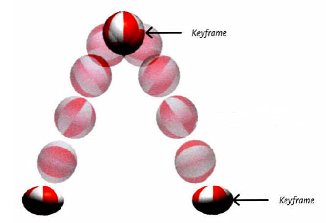

### 定义关键帧

```css
@keyframes 动画名 {
    from {
    /*property1:value1*/
    /*property2:value2*/
    }
    to {
    /*property1:value1*/
    }
}
```

```css
@keyframes 动画名 {
    0% {
    /*property1:value1*/
    }
    20% {
    /*property1:value1*/
    }
    40% {
    /*property1:value1*/
    }
    60% {
    /*property1:value1*/
    }
    80% {
    /*property1:value1*/
    }
    100% {
    /*property1:value1*/
    }
}
```

### 应用动画

```css
.box {
    /* 指定动画 */
    animation-name: testKey;
    /* 设置动画所需时间 */
    animation-duration: 5s;
    /* 设置动画延迟 */
    animation-delay: 0.5s;
}
```

### animation-timing-function 

设置动画的类型，常用值如下：

1. ease ： 平滑动画 —— 默认值
2. linear ： 线性过渡
3. ease-in ： 慢 → 快
4. ease-out ： 快 → 慢
5. ease-in-out ： 慢 → 快 → 慢
6. step-start ： 等同于 steps(1, start)
7. step-end ： 等同于 steps(1, end)
8. steps( integer,?) ： 接受两个参数的步进函数。第一个参数必须为正整数，指定
函数的步数。第二个参数取值可以是 start 或 end ，指定每一步的值发生变化的时间
点。第二个参数默认值为 end 。
9. cubic-bezie ( number, number, number, number)： 特定的贝塞尔曲线类型。

### animation-iteration-count

指定动画的播放次数，常用值如下：

1. number ：动画循环次数
2. infinite ： 无限循环

### animation-direction

指定动画方向，常用值如下:

1. normal ： 正常方向 (默认)
2. reverse ： 反方向运行
3. alternate ： 动画先正常运行再反方向运行，并持续交替运行
4. alternate-reverse ： 动画先反运行再正方向运行，并持续交替运行

### animation-fill-mode

设置动画之外的状态:

1. forwards ： 设置对象状态为动画结束时的状态
2. backwards ： 设置对象状态为动画开始时的状态

### animation-play-state

设置动画的播放状态，常用值如下:

1. running ： 运动 (默认)
2. paused ： 暂停

### 复合属性

只设置一个时间表示 duration ，设置两个时间分别是： duration 和 delay ，其他属性没有数量和顺序要求

```css
.inner {
    animation: atguigu 3s 0.5s linear 2 alternate-reverse forwards;
}
```

**animation-play-state 一般单独使用**

[查看示例](https://kt3xj5-3000.csb.app/4_CSS3/13_%E5%8A%A8%E7%94%BB/)

## 多列布局

专门用于实现类似于报纸的布局，比如瀑布流展示列表。

|属性|值|
|---|---|
|column-count | 指定列数，值是数字。|
|column-width | 指定列宽，值是长度。|
|columns | 同时指定列宽和列数，复合属性；值没有数量和顺序要求。|
|column-gap | 设置列边距，值是长度。|
|column-rule-style | 设置列与列之间边框的风格，值与 border-style 一致。|
|column-rule-width | 设置列与列之间边框的宽度，值是长度。|
|column-rule-color | 设置列与列之间边框的颜色。|
|column-rule | 设置列边框，复合属性。|
|column-span | 指定是否跨列；值: none 、 all 。|


[查看示例](https://kt3xj5-3000.csb.app/4_CSS3/14_%E5%A4%9A%E5%88%97%E5%B8%83%E5%B1%80/01_%E5%A4%9A%E5%88%97%E5%B8%83%E5%B1%80%E6%A1%88%E4%BE%8B)

[查看瀑布流示例](https://kt3xj5-3000.csb.app/4_CSS3/14_%E5%A4%9A%E5%88%97%E5%B8%83%E5%B1%80/02_%E5%A4%9A%E5%88%97%E5%9B%BE%E7%89%87%E6%A1%88%E4%BE%8B)

## 伸缩盒模型

2009 年， W3C 提出了一种新的盒子模型 —— Flexible Box （伸缩盒模型，又称：弹性盒
子）。它可以轻松的控制：元素分布方式、元素对齐方式、元素视觉顺序 ...，截止目前，除了在部分 IE 浏览器不支持，其他浏览器均已全部支持。伸缩盒模型的出现，逐渐演变出了一套新的布局方案 —— flex 布局

:::tip 小贴士
传统布局是指：基于传统盒状模型，主要靠： display 属性 + position 属性 + float属性。

flex 布局目前在移动端应用比较广泛，因为传统布局不能很好的呈现在移动设备上。
:::

### 伸缩容器

开启了 flex 的元素，就是：伸缩容器。

给元素设置： display:flex 或 display:inline-flex ，该元素就变为了伸缩容器。一个元素可以同时是：伸缩容器、伸缩项目。

### 伸缩项目

伸缩容器所有子元素自动成为了伸缩项目。

1. 仅伸缩容器的子元素成为了伸缩项目，孙子元素、重孙子元素等后代，不是伸缩项目。
2. 无论原来是哪种元素（块、行内块、行内），一旦成为了伸缩项目，全都会“块状化”。

### 主轴与侧轴

主轴： **伸缩项目沿着主轴排列**，主轴默认是水平的，默认方向是：从左到右（左边是起点，右边是终点）。
侧轴： 与主轴垂直的就是侧轴，侧轴默认是垂直的，默认方向是：从上到下（上边是起点，下边是终点）。

### 主轴方向

flex-direction设置主轴方向，改变了主轴的方向，侧轴方向也随之改变。

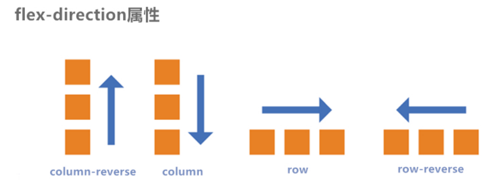

1. row ：主轴方向水平从左到右 —— 默认值
2. row-reverse ：主轴方向水平从右到左。
3. column ：主轴方向垂直从上到下。
4. column-reverse ：主轴方向垂直从下到上。

[查看示例](https://kt3xj5-3000.csb.app/4_CSS3/15_%E4%BC%B8%E7%BC%A9%E7%9B%92%E6%A8%A1%E5%9E%8B/02_%E4%B8%BB%E8%BD%B4%E6%96%B9%E5%90%91)

### 主轴换行方式

 flex-wrap设置主轴换行方式

 1. nowrap ：默认值，不换行。
 2. wrap ：自动换行，伸缩容器不够自动换行。
 3. wrap-reverse ：反向换行。

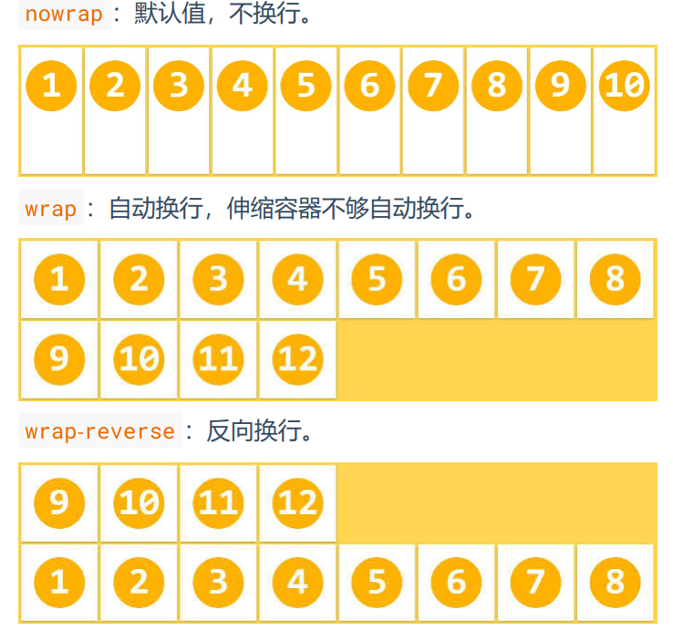

flex-flow 是一个复合属性，复合了 flex-direction 和 flex-wrap 两个属性。 值没有顺序要
求。

`flex-flow: row wrap;`

[查看示例](https://kt3xj5-3000.csb.app/4_CSS3/15_%E4%BC%B8%E7%BC%A9%E7%9B%92%E6%A8%A1%E5%9E%8B/03_%E4%B8%BB%E8%BD%B4%E6%8D%A2%E8%A1%8C%E6%96%B9%E5%BC%8F.html)

### 主轴对齐方式

justify-content设置主轴对齐方式。

1. flex-start ：主轴起点对齐。—— 默认值
2. flex-end ：主轴终点对齐。
3. center ：居中对齐
4. space-between ：均匀分布，两端对齐（最常用）。
5. space-around ：均匀分布，两端距离是中间距离的一半。
6. space-evenly ：均匀分布，两端距离与中间距离一致。

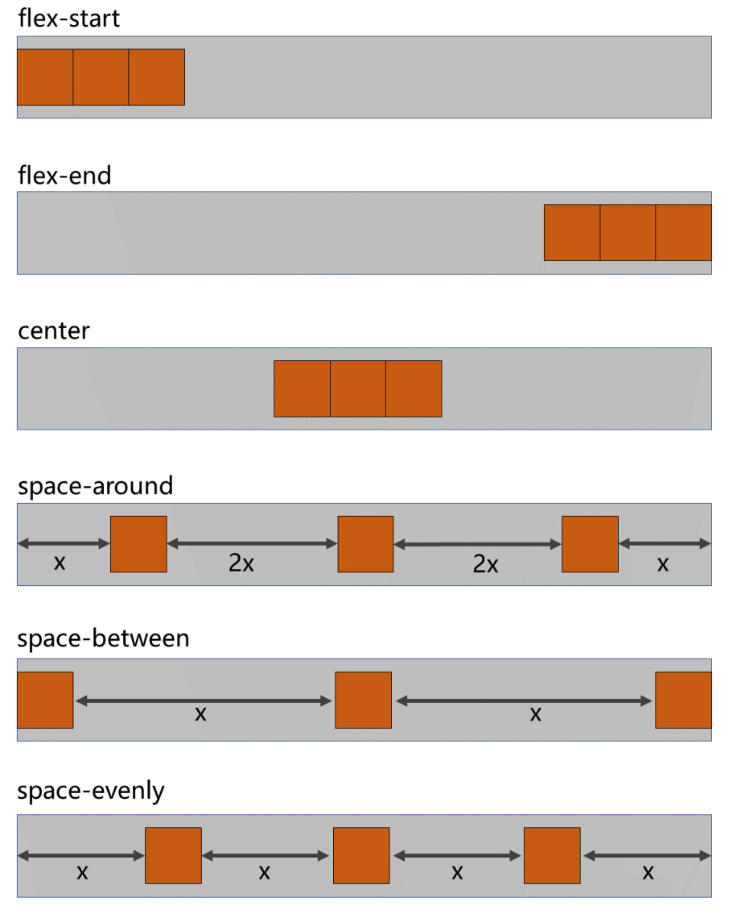

[查看示例](https://kt3xj5-3000.csb.app/4_CSS3/15_%E4%BC%B8%E7%BC%A9%E7%9B%92%E6%A8%A1%E5%9E%8B/05_%E4%B8%BB%E8%BD%B4%E5%AF%B9%E9%BD%90%E6%96%B9%E5%BC%8F)

### 侧轴对齐方式

#### 单行对齐

align-items设置侧轴的单行对齐方式

1. flex-start ：侧轴的起点对齐。
2. flex-end ：侧轴的终点对齐。
3. center ：侧轴的中点对齐。
4. baseline : 伸缩项目的第一行文字的基线对齐。
5. stretch ：如果伸缩项目未设置高度，将占满整个容器的高度。—— （默认值）

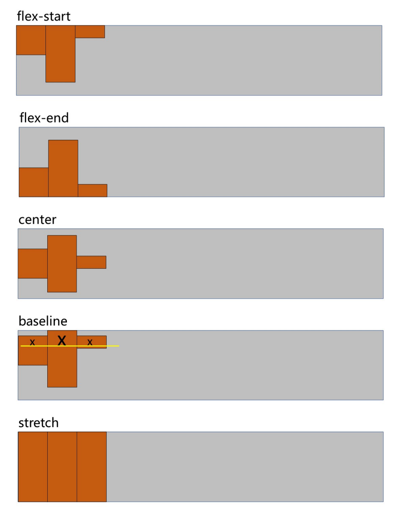

[查看示例](https://kt3xj5-3000.csb.app/4_CSS3/15_%E4%BC%B8%E7%BC%A9%E7%9B%92%E6%A8%A1%E5%9E%8B/06_%E4%BE%A7%E8%BD%B4%E5%AF%B9%E9%BD%90%E6%96%B9%E5%BC%8F_%E4%B8%80%E8%A1%8C.html)

#### 多行对齐

align-content设置侧轴的多行对齐方式

1. flex-start ：与侧轴的起点对齐。

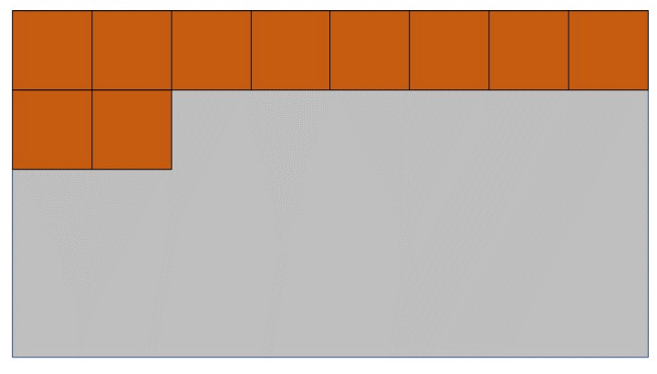
2. flex-end ：与侧轴的终点对齐。
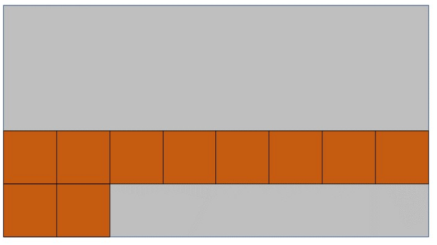

3. center ：与侧轴的中点对齐。
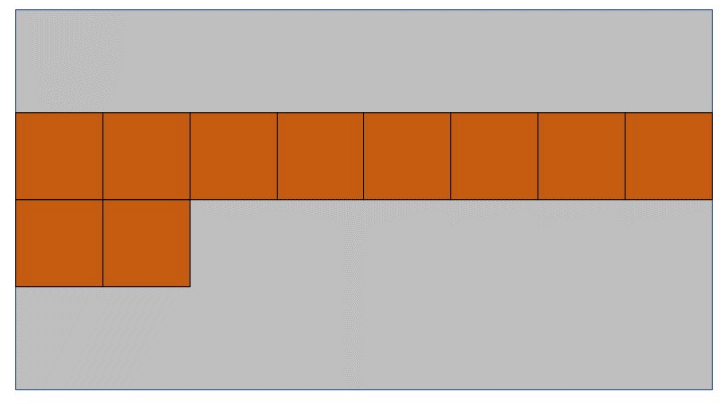
4. space-between ：与侧轴两端对齐，中间平均分布。
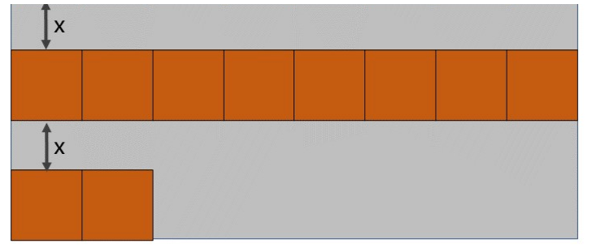
5. space-around ：伸缩项目间的距离相等，比距边缘大一倍。
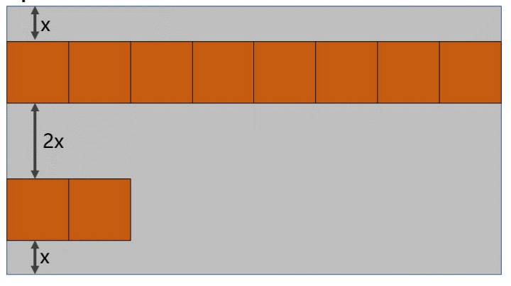
6. space-evenly : 在侧轴上完全平分。
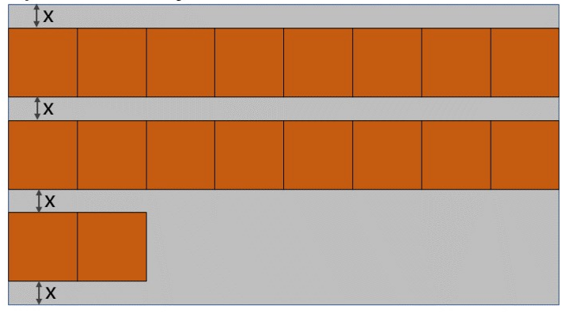
7. stretch ：占满整个侧轴。—— 默认值
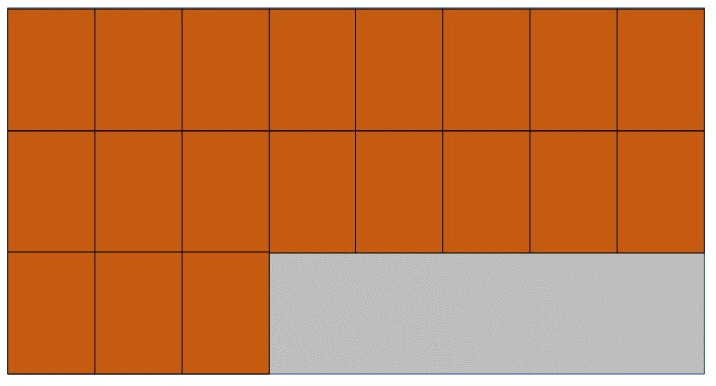

[查看示例](https://kt3xj5-3000.csb.app/4_CSS3/15_%E4%BC%B8%E7%BC%A9%E7%9B%92%E6%A8%A1%E5%9E%8B/07_%E4%BE%A7%E8%BD%B4%E5%AF%B9%E9%BD%90%E6%96%B9%E5%BC%8F_%E5%A4%9A%E8%A1%8C.html)

### 水平垂直居中

父容器开启 flex 布局，随后使用 justify-content 和 align-items 实现水平垂直居中

```css
.outer {
    width: 400px;
    height: 400px;
    background-color: #888;
    display: flex;
    justify-content: center;
    align-items: center;
}
.inner {
    width: 100px;
    height: 100px;
    background-color: orange;
}
```
父容器开启 flex 布局，随后子元素 margin: auto

```css
.outer {
    width: 400px;
    height: 400px;
    background-color: #888;
    display: flex;
}
.inner {
    width: 100px;
    height: 100px;
    background-color: orange;
    margin: auto;
}
```
**子元素无论是否设置高度，这两种方式都可居中子元素**

[查看示例](https://kt3xj5-3000.csb.app/4_CSS3/15_%E4%BC%B8%E7%BC%A9%E7%9B%92%E6%A8%A1%E5%9E%8B/08_%E5%85%83%E7%B4%A0%E6%B0%B4%E5%B9%B3%E5%9E%82%E7%9B%B4%E5%B1%85%E4%B8%AD.html)

### 伸缩性

flex-basis 设置的是主轴方向的基准长度，会让元素宽度或高度失效，按照这个基准值显示宽度或高度（主轴横向：宽度失效；主轴纵向：高度失效）

当设置flex-grow或flex-shrink属性值时，浏览器根据flex-basis设置的值，计算主轴上是否有多余空间，默认值 auto ，即：伸缩项目自身的宽或高，通常不需要修改这个值。

[查看示例](https://kt3xj5-3000.csb.app/4_CSS3/15_%E4%BC%B8%E7%BC%A9%E7%9B%92%E6%A8%A1%E5%9E%8B/09_%E9%A1%B9%E7%9B%AE%E5%9C%A8%E4%B8%BB%E8%BD%B4%E7%9A%84%E5%9F%BA%E5%87%86%E9%95%BF%E5%BA%A6.html)

#### 伸

flex-grow 定义伸缩项目的放大比例，默认为 0 ，即：纵使主轴存在剩余空间，也不拉伸（放大）。

1. 若所有伸缩项目的 flex-grow 值都为 1 ，则：它们将等分剩余空间（如果有空间的话）。
2. 若三个伸缩项目的 flex-grow 值分别为： 1 、 2 、 3 ，则：分别瓜分到： 1/6 、 2/6 、
3/6 的空间。

[查看示例](https://kt3xj5-3000.csb.app/4_CSS3/15_%E4%BC%B8%E7%BC%A9%E7%9B%92%E6%A8%A1%E5%9E%8B/10_%E4%BC%B8%E7%BC%A9%E9%A1%B9%E7%9B%AE_%E4%BC%B8.html)

#### 缩

flex-shrink 定义了项目的压缩比例，默认为 1 ，即：如果空间不足，该项目将会缩小。

**计算方式：**

假设有三个收缩项目，宽度分别为： 200px 、 300px 、 200px ，若想刚好容纳下三个项目，需要总宽度为 700px ，但目前容器只有 400px ，还差 300px，所以每个人都要收缩一下才可以放下，现在分别设置它们的 flex-shrink 值分别为： 1 、 2 、 3，具体收缩的值，这样计算：

1. 计算分母： (200×1) + (300×2) + (200×3) = 1400
2. 计算比例：
    - 项目一： (200×1) / 1400 = 比例值1
    - 项目二： (300×2) / 1400 = 比例值2
    - 项目三： (200×3) / 1400 = 比例值3
3. 计算最终收缩大小：
    - 项目一需要收缩： 比例值1 × 300
    - 项目二需要收缩： 比例值2 × 300
    - 项目三需要收缩： 比例值3 × 300

**注意：** 在扩大时，是按照剩余空间等比例分的，和元素自身大小无关。但是缩小时，是根据元素自身大小按比例计算的。也就是“有福是同享的，有难个子高的要多担当”

[查看示例](https://kt3xj5-3000.csb.app/4_CSS3/15_%E4%BC%B8%E7%BC%A9%E7%9B%92%E6%A8%A1%E5%9E%8B/11_%E4%BC%B8%E7%BC%A9%E9%A1%B9%E7%9B%AE_%E7%BC%A9.html)

### 复合属性

flex 是复合属性，复合了： flex-grow 、 flex-shrink 、 flex-basis 三个属性，默认值为 0 1 auto。

- 如果写 flex:1 1 auto ，则可简写为： flex:auto（伸缩项目永远多伸少缩）
- 如果写 flex:1 1 0 ，则可简写为： flex:1（伸缩项目永远均分）
- 如果写 flex:0 0 auto ，则可简写为： flex:none（伸缩项目永远按照自身大小显示）
- 如果写 flex:0 1 auto ，则可简写为： flex:0 auto —— 即 flex 初始值。

[查看示例](https://kt3xj5-3000.csb.app/4_CSS3/15_%E4%BC%B8%E7%BC%A9%E7%9B%92%E6%A8%A1%E5%9E%8B/12_flex%E5%A4%8D%E5%90%88%E5%B1%9E%E6%80%A7.html)

### 项目排序

order 属性定义项目的排列顺序。数值越小，排列越靠前，默认为 0 。

[查看示例](https://kt3xj5-3000.csb.app/4_CSS3/15_%E4%BC%B8%E7%BC%A9%E7%9B%92%E6%A8%A1%E5%9E%8B/13_%E9%A1%B9%E7%9B%AE%E6%8E%92%E5%BA%8F%E4%B8%8E%E5%8D%95%E7%8B%AC%E5%AF%B9%E9%BD%90.html)

### 单独对齐

通过 align-self 属性，可以单独调整某个伸缩项目的对齐方式。默认值为 auto ，表示继承父元素的 align-items 属性。

[查看示例](https://kt3xj5-3000.csb.app/4_CSS3/15_%E4%BC%B8%E7%BC%A9%E7%9B%92%E6%A8%A1%E5%9E%8B/13_%E9%A1%B9%E7%9B%AE%E6%8E%92%E5%BA%8F%E4%B8%8E%E5%8D%95%E7%8B%AC%E5%AF%B9%E9%BD%90)

## 媒体查询

根据不同的媒体类型应用不同的css

### 媒体类型

|值| 含义|
|---|---|
|all |检测所有设备。|
|screen| 检测电子屏幕，包括：电脑屏幕、平板屏幕、手机屏幕等。|
|print| 检测打印机。|

```css
/* 打印机 */
@media print {

}

/* 电子屏幕 */
@media screen {

}
```

### 媒体特性

|值|含义|
|---|---|
|width| 检测视口宽度。|
|max-width| 检测视口最大宽度。|
|min-width| 检测视口最小宽度。|
|height |检测视口高度。|
|max-height | 检测视口最大高度。|
|min-height |检测视口最小高度。|
|device-width |检测设备屏幕的宽度。|
|max-device-width |检测设备屏幕的最大宽度。|
|min-device-width |检测设备屏幕的最小宽度。|
|orientation |检测视口的旋转方向（是否横屏）。portrait ：视口处于纵向，即高度大于等于宽度landscape ：视口处于横向，即宽度大于高度。|

```css
/* 媒体类型不写，默认就是screen，当屏幕<= 700px时候应用样式 */
@media (max-width: 700px) {

}
```

### 运算符

|值| 含义|
|---|---|
|and| 并且|
|, 或 or| 或|
|not| 否定（没啥意义）|
|only |肯定（没啥意义）|

```css
/* 且运算符 */
@media (min-width:700px) and (max-width:800px) {
    h1 {
        background-color: orange;
    }
}
@media screen and (min-width:700px) and (max-width:800px) {
    h1 {
        background-color: orange;
    }
}

/* 或运算符 */
@media screen and (max-width:700px) or (min-width:800px) {
    h1 {
        background-color: orange;
    }
}

/* 否定运算符 */
@media not screen {
    h1 {
        background-color: orange;
    }
}

/* 肯定运算符 */
@media only screen and (width:800px) {
    h1 {
        background-color: orange;
    }
}
```

[查看示例](https://kt3xj5-3000.csb.app/4_CSS3/16_%E5%93%8D%E5%BA%94%E5%BC%8F%E5%B8%83%E5%B1%80/)

### 结合外部样式的用法

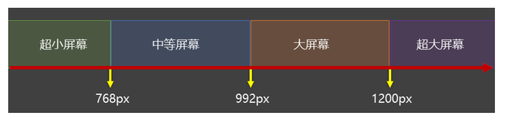

#### 方式一

```html
<link rel="stylesheet" media="具体的媒体查询" href="mystylesheet.css">

<link rel="stylesheet" media="screen and (min-width:1200px)" href="./css/huge.css">
```

#### 方式二

```css
@media screen and (max-width:768px) {
/*CSS-Code;*/
}
@media screen and (min-width:768px) and (max-width:1200px) {
/*CSS-Code;*/
}
```

## BFC

BFC 是 Block Formatting Context （块级格式上下文），可以理解成元素的一个“隐藏功能”。在默认的情况下处于关闭状态；当元素满足了某些条件后，该“隐藏功能”被激活。专业点说就是：为该元素创建了 BFC （又称：开启了 BFC ）。


### 能解决什么问题

1. 元素开启 BFC 后，子元素不会再产生 margin 塌陷问题。
2. 元素开启 BFC 后，子元素浮动，父元素自身高度也不会塌陷。
3. 元素开启 BFC 后，自己不会被其他浮动元素所覆盖。

### 如何开启

#### 自动开启

- html根元素
- 表格单元格元素，如table 、thead 、tbody 、tfoot 、th 、td 、tr 、caption

#### 手动开启

设置为浮动、绝对定位、固定定位、inline-block、flex、flow-root、inline-flex元素
设置overflow 的值不为 visible 的块元素
设置为多列容器
设置 column-span 为 all（即使该元素没有包裹在多列容器中）

[查看示例](https://kt3xj5-3000.csb.app/4_CSS3/17_BFC/)

## viewport

viewport视口，表示浏览器进行网页布局时的区域，浏览器是根据视口进行布局的。在桌面端，通常视口宽度等于设备的宽度；而在手机端，为了更好的呈现早期的PC网页，不同的浏览器都把视口定义的比手机屏幕要宽。

手机端网页布局方案，常用的有两种，vw和rem。

假设设计稿尺寸是`750px * 1340px`，DPR为2

### vw（推荐）

根据设计稿尺寸，结合[postcss-px-to-viewport](https://github.com/evrone/postcss-px-to-viewport)插件，相当于是百分比布局，100vw等于100%屏幕宽度，编码时按照`px`编写，计算也不用考虑DPR。

`1px = (1 / 750) * 100vw`

### rem（不推荐）

根据屏幕尺寸、设计稿尺寸、DPR值，动态计算出基准字体大小和scale值，rem方案其实是模拟vw，由于vw单位在当年兼容性不好，这是当时的过渡方案，现在已经没有兼容问题了。这种方案在嵌套iframe时还会有渲染问题，所以不推荐这种方案了。

```js
// scale为0.5
scale = 1 / DPR
// fontSize为7.5px，100rem是100%屏幕宽
fontSize = 750 / 100` 
```

