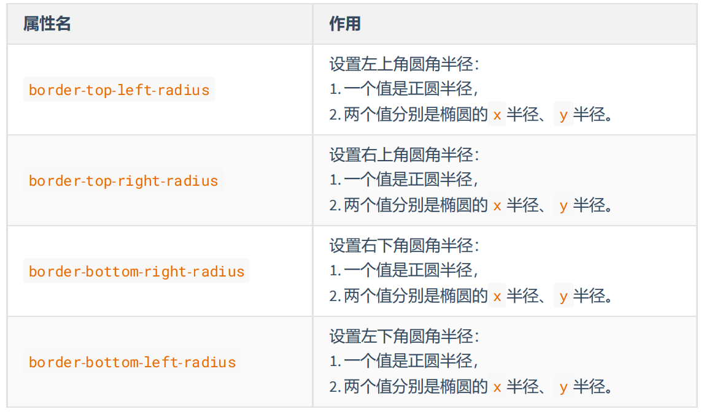

# css3

CSS3 是 CSS2 的升级版本，它在 CSS2 的基础上，新增了很多强大的新功能。

CSS3 在未来会按照模块化的方式去发展： https://www.w3.org/Style/CSS/current-work.html

**CSS3 的新特性如下：**

- 新增了更加实用的选择器，例如：动态伪类选择器、目标伪类选择器、伪元素选择器等等。
- 新增了更好的视觉效果，例如：圆角、阴影、渐变等。
- 新增了丰富的背景效果，例如：支持多个背景图片，同时新增了若干个背景相关的属性。
- 新增了全新的布局方案 —— 弹性盒子。
- 新增了 Web 字体，可以显示用户电脑上没有安装的字体。
- 增强了颜色，例如： HSL 、 HSLA 、 RGBA 几种新的颜色模式，新增 opacity 属性来控制透明度。
- 增加了 2D 和 3D 变换，例如：旋转、扭曲、缩放、位移等。
- 增加动画与过渡效果，让效果的变换更具流线性、平滑性。

## 私有前缀

W3C 标准所提出的某个 CSS 特性，在被浏览器正式支持之前，浏览器厂商会根据浏览器的内核，
使用私有前缀来测试该 CSS 特性，在浏览器正式支持该 CSS 特性后，就不需要私有前缀了。

```css
div {
    width:400px;
    height:400px;
    -webkit-border-radius: 20px;
}
```

- Chrome 浏览器： -webkit
- Safari 浏览器： -webkit
- Firefox 浏览器： -moz
- Edge 浏览器： -webkit
- ~~旧 Opera 浏览器： -o~~
- ~~旧 IE 浏览器： -ms~~

## 新增长度单位

1. rem 根元素字体大小的倍数，只与根元素字体大小有关，如果根元素没有设置字体大小，就是浏览器默认字体大小。
2. vw 视口宽度的百分之多少 10vw 就是视口宽度的 10% 。
3. vh 视口高度的百分之多少 10vh 就是视口高度的 10% 。
4. vmax 视口宽高中大的那个的百分之多少。（了解即可）
5. vmin 视口宽高中小的那个的百分之多少。（了解即可）

[查看示例](https://kt3xj5-3000.csb.app/4_CSS3/01_CSS3_%E6%96%B0%E5%A2%9E%E9%95%BF%E5%BA%A6%E5%8D%95%E4%BD%8D/%E6%96%B0%E5%A2%9E%E9%95%BF%E5%BA%A6%E5%8D%95%E4%BD%8D)

## 新增颜色设置方式

CSS3 新增了三种颜色设置方式，分别是： rgba 、 hsl 、 hsla ，由于之前已经详细讲解，此处略
过。

[查看新增颜色设置方式](./css.md#颜色)

## 新增选择器

CSS3 新增的选择器有：动态伪类、目标伪类、语言伪类、 UI 伪类、结构伪类、否定伪类、伪元素；这
些在 CSS2 中已经详细讲解，此处略过。

[查看新增选择器](./css.md#伪类选择器)

## 新增盒模型相关属性

### box-sizing

使用 box-sizing 属性可以设置盒模型的两种类型

|可选值| 含义|
|---|---|
|content-box| width 和 height 设置的是盒子内容区的大小。（默认值）|
|border-box| width 和 height 设置的是盒子总大小。（怪异盒模型）|

[查看示例](https://kt3xj5-3000.csb.app/4_CSS3/04_CSS3_%E6%96%B0%E5%A2%9E%E7%9B%92%E5%AD%90%E6%A8%A1%E5%9E%8B%E7%9B%B8%E5%85%B3%E5%B1%9E%E6%80%A7/01_box-sizing.html)

### resize

使用 resize 属性可以控制是否允许用户调节元素尺寸。

|值| 含义|
|---|---|
|none| 不允许用户调整元素大小。(默认)|
|both| 用户可以调节元素的宽度和高度。|
|horizontal| 用户可以调节元素的宽度| 
|vertical| 用户可以调节元素的高度。|

**注意：** resize元素的overflow属性，不能是默认值visible才可以调整尺寸

[查看示例](https://kt3xj5-3000.csb.app/4_CSS3/04_CSS3_%E6%96%B0%E5%A2%9E%E7%9B%92%E5%AD%90%E6%A8%A1%E5%9E%8B%E7%9B%B8%E5%85%B3%E5%B1%9E%E6%80%A7/02_resize.html)

### box-shadow 

使用 box-shadow 属性为盒子添加阴影。
```css
box-shadow: h-shadow v-shadow blur spread color inset;

```

|值 |含义|
|---|---|
|h-shadow |水平阴影的位置，必须填写，可以为负值|
|v-shadow |垂直阴影的位置，必须填写，可以为负值|
|blur |可选，模糊距离|
|spread |可选，阴影的外延值|
|color |可选，阴影的颜色|
|inset |可选，将外部阴影改为内部阴影|

默认值： box-shadow:none 表示没有阴影

```css
/* 写两个值，含义：水平位置、垂直位置 */
box-shadow: 10px 10px;
/* 写三个值，含义：水平位置、垂直位置、颜色 */
box-shadow: 10px 10px red;
/* 写三个值，含义：水平位置、垂直位置、模糊值 */
box-shadow: 10px 10px 10px;
/* 写四个值，含义：水平位置、垂直位置、模糊值、颜色 */
box-shadow: 10px 10px 10px red;
/* 写五个值，含义：水平位置、垂直位置、模糊值、外延值、颜色 */
box-shadow: 10px 10px 10px 10px blue;
/* 写六个值，含义：水平位置、垂直位置、模糊值、外延值、颜色、内阴影 */
box-shadow: 10px 10px 20px 3px blue inset;
```

[查看示例](https://kt3xj5-3000.csb.app/4_CSS3/04_CSS3_%E6%96%B0%E5%A2%9E%E7%9B%92%E5%AD%90%E6%A8%A1%E5%9E%8B%E7%9B%B8%E5%85%B3%E5%B1%9E%E6%80%A7/03_box-shadow.html)


### opacity 

opacity 属性能为整个元素添加透明效果， 值是 0 到 1 之间的小数， 0 是完全透明， 1 表示完
全不透明

:::tip opacity 与 rgba 的区别？
opacity 是一个属性，设置的是整个元素（包括元素里的内容）的不透明度。

rgba 是颜色的设置方式，用于设置颜色，它的透明度，仅仅是调整颜色的透明度
:::

[查看示例](https://kt3xj5-3000.csb.app/4_CSS3/04_CSS3_%E6%96%B0%E5%A2%9E%E7%9B%92%E5%AD%90%E6%A8%A1%E5%9E%8B%E7%9B%B8%E5%85%B3%E5%B1%9E%E6%80%A7/04_opacity.html)

## 新增背景属性

### background-origin

background-origin设置背景图的原点

1. padding-box ：从 padding 区域开始显示背景图像。—— 默认值
2. border-box ： 从 border 区域开始显示背景图像。
3. content-box ： 从 content 区域开始显示背景图像。

[查看示例](https://kt3xj5-3000.csb.app/4_CSS3/05_CSS3_%E6%96%B0%E5%A2%9E%E8%83%8C%E6%99%AF%E7%9B%B8%E5%85%B3%E5%B1%9E%E6%80%A7/01_background-origin.html)

###  background-clip

background-clip设置背景图的向外裁剪的区域。

1. border-box ： 从 border 区域开始向外裁剪背景。 —— 默认值
2. padding-box ： 从 padding 区域开始向外裁剪背景。
3. content-box ： 从 content 区域开始向外裁剪背景。
4. text ：背景图只呈现在文字上。

[查看示例](https://kt3xj5-3000.csb.app/4_CSS3/05_CSS3_%E6%96%B0%E5%A2%9E%E8%83%8C%E6%99%AF%E7%9B%B8%E5%85%B3%E5%B1%9E%E6%80%A7/02_background-clip)

### background-size

设置背景图的尺寸。

1. 用长度值指定背景图片大小，不允许负值。
```css
background-size: 300px 200px;
```

2. 用百分比指定背景图片大小，不允许负值。

```css
background-size: 100% 100%;
```

3. auto ： 背景图片的真实大小，根据容器大小不压缩展示。 —— 默认值

4. contain ： 将背景图片等比缩放，使背景图片的宽或高，与容器的宽或高相等，再将完整
背景图片包含在容器内，但要注意：可能会造成容器里部分区域没有背景图片。

```css
background-size: contain;
```

5. cover ：将背景图片等比缩放，直到完全覆盖容器，图片会尽可能全的显示在元素上，但要
注意：背景图片有可能显示不完整。—— 相对比较好的选择

```css
background-size: cover;
```

[查看示例](https://kt3xj5-3000.csb.app/4_CSS3/05_CSS3_%E6%96%B0%E5%A2%9E%E8%83%8C%E6%99%AF%E7%9B%B8%E5%85%B3%E5%B1%9E%E6%80%A7/03_background-size)

### 复合属性

`background: color url repeat position / size origin clip`

**注意：**
1. origin 和 clip 如果只写一个值，则 origin 和 clip 都设置；如
果设置了两个值，前面的是 origin ，后面的 clip 。
2. size 的值必须写在 position 值的后面，并且用 / 分开。

[查看示例](https://kt3xj5-3000.csb.app/4_CSS3/05_CSS3_%E6%96%B0%E5%A2%9E%E8%83%8C%E6%99%AF%E7%9B%B8%E5%85%B3%E5%B1%9E%E6%80%A7/04_background%E5%A4%8D%E5%90%88%E5%B1%9E%E6%80%A7.html)

### 多背景图

CSS3 允许元素设置多个背景图片

```css
/* 添加多个背景图 */
background: url(../images/bg-lt.png) no-repeat,
    url(../images/bg-rt.png) no-repeat right top,
    url(../images/bg-lb.png) no-repeat left bottom,
    url(../images/bg-rb.png) no-repeat right bottom;
```

[查看示例](https://kt3xj5-3000.csb.app/4_CSS3/05_CSS3_%E6%96%B0%E5%A2%9E%E8%83%8C%E6%99%AF%E7%9B%B8%E5%85%B3%E5%B1%9E%E6%80%A7/05_%E5%A4%9A%E8%83%8C%E6%99%AF%E5%9B%BE.html)

## 新增边框属性

### 边框圆角

使用 border-radius 属性可以将盒子变为圆角

**同时设置四个角的圆角：**`border-radius:10px;`

**分开设置每个角的圆角：**



**分开设置每个角的圆角，综合写法**

`border-raidus: 左上角x 右上角x 右下角x 左下角x / 左上y 右上y 右下y 左下y`

[查看示例](https://kt3xj5-3000.csb.app/4_CSS3/06_CSS3_%E6%96%B0%E5%A2%9E%E8%BE%B9%E6%A1%86%E7%9B%B8%E5%85%B3%E5%B1%9E%E6%80%A7/01_%E8%BE%B9%E6%A1%86%E5%9C%86%E8%A7%92.html)


### 边框外轮廓

- outline-width ：外轮廓的宽度。
- outline-color ：外轮廓的颜色。
- outline-style ：外轮廓的风格。
    - none ： 无轮廓
    - dotted ： 点状轮廓
    - dashed ： 虚线轮廓
    - solid ： 实线轮廓
    - double ： 双线轮廓
- outline-offset 设置外轮廓与边框的距离，正负值都可以设置。

**复合属性：**`outline: 50px solid blue;`，和设置border写法类似。

[查看示例](https://kt3xj5-3000.csb.app/4_CSS3/06_CSS3_%E6%96%B0%E5%A2%9E%E8%BE%B9%E6%A1%86%E7%9B%B8%E5%85%B3%E5%B1%9E%E6%80%A7/02_%E8%BE%B9%E6%A1%86%E5%A4%96%E8%BD%AE%E5%BB%93.html)

**注意：**

1. 外轮廓不是盒模型的一部分，不占据文档位置
2.  outline-offset 不是 outline 的子属性，是一个独立的属性

## 新增文本属性

### 文本阴影

在 CSS3 中，我们可以使用 text-shadow 属性给文本添加阴影

`text-shadow: h-shadow v-shadow blur color;`

|值 |描述|
|---|---|
|h-shadow |必需写，水平阴影的位置。允许负值。|
|v-shadow |必需写，垂直阴影的位置。允许负值。|
|blur |可选，模糊的距离。|
|color| 可选，阴影的颜色|

默认值： text-shadow:none 表示没有阴影。

[查看示例](https://kt3xj5-3000.csb.app/4_CSS3/07_CSS3_%E6%96%B0%E5%A2%9E%E6%96%87%E6%9C%AC%E5%B1%9E%E6%80%A7/01_%E6%96%87%E6%9C%AC%E9%98%B4%E5%BD%B1.html)

### 文本换行

在 CSS3 中，我们可以使用 white-space 属性设置文本换行方式。

|值| 含义|
|---|---|
|normal| 文本超出边界自动换行，文本中的换行被浏览器识别为一个空格。（默认值）|
|pre |原样输出，与 pre 标签的效果相同。|
|pre-wrap |在 pre 效果的基础上，超出元素边界自动换行。|
|pre-line |在 pre 效果的基础上，超出元素边界自动换行，文本行中的连续空格会被忽略。|
|nowrap |强制不换行|

[查看示例](https://kt3xj5-3000.csb.app/4_CSS3/07_CSS3_%E6%96%B0%E5%A2%9E%E6%96%87%E6%9C%AC%E5%B1%9E%E6%80%A7/02_%E6%96%87%E6%9C%AC%E6%8D%A2%E8%A1%8C.html)

### 文本溢出

在 CSS3 中，我们可以使用 text-overflow 属性设置文本内容溢出时的呈现模式。

|值| 含义|
|---|---|
|clip |当内联内容溢出时，将溢出部分裁切掉。 （默认值）|
|ellipsis| 当内联内容溢出块容器时，将溢出部分替换为 ... 。|

**注意：** 要使得 text-overflow 属性生效，块容器必须显式定义 overflow 为非 visible
值， white-space 为 nowrap 值。

[查看示例](https://kt3xj5-3000.csb.app/4_CSS3/07_CSS3_%E6%96%B0%E5%A2%9E%E6%96%87%E6%9C%AC%E5%B1%9E%E6%80%A7/03_%E6%96%87%E6%9C%AC%E6%BA%A2%E5%87%BA.html)

### 文本修饰

CSS3 升级了 text-decoration 属性，让其变成了复合属性

`text-decoration: text-decoration-line  text-decoration-style text-decorationcolor`

- text-decoration-line 设置文本装饰线的位置
    - none ： 指定文字无装饰 （默认值）
    - underline ： 指定文字的装饰是下划线
    - overline ： 指定文字的装饰是上划线
    - line-through ： 指定文字的装饰是贯穿线
- text-decoration-style 文本装饰线条的形状
    - solid ： 实线 （默认）
    - double ： 双线
    - dotted ： 点状线条
    - dashed ： 虚线
    - wavy ： 波浪线
- text-decoration-color 文本装饰线条的颜色

[查看示例](https://kt3xj5-3000.csb.app/4_CSS3/07_CSS3_%E6%96%B0%E5%A2%9E%E6%96%87%E6%9C%AC%E5%B1%9E%E6%80%A7/04_%E6%96%87%E6%9C%AC%E4%BF%AE%E9%A5%B0.html)

### 文本描边

文字描边功能仅 webkit 内核浏览器支持。

- -webkit-text-stroke-width ：设置文字描边的宽度，写长度值。
- -webkit-text-stroke-color ：设置文字描边的颜色，写颜色值。
- -webkit-text-stroke ：复合属性，设置文字描边宽度和颜色。

[查看示例](https://kt3xj5-3000.csb.app/4_CSS3/07_CSS3_%E6%96%B0%E5%A2%9E%E6%96%87%E6%9C%AC%E5%B1%9E%E6%80%A7/05_%E6%96%87%E6%9C%AC%E6%8F%8F%E8%BE%B9.html)

## 新增渐变

### 线性渐变

1. 多个颜色之间的渐变， 默认从上到下渐变。

`background-image: linear-gradient(red,yellow,green);`

2. 使用关键词`to top`, `to right`设置线性渐变的方向。

```css
background-image: linear-gradient(to top,red,yellow,green);
background-image: linear-gradient(to right top,red,yellow,green);
```

3. 使用角度设置线性渐变的方向。

`background-image: linear-gradient(30deg,red,yellow,green);`

4. 调整开始渐变的位置

`background-image: linear-gradient(red 50px,yellow 100px ,green 150px);`

[查看示例](https://kt3xj5-3000.csb.app/4_CSS3/08_CSS3_%E6%96%B0%E5%A2%9E%E6%B8%90%E5%8F%98/01_%E7%BA%BF%E6%80%A7%E6%B8%90%E5%8F%98.html)

### 径向渐变

1. 多个颜色之间的渐变， 默认从圆心四散。（注意：不一定是正圆，要看容器本身宽高比）

`background-image: radial-gradient(red,yellow,green);`

2. 使用关键词调整渐变圆的圆心位置。

`background-image: radial-gradient(at right top,red,yellow,green);`

3. 使用像素值调整渐变圆的圆心位置。

`background-image: radial-gradient(at 100px 50px,red,yellow,green);`


4. 调整渐变形状为正圆 。

`background-image: radial-gradient(circle,red,yellow,green);`

5. 调整渐变形状的半径，分别是x方向和y方向，相同为正圆，不同为椭圆

```css
background-image: radial-gradient(100px,red,yellow,green);
background-image: radial-gradient(50px 100px,red,yellow,green);
```

6. 调整开始渐变的位置。

`background-image: radial-gradient(red 50px,yellow 100px,green 150px);`

[查看示例](https://kt3xj5-3000.csb.app/4_CSS3/08_CSS3_%E6%96%B0%E5%A2%9E%E6%B8%90%E5%8F%98/02_%E5%BE%84%E5%90%91%E6%B8%90%E5%8F%98.html)

### 重复渐变

无论线性渐变，还是径向渐变，**在没有发生渐变的位置**，继续进行渐变，就为重复渐变。

- 使用 repeating-linear-gradient 进行重复线性渐变，具体参数同 linear-gradient 。
- 使用 repeating-radial-gradient 进行重复径向渐变，具体参数同 radial-gradient 。

[查看示例](https://kt3xj5-3000.csb.app/4_CSS3/08_CSS3_%E6%96%B0%E5%A2%9E%E6%B8%90%E5%8F%98/03_%E9%87%8D%E5%A4%8D%E6%B8%90%E5%8F%98.html)  

[重复渐变小应用](https://kt3xj5-3000.csb.app/4_CSS3/08_CSS3_%E6%96%B0%E5%A2%9E%E6%B8%90%E5%8F%98/04_%E6%B8%90%E5%8F%98%E5%B0%8F%E6%A1%88%E4%BE%8B.html)

## web字体

可以通过 `@font-face` 指定字体的具体地址，浏览器会自动下载该字体，这样就不依赖用户电脑上的字体了。

### 基本用法

**简写方式**

```css
@font-face {
    font-family: "情书字体";
    src: url('./方正手迹.ttf');
}

body {
    font: 16px "情书字体",sans-serif;
}
```


**高兼容性写法**

```css
@font-face {
font-family: "atguigu";
font-display: swap;
    src: url('webfont.eot'); /* IE9 */
    src: url('webfont.eot?#iefix') format('embedded-opentype'), /* IE6-IE8 */
        url('webfont.woff2') format('woff2'),
        url('webfont.woff') format('woff'), /* chrome、firefox */
        url('webfont.ttf') format('truetype'), /* chrome、firefox、opera、Safari,
        Android*/
        url('webfont.svg#webfont') format('svg'); /* iOS 4.1- */
}
```


### 定制字体

- 中文的字体文件很大，使用完整的字体文件不现实，通常针对某几个文字进行单独定制。
- 可使用阿里 Web 字体定制工具：https://www.iconfont.cn/webfont

[查看示例](https://kt3xj5-3000.csb.app/4_CSS3/09_web%E5%AD%97%E4%BD%93/01_web%E5%AD%97%E4%BD%93)

### 字体图标

- 相比图片更加清晰。
- 灵活性高，更方便改变大小、颜色、风格等。
- 兼容性好， IE 也能支持。（彩色图标IE不支持）

[查看示例](https://kt3xj5-3000.csb.app/4_CSS3/09_web%E5%AD%97%E4%BD%93/)

## 2D变换

## 3D变换