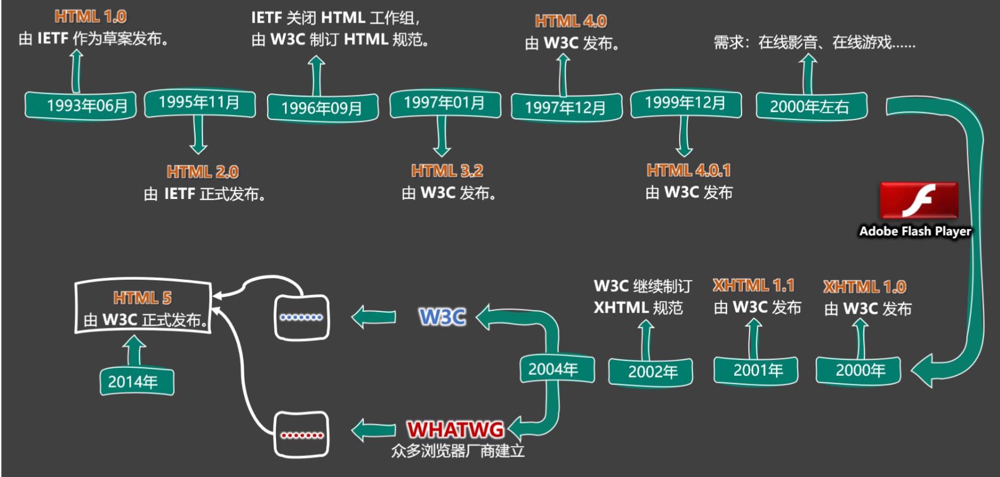
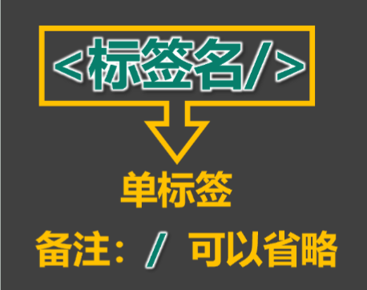
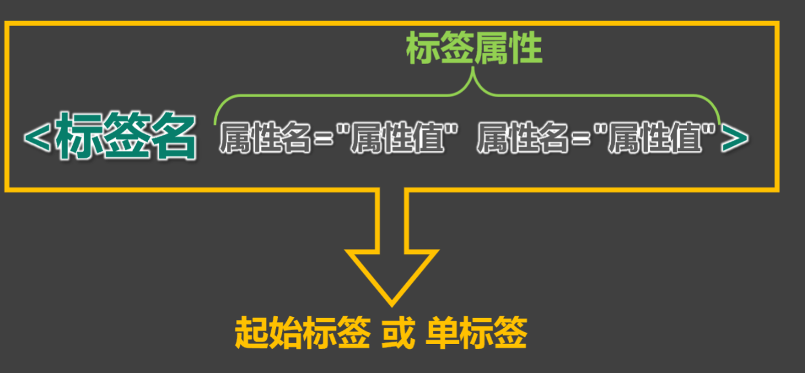
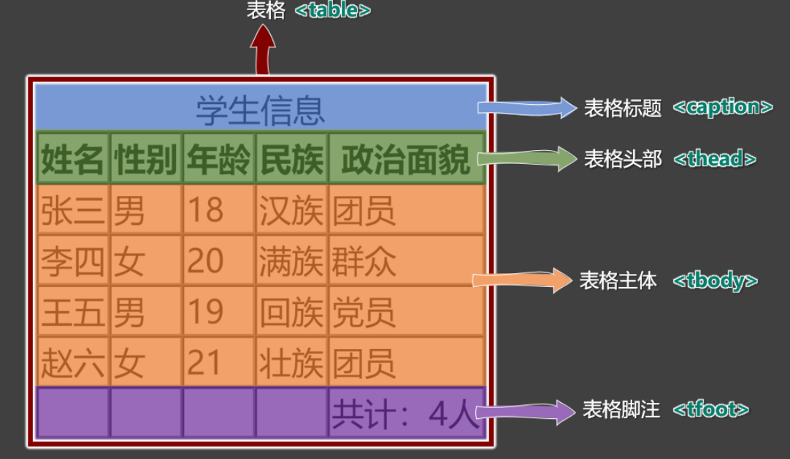
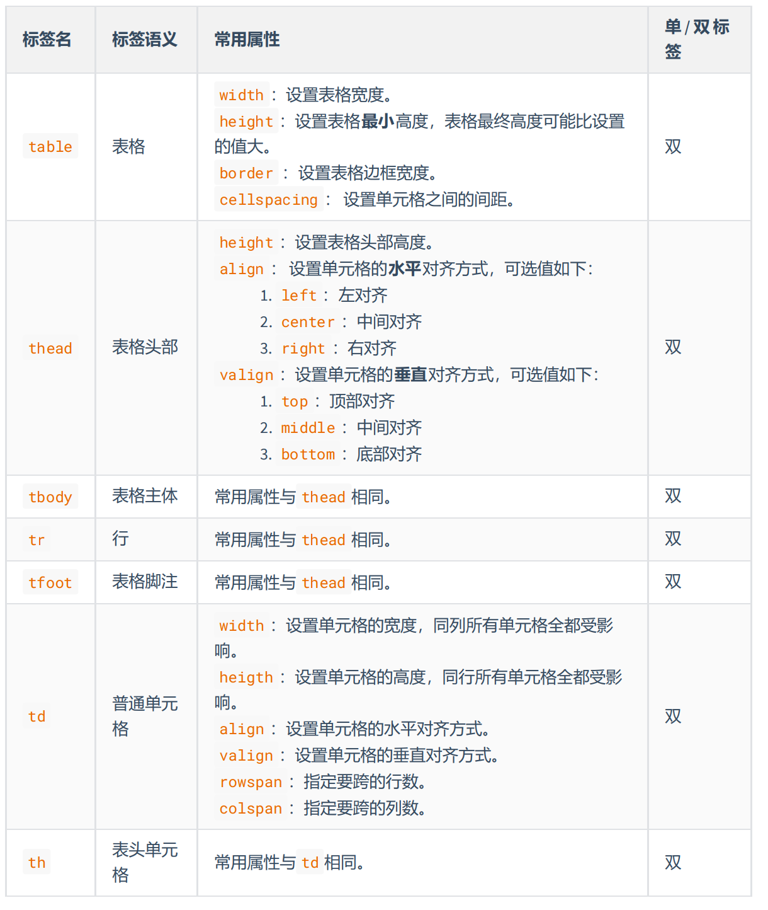
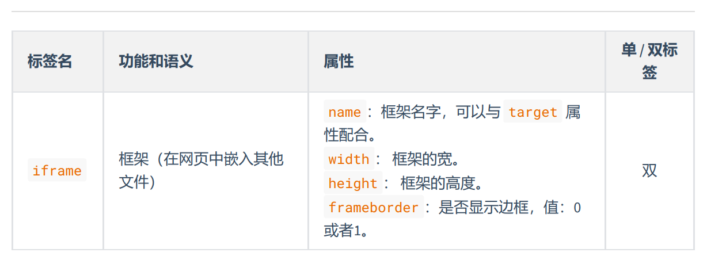
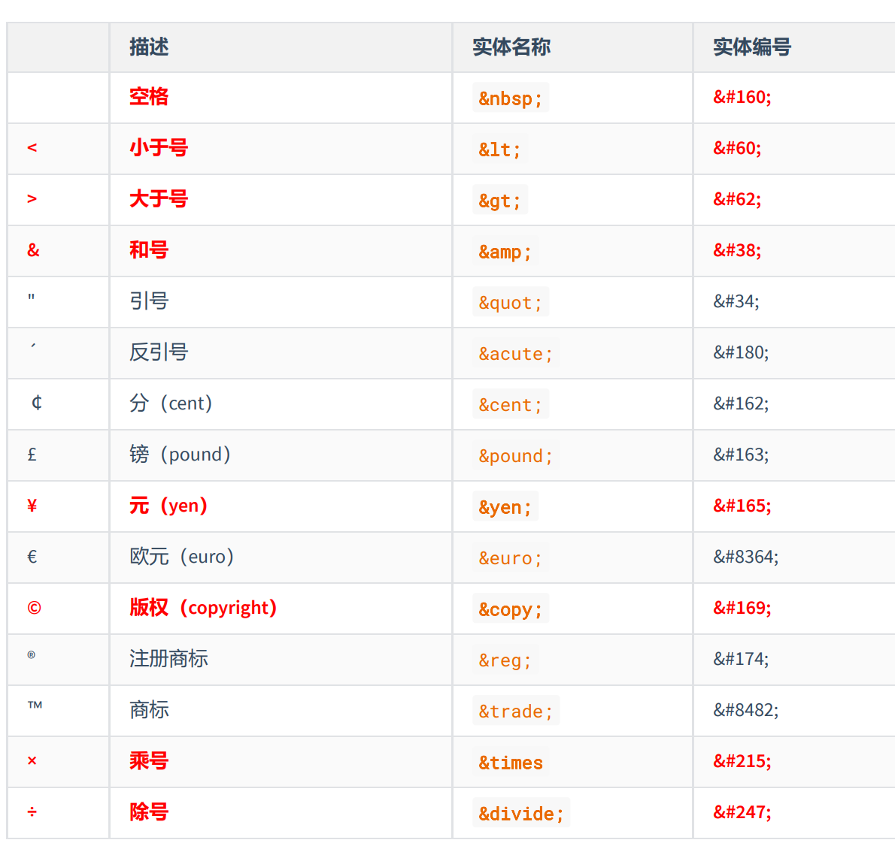
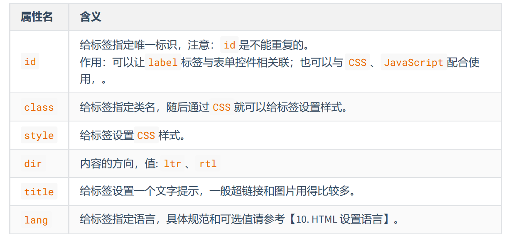
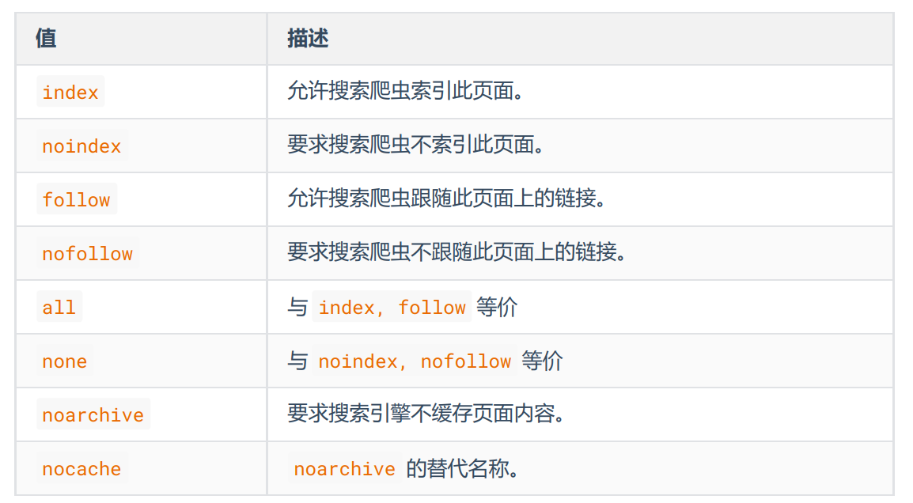

# HTML

全称：HyperText Markup Language（超文本标记语言）。


- 超文本：暂且简单理解为 “超级的文本”，和普通文本比，内容更丰富。
- 标    记：文本要变成超文本，就需要用到各种标记符号。
- 语    言：每一个标记的写法、读音、使用规则，组成了一个标记语言。

## 相关国际组织（了解） 

:::tip IETF
全称：Internet Engineering Task Force（国际互联网工程任务组），成立于1985年底，是一个权威
的互联网技术标准化组织，主要负责互联网相关技术规范的研发和制定，当前绝大多数国际互联网
技术标准均出自IETF。官网：https://www.ietf.org
:::

:::tip W3C
全称：World Wide Web Consortium（万维网联盟），创建于1994年，是目前Web技术领域，最具影
响力的技术标准机构。共计发布了200多项技术标准和实施指南，对互联网技术的发展和应用起到
了基础性和根本性的支撑作用，官网：https://www.w3.org
:::

:::tip WHATWG

全称：Web Hypertext Application Technology Working Group（网页超文本应用技术工作小组）成立于2004年，是一个以推动网络HTML 5 标准为目的而成立的组织。由Opera、Mozilla基金会、苹果，
等这些浏览器厂商组成。官网：https://whatwg.org/
:::

## HTML 发展历史（了解）  



## 标签

1. 标签  又称 元素，是HTML的基本组成单位。
2. 标签分为：双标签 与 单标签 （绝大多数都是双标签）。
3. 标签名不区分大小写，但推荐小写，因为小写更规范。
4. 双标签：

5. 单标签：


## 标签属性

用于给标签提供附加信息。可以写在：起始标签或单标签中，形式如下：



有些特殊的属性，没有属性名，只有属性值，例如：

```html
<input disabled>
```


**注意事项：**
1. 不同的标签，有不同的属性；也有一些通用属性（在任何标签内都能写，后面会详细
总结）。
2. 属性名、属性值不能乱写，都是W3C规定好的。
3. 属性名、属性值，都不区分大小写，但推荐小写。
4. 双引号，也可以写成单引号，甚至不写都行，但还是推荐写双引号。
5. 标签中不要出现同名属性，否则后写的会失效。

## 基本结构

```html
<html>
    <head>
        <title>网页标题</title>
    </head>
    <body>
        ......
    </body>
</html>
```

## 注释

特点：注释的内容会被浏览器所忽略，不会呈现到页面中，但源代码中依然可见。
作用：对代码进行解释和说明。
写法：

```html
<!-- 下面的文字只能滚动一次 -->
<marquee loop="1">尚硅谷</marquee>
<!-- 下面的文字可以无限滚动 -->
<marquee>尚硅谷123</marquee>
```

注释不可以嵌套，以下这么写是错的（反例）。

```html
<!--
我是一段注释
<!-- 我是一段注释 -->
-->
```

## 文档声明

作用：告诉浏览器当前网页的版本。文档声明，必须在网页的第一行，且在 html 标签的外侧。

:::tip 旧写法
要依网页所用的HTML版本而定，写法有很多，具体有哪些写法请参考 ：[W3C官网-文档声明](https://www.w3.org/QA/2002/04/valid-dtd-list.html)（了解即可，千万别背！）
:::

:::tip 新写法
一切都变得简单了！W3C 推荐使用 HTML 5 的写法。
:::

```html
<!DOCTYPE html>
或
<!DOCTYPE HTML>
或
<!doctype html>
```

## 字符编码

1. 计算机对数据的操作：
    - 存储时，对数据进行：编码。
    - 读取时，对数据进行：解码。
2. 编码、解码，会遵循一定的规范 —— 字符集。
3. 字符集有很多中，常见的有（了解）：
    - ASCII ：大写字母、小写字母、数字、一些符号，共计128个。
    - ISO 8859-1 ：在 ASCII 基础上，扩充了一些希腊字符等，共计是256个。
    - GB2312 ：继续扩充，收录了 6763 个常用汉字、682个字符。
    - GBK ：收录了的汉字和符号达到 20000+ ，支持繁体中文。
    - UTF-8 ：包含世界上所有语言的：所有文字与符号。—— 很常用。
4. 使用原则是怎样的？
    - 原则1：存储时，务必采用合适的字符编码 。否则：无法存储，数据会丢失！
    - 原则2：存储时采用哪种方式编码 ，读取时就采用哪种方式解码。否则：数据错乱（乱码）！
5. 总结：
    - 平时编写代码时，统一采用 UTF-8 编码（最稳妥）。
    - 为了让浏览器在渲染 html 文件时，不犯错误，可以通过 meta 标签配合 charset 属性指定字符编码。

```html
<head>
<meta charset="UTF-8"/>
</head>
```

## 设置语言

1. 主要作用：
    - 让浏览器显示对应的翻译提示。
    - 有利于搜索引擎优化。
2. 具体写法：`<html lang="zh-CN>`
3. 扩展知识： lang 属性的编写规则（作为一个课外扩展知识，了解即可）
    - 第一种写法（ 语言-国家/地区 ），例如：
        - zh-CN ：中文-中国大陆（简体中文）
        - zh-TW ：中文-中国台湾（繁体中文）
        - zh ：中文
        - en-US ：英语-美国
        - en-GB ：英语-英国
    - 第二种写法（ 语言—具体种类）已不推荐使用，例如：
        - zh-Hans ：中文—简体
        - zh-Hant ：中文—繁体
    - W3School 上的说明：[《语言代码参考手册》](https://www.w3school.com.cn/tags/html_ref_language_codes.asp)、[《国家/地区代码参考手册》](https://www.w3school.com.cn/tags/html_ref_country_codes.asp)
    - W3C官网上的说明：[《Language tags in HTML》](https://www.w3.org/International/articles/language-tags/)

## 标准结构

```html
<!DOCTYPE html>
<html lang="zh-CN">
<head>
<meta charset="UTF-8">
<title>我是一个标题</title>
</head>
<body>
</body>
</html>
```

- 配置 VScode 的内置插件 emmet ，可以对生成结构的属性进行定制。
- 在存放代码的文件夹中，存放一个 favicon.ico 图片，可配置网站图标。

## 排版标签

`h1 ~ h6` 标题 

`p` 段落

`div `没有任何含义，用于整体布局（生活中的包装袋）。


**注意：**
- `h1`最好写一个， `h2~h6 `能适当多写。
- `h1~h6 `不能互相嵌套，例如： `h1` 标签中最好不要写 `h2 `标签了。
- `p `标签很特殊！它里面不能有：` h1~h6` 、 `p `、` div` 标签。


## 语义化

- 概念：用特定的标签，去表达特定的含义。
- 原则：标签的默认效果不重要（后期可以通过 CSS 随便控制效果），语义最重要！
- 举例：对于 h1 标签，效果是文字很大（不重要），语义是网页主要内容（很重要）。

## 块级元素与行内元素

1. 块级元素：独占一行（排版标签都是块级元素）。
2. 行内元素：不独占一行（目前只学了： input ，稍后会学习更多）。
3. 使用原则：
 - 块级元素 中能写 行内元素 和 块级元素（简单记：块级元素中几乎什么都能写）。
 - 行内元素 中能写 行内元素，但不能写 块级元素。
 - 一些特殊的规则：
    - h1~h6 不能互相嵌套。
    - p 中不要写块级元素。


## 文本标签

1. 用于包裹：词汇、短语等。
2. 通常写在排版标签里面。
3. 排版标签更宏观（大段的文字），文本标签更微观（词汇、短语）。
4. 文本标签通常都是行内元素。

`em` 要着重阅读的内容 
`strong` 十分重要的内容（语气比`em`要强）
`span` 没有语义，用于包裹短语的通用容器（`span` 是小包装袋）。

## 图片标签

```html

```

**属性**

- src ：图片路径（又称：图片地址）—— 图片的具体位置
- alt ：图片描述
- width ：图片宽度，单位是像素，例如： 200px 或 200
- height ：图片高度， 单位是像素，例如： 200px 或 200

## 常见图片格式

:::tip jpg 格式：
概述：扩展名为 .jpg 或 .jpeg ，是一种有损的压缩格式（把肉眼不容易观察出来的细节
丢弃了）。

主要特点：支持的颜色丰富、占用空间较小、不支持透明背景、不支持动态图。

使用场景：对图片细节没有极高要求的场景，例如：网站的产品宣传图等 。—— 该格式网
页中很常见。
:::

:::tip  png 格式：
概述：扩展名为 .png ，是一种无损的压缩格式，能够更高质量的保存图片。

主要特点：支持的颜色丰富、占用空间略大、支持透明背景、不支持动态图。

使用场景：①想让图片有透明背景；②想更高质量的呈现图片；例如 ：公司logo图、重要配图等。
:::

:::tip  bmp 格式：
概述：扩展名为 .bmp ，不进行压缩的一种格式，在最大程度上保留图片更多的细节
。
主要特点：支持的颜色丰富、保留的细节更多、占用空间极大、不支持透明背景、不支持动态图。

使用场景：对图片细节要求极高的场景，例如：一些大型游戏中的图片 。（网页中很少使用）
:::

:::tip gif 格式：
概述：扩展名为 .gif ，仅支持256种颜色，色彩呈现不是很完整。

主要特点：支持的颜色较少、支持简单透明背景、支持动态图。

使用场景：网页中的动态图片。
:::

:::tip  webp 格式：
概述：扩展名为 .webp ，谷歌推出的一种格式，专门用来在网页中呈现图片。

主要特点：具备上述几种格式的优点，但兼容性不太好，一旦使用务必要解决兼容性问题。

使用场景：网页中的各种图片。
:::

:::tip  base64 格式
 本质：一串特殊的文本，要通过浏览器打开，传统看图应用通常无法打开。

 原理：把图片进行 base64 编码，形成一串文本。

 如何生成：靠一些工具或网站。

 如何使用：直接作为 img 标签的 src 属性的值即可，并且不受文件位置的影响。

 使用场景：一些较小的图片，或者需要和网页一起加载的图片。
:::

图片的格式非常多，上面这些，只是一些常见的、我们前端人员常接触到的。

## 超链接

主要作用：从当前页面进行跳转。

可以实现：①跳转到指定页面、②跳转到指定文件（也可触发下载）、③跳转到锚点位置、④唤起指定
应用。

### 跳转到页面

```html
<!-- 跳转其他网页 -->
<a href="https://www.jd.com/" target="_blank">去京东</a>
<!-- 跳转本地网页 -->
<a href="./10_HTML排版标签.html" target="_self">去看排版标签</a>
```

> 1. 代码中的多个空格、多个回车，都会被浏览器解析成一个空格！
> 2. 虽然 a 是行内元素，但 a 元素可以包裹除它自身外的任何元素！

### 跳转到文件

```html
<!-- 浏览器能直接打开的文件 -->
<a href="./resource/自拍.jpg">看自拍</a>
<a href="./resource/小电影.mp4">看小电影</a>
<a href="./resource/小姐姐.gif">看小姐姐</a>
<a href="./resource/如何一夜暴富.pdf">点我一夜暴富</a>
<!-- 浏览器不能打开的文件，会自动触发下载 -->
<a href="./resource/内部资源.zip">内部资源</a>
<!-- 强制触发下载 -->
<a href="./resource/小电影.mp4" download="电影片段.mp4">下载电影</a>
```

> 注意1：若浏览器无法打开文件，则会引导用户下载。

> 注意2：若想强制触发下载，请使用 download 属性，属性值即为下载文件的名称。

### 跳转到锚点


**设置锚点**

```html
<!-- 第一种方式：a标签配合name属性 -->
<a name="test1"></a>
<!-- 第二种方式：其他标签配合id属性 -->
<h2 id="test1">我是一个位置</h2>
```
> 具有 href 属性的 a 标签是超链接，具有 name 属性的 a 标签是锚点。

**跳转锚点**


```html
<!-- 跳转到test1锚点-->
<a href="#test1">去test1锚点</a>
<!-- 跳到本页面顶部 -->
<a href="#">回到顶部</a>
<!-- 跳转到其他页面锚点 -->
<a href="demo.html#test1">去demo.html页面的test1锚点</a>
<!-- 刷新本页面 -->
<a href="">刷新本页面</a>
<!-- 执行一段js,如果还不知道执行什么，可以留空，javascript:; -->
<a href="javascript:alert(1);">点我弹窗</a>
```

### 唤起应用

```html
<!-- 唤起设备拨号 -->
<a href="tel:10010">电话联系</a>
<!-- 唤起设备发送邮件 -->
<a href="mailto:10010@qq.com">邮件联系</a>
<!-- 唤起设备发送短信 -->
<a href="sms:10086">短信联系</a>
```

## 列表

### 有序列表

概念：有顺序或侧重顺序的列表。

```html
<h2>要把大象放冰箱总共分几步</h2>
<ol>
    <li>把冰箱门打开</li>
    <li>把大象放进去</li>
    <li>把冰箱门关上</li>
</ol>
```
### 无序列表

概念：无顺序或不侧重顺序的列表。

```html
<h2>我想去的几个城市</h2>
<ul>
    <li>成都</li>
    <li>上海</li>
    <li>西安</li>
    <li>武汉</li>
</ul>
```

### 嵌套列表

```html
<h2>我想去的几个城市</h2>
<ul>
    <li>成都</li>
    <li>
        <span>上海</span>
        <ul>
            <li>外滩</li>
            <li>东方明珠</li>
            <li>迪士尼乐园</li>
            <li>杜莎夫人蜡像馆</li>
        </ul>
    </li>
    <li>西安</li>
    <li>武汉</li>
</ul>
```

### 自定义列表

1. 概念：所谓自定义列表，就是一个包含术语名称以及术语描述的列表。
2. 一个 dl 就是一个自定义列表，一个 dt 就是一个术语名称，一个 dd 就是术语描述（可以有多
个）。

```html
<h2>如何更好的学习</h2>
<dl>
    <dt>做好笔记</dt>
    <dd>笔记是我们以后复习的一个抓手</dd>
    <dt>多加练习</dt>
    <dd>只有敲出来的代码，才是自己的</dd>
    <dt>别怕出错</dt>
    <dd>错很正常的，改正后并记住，就是经验</dd>
</dl>
```

## 表格

一个完整的表格由：表格标题、表格头部、表格主体、表格脚注，四部分组成



### 常用属性




**注意事项：**

1. `<table>` 元素的 border 属性可以控制表格边框，但 border 值的大小，并不控制单元格
边框的宽度，只能控制表格最外侧边框的宽度，这个问题如何解决？—— 后期靠 CSS 控制。
2. 默认情况下，每列的宽度，得看这一列单元格最长的那个文字。
3. 给某个 th 或 td 设置了宽度之后，他们所在的那一列的宽度就确定了。
4. 给某个 th 或 td 设置了高度之后，他们所在的那一行的高度就确定了。

### 跨行跨列

1. rowspan ：指定单元格要跨的行数。
2. colspan ：指定单元格要跨的列数。


[点击查看示例](https://kt3xj5-3000.csb.app/1_HTML4/25_%E8%A1%A8%E6%A0%BC_%E8%B7%A8%E8%A1%8C%E4%B8%8E%E8%B7%A8%E5%88%97)

## 常用标签补充

`br `换行

`hr` 分隔 

`pre` 按原文显示（一般用于在页面中嵌入大段代码）

## 表单

一个包含交互的区域，用于收集用户提供的数据。

[查看示例](https://kt3xj5-3000.csb.app/1_HTML4/28_%E8%A1%A8%E5%8D%95_%E5%B8%B8%E7%94%A8%E6%8E%A7%E4%BB%B6)

## iframe



[查看示例](https://kt3xj5-3000.csb.app/1_HTML4/32_%E6%A1%86%E6%9E%B6%E6%A0%87%E7%AD%BE)

## 实体字符

在 HTML 中我们可以用一种特殊的形式的内容，来表示某个符号，这种特殊形式的内容，就是 HTML 实
体。比如小于号 `<` 用于定义 HTML 标签的开始。如果我们希望浏览器正确地显示这些字符，我们必须
在 HTML 源码中插入字符实体。

字符实体由三部分组成：一个` & `和 一个实体名称（或者一个 `#` 和 一个实体编号），最后加上一
个分号 `;` 。

常见字符实体总结：



完整实体列表，请参考：[HTML Standard (whatwg.org)](https://html.spec.whatwg.org/multipage/named-characters.html#named-character-references)

## 全局属性

常用的全局属性：



完整的全局属性，请参考：[全局属性 - HTML（超文本标记语言）](https://developer.mozilla.org/zh-CN/docs/Web/HTML/Global_attributes)

## meta元信息

1. 配置字符编码
```html
<meta charset="utf-8">
```
2. 针对 IE 浏览器的兼容性配置。
```html
<meta http-equiv="X-UA-Compatible" content="IE=edge">
```
3. 针对移动端的配置（移动端课程中会详细讲解）
```html
<meta name="viewport" content="width=device-width, initial-scale=1.0">
```
4. 配置网页关键字
```html
<meta name="keywords" content="8-12个以英文逗号隔开的单词/词语">
```
5. 配置网页描述信息
```html
<meta name="description" content="80字以内的一段话，与网站内容相关">
```
6. 针对搜索引擎爬虫配置：
```html
<meta name="robots" content="此处可选值见下表">
```



7. 配置网页作者：

```html
<meta name="author" content="tony">
```
8. 配置网页生成工具
```html
<meta name="generator" content="Visual Studio Code">
```
9. 配置定义网页版权信息：
```html
<meta name="copyright" content="2023-2027©版权所有">
```
10. 配置网页自动刷新
```html
<meta http-equiv="refresh" content="10;url=http://www.baidu.com">
```

完整的网页元信息，请参考：[文档级元数据元素 | MDN](https://developer.mozilla.org/zh-CN/docs/Web/HTML/Element/meta)
