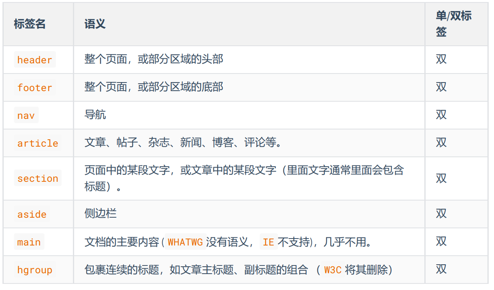
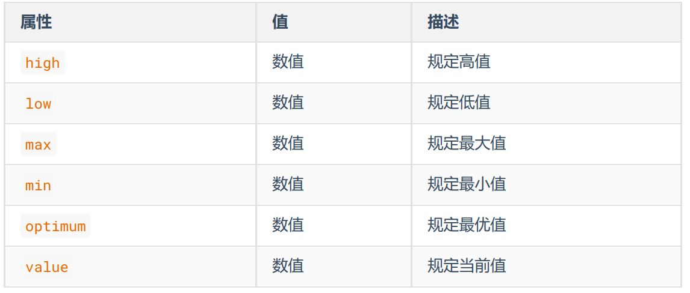
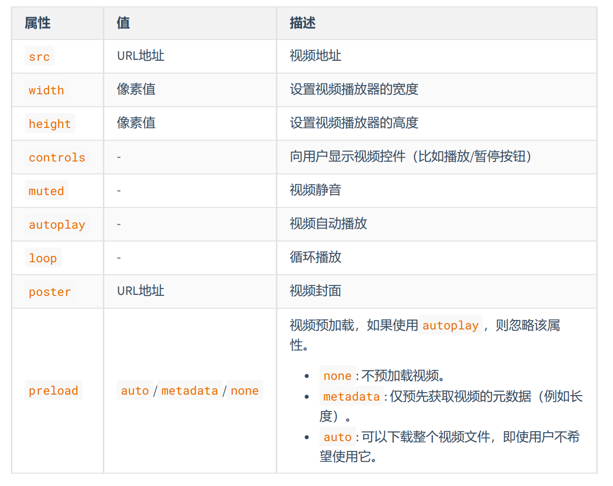
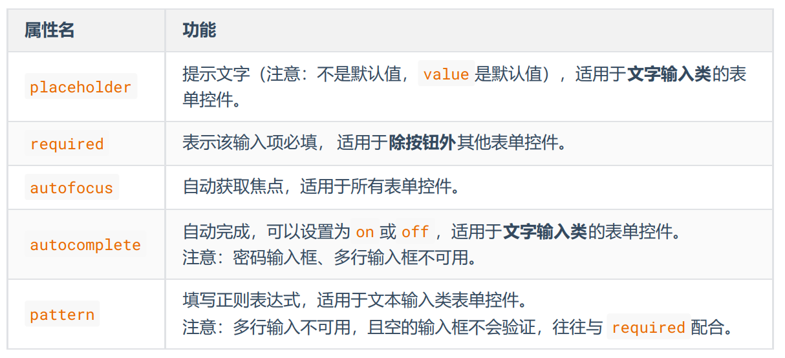
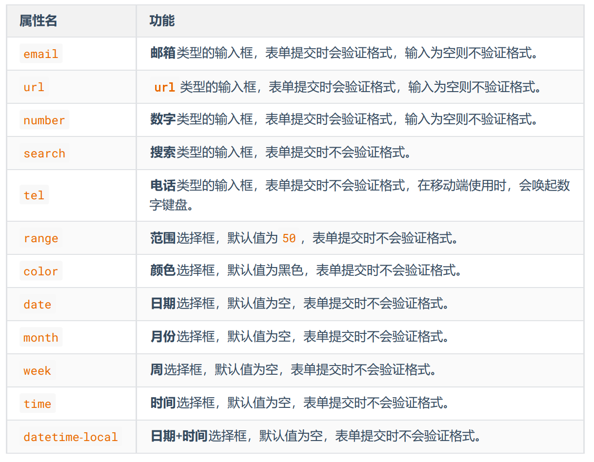
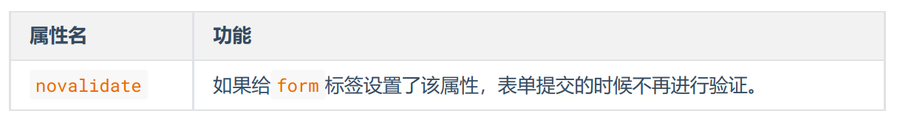
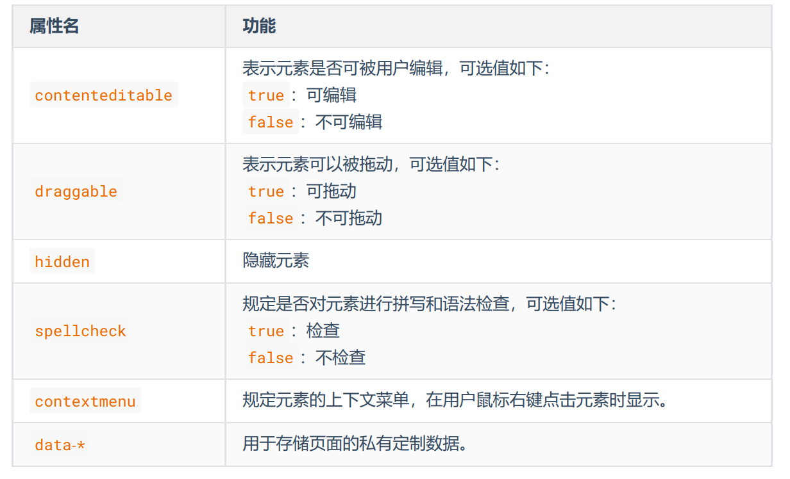

# HTML5

HTML5 是新一代的 HTML 标准，2014年10月由万维网联盟（ W3C ）完成标准制定。HTML5 在狭义上是指新一代的 HTML 标准，在广义上是指：整个前端。

**官网地址：**
- W3C 提供： https://www.w3.org/TR/html/index.html
- WHATWG 提供：https://whatwg-cn.github.io/html/multipage

## 优势

1. 针对 JavaScript ，新增了很多可操作的接口。
2. 新增了一些语义化标签、全局属性。
3. 新增了多媒体标签，可以很好的替代 flash 。
4. 更加侧重语义化，对于 SEO 更友好。
5. 可移植性好，可以大量应用在移动设备上。

## 新增布局标签



**关于 article 和 section ：**

1. artical 里面可以有多个 section 。
2. section 强调的是分段或分块，如果你想将一块内容分成几段的时候，可使用 section 元
素。
3. article 比 section 更强调独立性，一块内容如果比较独立、比较完整，应该使用
article 元素。

[查看示例](https://kt3xj5-3000.csb.app/3_HTML5/01_H5_%E6%96%B0%E5%A2%9E%E8%AF%AD%E4%B9%89%E5%8C%96%E6%A0%87%E7%AD%BE/01_%E6%96%B0%E5%A2%9E%E5%B8%83%E5%B1%80%E6%A0%87%E7%AD%BE)

## 新增状态标签

### meter

定义已知范围内的标量测量。也被称为 gauge （尺度），双标签，例如：电量、磁盘用量等。常用属性如下：



[查看示例](https://kt3xj5-3000.csb.app/3_HTML5/01_H5_%E6%96%B0%E5%A2%9E%E8%AF%AD%E4%B9%89%E5%8C%96%E6%A0%87%E7%AD%BE/02_%E6%96%B0%E5%A2%9E%E7%8A%B6%E6%80%81%E6%A0%87%E7%AD%BE)

### progress

显示某个任务完成的进度的指示器，一般用于表示进度条，例如：工作完成进度等。常用属性如下：

|属性| 值 |描述|
|---|---|---|
|max |数值| 规定目标值。|
|value| 数值 |规定当前值。|


## 新增列表标签

|标签名| 语义| 单/双标签|
|---|---|---|
|datalist| 用于搜索框的关键字提示| 双|
|details| 用于展示问题和答案，或对专有名词进行解释 |双|
|summary| 写在 details 的里面，用于指定问题或专有名词| 双|

[查看示例](https://kt3xj5-3000.csb.app/3_HTML5/01_H5_%E6%96%B0%E5%A2%9E%E8%AF%AD%E4%B9%89%E5%8C%96%E6%A0%87%E7%AD%BE/03_%E6%96%B0%E5%A2%9E%E5%88%97%E8%A1%A8%E6%A0%87%E7%AD%BE)

## 新增文本标签

### 文本注音

```html
<ruby>
    <span>魑魅魍魉</span>
    <rt>chī mèi wǎng liǎng </rt>
</ruby>
```

[查看示例](https://kt3xj5-3000.csb.app/3_HTML5/01_H5_%E6%96%B0%E5%A2%9E%E8%AF%AD%E4%B9%89%E5%8C%96%E6%A0%87%E7%AD%BE/04_%E6%96%B0%E5%A2%9E%E6%96%87%E6%9C%AC%E6%A0%87%E7%AD%BE)

### 文本标记

```html
<p>Lorem ipsum <mark>dolor</mark> sit amet consectetur adipisicing elit. Laboriosam, nemo?</p>
```

**注意：** W3C 建议 mark 用于标记搜索结果中的关键字。

## 新增多媒体标签

### 视频



[查看示例](https://kt3xj5-3000.csb.app/3_HTML5/03_H5_%E6%96%B0%E5%A2%9E%E5%A4%9A%E5%AA%92%E4%BD%93%E6%A0%87%E7%AD%BE/01_%E6%96%B0%E5%A2%9E%E8%A7%86%E9%A2%91%E6%A0%87%E7%AD%BE)


**注意：** 视频只有静音才能自动播放

### 音频


[查看示例](https://kt3xj5-3000.csb.app/3_HTML5/03_H5_%E6%96%B0%E5%A2%9E%E5%A4%9A%E5%AA%92%E4%BD%93%E6%A0%87%E7%AD%BE/02_%E6%96%B0%E5%A2%9E%E9%9F%B3%E9%A2%91%E6%A0%87%E7%AD%BE)


## 新增表单功能

### 表单控件新增属性



[查看示例](https://kt3xj5-3000.csb.app/3_HTML5/02_H5_%E8%A1%A8%E5%8D%95%E7%9B%B8%E5%85%B3%E7%9A%84%E6%96%B0%E5%A2%9E/01_%E6%96%B0%E5%A2%9E%E7%9A%84%E8%A1%A8%E5%8D%95%E6%8E%A7%E4%BB%B6%E5%B1%9E%E6%80%A7)

### input新增属性值



[查看示例](https://kt3xj5-3000.csb.app/3_HTML5/02_H5_%E8%A1%A8%E5%8D%95%E7%9B%B8%E5%85%B3%E7%9A%84%E6%96%B0%E5%A2%9E/02_input%E6%96%B0%E5%A2%9E%E7%9A%84type%E5%B1%9E%E6%80%A7%E5%80%BC)

### form标签新增属性



## 新增全局属性（了解）



[查看示例](https://kt3xj5-3000.csb.app/3_HTML5/04_H5_%E6%96%B0%E5%A2%9E%E7%9A%84%E5%85%A8%E5%B1%80%E5%B1%9E%E6%80%A7/%E6%96%B0%E5%A2%9E%E7%9A%84%E5%85%A8%E5%B1%80%E5%B1%9E%E6%80%A7)

## 兼容性处理

1. 添加元信息，让浏览器处于最优渲染模式。

```html
<!--设置IE总是使用最新的文档模式进行渲染-->
<meta http-equiv="X-UA-Compatible" content="IE=Edge">
<!--优先使用 webkit ( Chromium ) 内核进行渲染, 针对360等壳浏览器-->
<meta name="renderer" content="webkit">
```

2. 使用 html5shiv 让低版本浏览器认识 H5 的语义化标签。

```html
<!--[if lt ie 9]>
<script src="../sources/js/html5shiv.js"></script>
<![endif]-->
```

```
<!--[if IE 8]>仅IE8可见<![endif]-->
<!--[if gt IE 8]>仅IE8以上可见<![endif]—>
<!--[if lt IE 8]>仅IE8以下可见<![endif]—>
<!--[if gte IE 8]>IE8及以上可见<![endif]—>
<!--[if lte IE 8]>IE8及以下可见<![endif]—>
<!--[if !IE 8]>非IE8的IE可见<![endif]-->
```