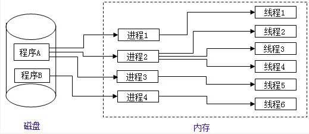
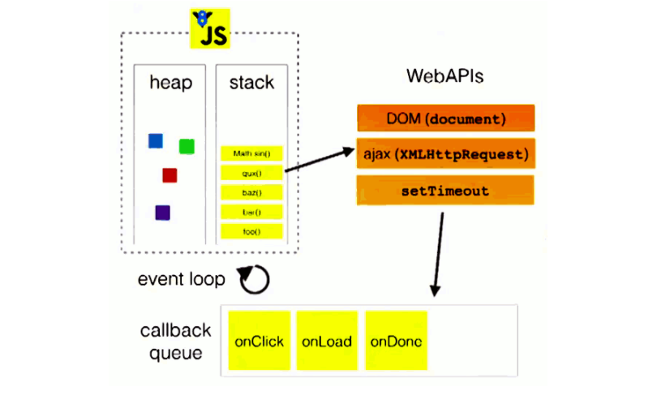

# JavaScript高级

本套笔记只包含ES5内容。

## 数据类型

**原始类型：** String、Number、Boolean、undefined、null

**对象类型：** Object（任意对象）、Function（可以执行的对象）、Array（key为索引的对象）

undefined和null类型比较特殊，他们的值只能是他自身，只有一个值。

原始类型也可以叫做**不可变类型**，对象类型叫做**可变类型**，他们的值都存在堆内存中，变量中存储的只是一个内存地址。

#### typeof类型判断

typeof 操作符返回一个字符串，表示未经计算的操作数的类型

typeof 可以判断 `undefined / 数值 / 字符串 / 布尔值 / function`，不能判断`null /object / array`，因为 `null / object / array`返回值都是`object`，无法区分。

#### instanceof 类型判断

`A instanceof B` 运算符检测A的`prototype`属性是否在B的原型链上，返回一个布尔值。

```js
var b1 = {
  b2: [1, 'abc', console.log],
  b3: function () {}
}
// 使用instanceof进行对象判断
console.log(b1 instanceof Object) // true
console.log(null instanceof Object) // false
// 注意：数组是特殊的对象
console.log(b1.b2 instanceof Array, b1.b2 instanceof Object) // true true
// 注意：函数是特殊的对象
console.log(b1.b3 instanceof Function, b1.b3 instanceof Object) // true true
```

这种方法可以判断引用类型`object、array、function`，但是不能判断值类型`null、undefined、string、number、boolean`

#### 全等运算符

`===`可以判断undefined和null

```js
console.log(null === null); // true
console.log(undefined === undefined); // true
```

上面三种方式各有优缺点，我们可以结合上面三种方式总结一个通用的判断方法。

```js
function getType(val) {
  if(val === null) return 'null';
  if(val instanceof Array) return 'array';
  if(val instanceof Function) return 'function';
  if(val instanceof Object) return 'object';
  return typeof val;
}

// string number boolean null undefined array object function symbol
console.log(getType('hello'), getType(1), getType(true), getType(null), getType(undefined), getType([]), getType({}), getType(getType),getType(Symbol()))
```

#### undefined和null区别

undefined表示定义了未赋值，null表示定义了并赋值为null

```js
var a
console.log(a)  // undefined
a = null
console.log(a) // null
```

## 变量

每个变量在内存中对应一小块存储空间，变量名用来查找这块内存（通过内存地址）。

内存可以简单分为堆内存和栈内存，堆中存储数据（变量的值），栈中存储变量（全局变量和局部变量）。

无论是原始类型数据还是对象类型数据，赋值时本质都是赋值内存地址给变量。不同点在于原始值是不可变的，所以无法通过这个地址值修改数据；对象值是可变的，可以通过地址值修改数据。

```js
var a = 10; // 假设数字10的内存地址是0x01
var b = a; // 数字10在内存中已经存在，b中存储的地址也是0x01
console.log(a === b); // 因为地址值是一样的，所以他们相等
a = 11;
console.log(b); // 由于数字是不可变的类型，所以无法通过0x01修改原地址的10为11；于是在内存中创建数字11，假设地址值是0x02，然后赋值给变量a；变量b存储的还是0x01，所以值是10
```

```js
var a = {name: 'wmui'};
var b = a;
console.log(a === b);
a = {name: 'hello'};
console.log(b); // a中存储的新的地址值，b中存储的是旧的地址值，所以结果是：{name: 'wmui'}
```

```js
var a = {name: 'wmui'};
var b = a;
console.log(a === b);
a.name = 'hello';
console.log(b); // a中存储的地址值未发生过改变，只是根据这个地址值修改了name的值，所以结果是：{name: 'hello'}
```

#### 函数参数是地址值传递

```js
var a = {name: 'wmui'};

function fn(val) {
  val.age = 18
}

fn(a);
console.log(a.age); // 18
```

函数调用时，等价于把变量`a`赋值给变量`val`，因此`val`中存储的`a`的地址值，当修改`val`时候就会影响`a`

#### JS引擎如何管理内存

**局部变量：** 函数执行完毕后自动释放内存

**全局变量：** 没有变量指向这个数据时，由垃圾回收器回收。

```js
var a = 3; // a指向数字3，不会释放内存
var obj = {name:"wmui"};
obj = undefined || null  // 由于没有变量指向 {name:"wmui"}，它会在某个时刻被垃圾回收器回收，但obj不会被回收

// b所指向的对象是在函数执行完后，在某个时刻由垃圾回收器回收
function fn () { var b = {}}
fn()
```

## 对象

对象是一组数据的容器，用于统一管理多个数据，对象由属性和方法组成，方法是特殊的属性（属性值为函数的属性）。

可以通过`obj.propName`和`obj[propName]`两种方式访问属性值

```js
var p = {
  name: 'wmui'
}
conosle.log(p.name); // wmui

 //1. 给p对象添加一个属性: content type: text/json
 // p.content-type = 'text/json' //不能用
 p['content-type'] = 'text/json'
 console.log(p['content-type'])

 //2. 属性名不确定
 var propName = 'myAge'
 var value = 18
 // p.propName = value //不能用
 p[propName] = value
 console.log(p[propName])
 ```

## 函数

函数是实现特定功能的语句封装体，它是唯一一种可以执行的数据类型。通过函数封装，可以实现代码的复用。

可以通过函数声明和函数表达式来定义函数

```js
  function fn1 () { console.log('fn1()' )//函数声明
                   
  var fn2 = ()=> console.log('fn2()')  //表达式
```

#### 回调函数

我定义的但是我没有手动调用，最终函数执行了，这样的函数就叫做回调函数。

常见的回调函数比如：DOM事件回调、定时器回调、ajax请求、生命周期回调。

```js
  // dom事件回调函数
 document.getElementById('btn').onclick = function () {alert(this.innerHTML)}
 // 定时器回调函数
 setTimeout(function () {   alert('到点了'+this)}, 2000)
```

#### 自调用函数IIFE

IIFE全称: `Immediately-Invoked Function Expression` 自调用函数

主要作用：编码JS模块、不污染全局空间

```js
(function () { //匿名函数自调用
  var a = 3
  console.log(a + 3)
})()
console.log(a) // a is not defined
//此处前方为何要一个`;`,因为自调用函数外部有一个()包裹,可能与前方以()结尾的代码被一起认为是函数调用
//不加分号可能会被认为这样 console.log(a)(IIFE)
;(function () {//不会污染外部(全局)命名空间-->举例
  let a = 1;
  function test () { console.log(++a) } //声明一个局部函数test
  window.$ = function () {  return {test: test} }// 向外暴露一个全局函数
})()
test ()  //test is not defined
$().test()
```
编码时，是否加分号是编码风格问题, 没有应该不应该，只有你自己喜欢不喜欢。有两种情况如果不加分号会有问题：

- 小括号开头的前一条语句
- 中方括号开头的前一条语句


```js
// 会被当做函数调用：1()
var a = 1
(function(){
console.log(1)
})()

// 会被当做取值：2[].push(1)
var b=2
[].push(1)
```

#### 函数中的this

所有函数内部都有一个变量this，它的值是调用函数的当前对象。如果没有调用对象，就指向window

```js
 function Person(color) {
   console.log(this)
   this.color = color;
   this.getColor = function () {
     console.log(this)
     return this.color;
   };
   this.setColor = function (color) {
     console.log(this)
     this.color = color;
   };
 }

 Person("red"); // 相当于window.Person('red')，所以this是window

 var p = new Person("yello"); //this是谁? p

 p.getColor(); //this是谁? p

 var obj = {};
 //调用call会改变this指向-->让setColor函数内部的this指向obj对象
 p.setColor.call(obj, "black"); //this是谁? obj

 var test = p.setColor;
 test(); // this是谁? window  -->因为直接调用了，相当于window.test()

 function fun1() {
   this.a = 1
   function fun2() {  console.log(this.a); } // this是window
   fun2();
 }
fun1();//调用fun1
```

## 原型

### 显式原型

每个函数function都有一个prototype属性，即显式原型，它的值是一个空对象（没有我们自定义的属性）。

```js
function Fun () {
  // this.prototype = {}
}
console.log(Fun.prototype)  // 默认指向一个Object空对象(没有我们的属性)
```

### 隐式原型

每个实例对象都有一个`__ proto __`属性，可称为隐式原型，它的值是构造函数的显示原型。

```js
function Demo() {
   
}
var demo = new Demo();
console.log(demo.__proto__ === Demo.prototype); // true
```

### 原型链

实例对象的隐式原型`__proto__`指向构造函数的显式原型`prototype`（重中之重）。访问实例属性时，就是根据这个关系，向上完成属性查找的。

```js
function Demo() {
    this.test2 = function() { console.log('test2')};
}

Demo.prototype.test = function() { console.log('test')};

// 这是new操作发生时，最重要的一步，执行了 this.__proto__ = Demo.prototype
var demo = new Demo();

// 核心一句话：实例对象的隐式原型（__proto__）指向构造函数的显式原型（prototype）
console.log(demo.__proto__ === Demo.prototype);
console.log(Demo.prototype.__proto__ === Object.prototype);
console.log(Object.prototype.__proto__ === null);
console.log('====================================');

// 函数Demo是Function的实例，Function是对象的实例
console.log(Demo.__proto__ === Function.prototype);
console.log(Function.prototype.__proto__ === Object.prototype)
console.log(Object.prototype.__proto__ === null)
console.log('====================================');

// Object也是实例对象，所以对象是函数的实例
console.log(Object.__proto__ === Function.prototype)

// 原型链：实例是通过隐式原型链(__proto__)完成定义在原型对象上的属性的查找的
// 先去demo自身找，找到了
demo.test2();
// 先去demo自身找，没找到，再去Demo.prototype上找，找到了
demo.test();
// 先去demo自身找，没找到，再去Demo.prototype上找，没找到，再去Object.prototype上找，找到了
console.log(demo.toString())
```

**重点：函数是对象的实例，对象是函数的实例**

### 构造函数

简单说，用来创建实例的函数就是构造函数，通常我们把这种函数的首字母大写，用于区分普通函数。

创建函数时候的prototype属性，它的值虽然没有我们自定义的属性，但是有其他默认属性，其中有个叫做constructor的属性，他的值指向构造函数本身。

这个属性的作用是为了让我们可以判断出实例是谁构造出来的。

`A instanceof B`运算符在判断的时候，只要A实例沿着原型链能找到B对象，就返回true，找不到就返回false。

```js
function Fun () {
}
console.log(Fun.prototype.constructor === Fun); // true

var f = new Fun();
console.log(f instanceof Fun); // true
console.log(f instanceof Object); // true
```

```js
 console.log(Object instanceof Function) // true
 console.log(Object instanceof Object) // true
 console.log(Function instanceof Function) // true
 console.log(Function instanceof Object) // true
```

### new运算符

当我们使用new运算符调用函数时，发生了什么？

1. 在构造函数内部创建了一个空实例对象
2. 实例对象的隐式原型指向构造函数的显式原型
3. 修改构造函数this，指向为实例对象
4. 返回实例

```js
function Fun() {
  // var instance = {};
  // instance.__proto__ = Fun.prototype;
  // this = instance;
  // return this
}

const instance = new Fun()
```

### 测试题

```js
 function A () {}
 A.prototype.n = 1
 var b = new A()
 A.prototype = { n: 2, m: 3}
 var c = new A()
 
 console.log(b.n, b.m, c.n, c.m) // 1 undefined 2 3
 ```

```js
 function F (){}
 Object.prototype.a = function(){
   console.log('a()')
 }
 Function.prototype.b = function(){
   console.log('b()')
 }
 
 let f = new F()
 f.a() //a()
 f.b() //f.b is not a function -->找不到
 F.a() //a()
 F.b() //b()

 console.log(f)
 console.log(Object.prototype)
 console.log(Function.prototype)
 ```

### 继承

使用原型链和构造函数，实现组合继承。

```js
function Person(name, age) {
 this.name = name
 this.age = age
}

Person.prototype.setName = function (name) {
 this.name = name
}

function Student(name, age, price) {
 Person.call(this, name, age)  // 为了得到属性
 this.price = price
}
Student.prototype = new Person() // 原型修改为Person的实例（原本是Object的实例）
Student.prototype.constructor = Student //修正constructor属性
Student.prototype.setPrice = function (price) {
 this.price = price
}

var s = new Student('Tom', 24, 15000)
s.setName('Bob')
s.setPrice(16000)
console.log(s.name, s.age, s.price)
```

## 执行上下文

执行上下文就是当前代码的执行环境，这个环境通常会在代码执行前后完成一些其他操作，如执行前的预数据处理，执行后的垃圾回收。执行上下文可以分为全局执行上下文和局部（函数）执行上下文，执行上下文是动态的, 调用函数时创建, 函数调用结束时就会自动释放

### 全局执行上下文

在执行全局代码前，将window确定为全局执行上下文，并对全局数据进行预处理，具体如下：

1. var定义的全局变量, 添加为window的属性，值为undefined
2. function声明的全局函数, 添加为window的方法
3. this赋值为window


### 函数执行上下文

在调用函数时, 准备执行函数体之前, 创建对应的函数执行上下文对象(虚拟的, 存在于栈中)，并对局部数据进行预处理，具体如下：

1. 把实参赋值给形参，并添加为执行上下文的属性
2. 把实参列表赋值给arguments，并添加为执行上下文的属性
3. var定义的局部变量赋值为undefined，并添加为执行上下文的属性
4. function声明的函数，添加为执行上下文的方法
5. this赋值为调用函数的对象

### 变量声明提升和函数声明提升

变量声明提升和函数声明提升是全局执行上下文在预处理阶段完成的，因此我们可以在声明前访问到变量和函数。

#### 变量声明提升

通过var定义(声明)的变量, 在定义语句之前就可以访问到，值为undefined

#### 函数声明提升

通过function声明的函数, 在之前就可以直接调用，值为函数定义(对象)

```js
var a = 3
 function fn () {
   console.log(a)
   var a = 4 //变量提升
 }
 fn()  //undefined
 ```

```js
console.log(b) //undefined  变量提升
 fn2() //可调用  函数提升
 // fn3() //不能  变量提升
 var b = 3
 function fn2() {  console.log('fn2()') }
 var fn3 = function () { console.log('fn3()') }
 ```

#### 优先级

先执行变量提升，再执行函数提升。

```js
function a() {}
var a
console.log(typeof a) // 'function'


function b() {}
var b = 1
console.log(typeof b) // 'number'
```

```js
// b提升后值为undefined，if判断为false，因此不会执行赋值操作。
if (!(b in window)) {
 var b = 1
}
console.log(b) // undefined
```

```js
var c = 1
function c(c) {
 console.log(c)
 var c = 3 // 与此行无关
}
c(2) // 报错  c is not a function 第一次c的值undefined，第二次c的值是函数，第三次c的值是1
```

## 执行上下文栈

执行上下文通常是多个的，JS引擎用栈结构来管理多个上下文对象。

1. 在全局代码执行前, JS引擎就会创建一个栈来存储管理所有的执行上下文对象
2. 在全局执行上下文(window)确定后, 将其添加到栈中(压栈)-->所以栈底百分百是[window]
3. 在函数执行上下文创建后, 将其添加到栈中(压栈)
4. 在当前函数执行完后,将栈顶的对象移除(出栈)
5. 当所有的代码执行完后, 栈中只剩下window

所以栈中上下文数量等于函数的调用次数+1（1是window对象）


```js
//1. 进入全局执行上下文
var a = 10
var bar = function (x) {
  var b = 5
  fn(x + b)   //3. 进入fn执行上下文           
}
var fn = function (y) {
  var c = 5
  console.log(a + c + y)
}
bar(10) //2. 进入bar函数执行上下文
```


## 作用域

作用域就是代码运行的一块区域，分为全局作用域和函数作用域（es6新增了块作用域），JS中的作用域是静态的，在代码编写时就确定了（动态作用域是根据代码运行时决定的）

作用域的主要作用是隔离变量，不同作用域下同名变量不会有冲突。

```js
/*  //没块作用域
 if(true) { var c = 3 }
 console.log(c)
 */
 var a = 10,
   b = 20
 function fn(x) {
   var a = 100, c = 300;
   console.log('fn()', a, b, c, x) //100 20 300 10
   function bar(x) {
     var a = 1000, d = 400
     console.log('bar()', a, b, c, d, x)
   }
   bar(100)//1000 20 300 400 100
   bar(200)//1000 20 300 400 200
 }
 fn(10)
 ```

 ### 作用域链

 多个上下级关系的作用域形成的链, 它的方向是从下向上的(从内到外)，查找变量时就是沿着作用域链来查找的

 ```js
 var a = 1
 function fn1() {
   var b = 2
   function fn2() {
     var c = 3
     console.log(c)
     console.log(b)
     console.log(a)
     console.log(d)
   }
   fn2()
 }
 fn1()
 ```

 ```js
//  作用域在函数定义时就已经确定了。而不是在函数调用时
var x = 10;
 function fn() { console.log(x); }
 function show(f) {
   var x = 20;
   f();
 }
 show(fn); //输出10
```

```js
var obj = { //对象变量不能产生局部作用域,所以会找到全局去,导致报错
 fn2: function () {
  console.log(fn2)
  //console.log(this.fn2)
 }
}
obj.fn2()
```

## 闭包函数

```js
 function fn1() {
   var a = 1
   function fn2() {
     console.log(a)
   }
 }
 fn1(); // 此时产生闭包
```

**什么是闭包？** 示例中的fn2就是一个闭包，更具体点说是fn2中的a是一个闭包。

**如何形成一个闭包函数？** 形成闭包函数需要满足三个条件：

1. 函数发生嵌套
2. 内部函数访问外部函数的数据
3. 外部函数被调用

示例中如果没有`fn1()`，就不算形成闭包。

### 闭包使用场景示例

```html
<button>测试1</button>
<button>测试2</button>
<button>测试3</button>

<script type="text/javascript">
 for (var i = 0,length=btns.length; i < length; i++) {
    // 有函数嵌套、有内部访问外部变量
   (function (j) {
     var btn = btns[j]
     btn.onclick = function () {
       alert('第'+(j+1)+'个')
     }
   })(i)
 }
</script> 
```

### 柯里化函数

了解柯里化前需要知道什么是高阶函数

:::tip 高阶函数
函数的参数或返回值是一个函数，这样的函数被称为高阶函数，常见的高阶函数有map、reduce、filter、sort等
:::

柯里化函数是一种使用了闭包的高阶函数，他是在闭包的基础上，把内部函数作为了返回值，这样形成的函数就是柯里化函数

```js
function add(a) {
    return function(b) {
        return a + b
    }
}
var ret = add(3)(4)
```

### 闭包的声明周期

在外部函数调用时产生，在内部函数称为垃圾对象时死亡。

```js
function fn1() {
   var a = 2
   function fn2 () {
     a++
     console.log(a)
   }
   return fn2
 }
 var f = fn1(); // 闭包产生
 f = null //闭包死亡(包含闭包的函数对象成为垃圾对象)
```

### 闭包的应用

- JS模块化
- 柯里化函数
- 内部函数持久访问外部函数数据

### 闭包易错题

```js
//代码片段一  -->没有产生闭包:因为内部函数没有调用外部变量
var name = "The Window";
var object = {
 name : "My Object",
 getNameFunc : function(){
   return function(){
     return this.name;
   };
 }
};
alert(object.getNameFunc()());  //?  the window
//函数体的this是window

//代码片段二
var name2 = "The Window";
var object2 = {
 name2 : "My Object",
 getNameFunc : function(){
   var that = this;
   // 产生闭包
   return function(){
     return that.name2;
   };
 }
};
alert(object2.getNameFunc()()); //?  my object
```

### 闭包的缺点

由于闭包函数内部可以持久访问外部函数的数据，所以如果外部函数没有及时释放，内部的数据会一直在内存中，如果这个数据很大，就会造成内存泄露。

```js
function fn1() {
  var arr = new Array(100000)
  function fn2() {
    console.log(arr.length)
  }
  return fn2
}
var f = fn1()
f()
f = null // 使用完后，让内部函数成为垃圾对象-->回收闭包；如果不回收，arr会一直在内存中
```

### 内存溢出和内存泄露

#### 内存溢出

程序运行需要的内存超过了剩余的内存时, 就出抛出内存溢出的错误

```js
var obj = {}
for (var i = 0; i < 10000; i++) {
  obj[i] = new Array(10000000)
  console.log('-----')
}
```

#### 内存泄露

内存泄露是占用的内存没有及时释放，内存泄露积累多了就容易导致内存溢出。

常见的内存泄露: 意外的全局变量、没有及时清理的计时器或回调函数、闭包

```js
  // 意外的全局变量
 function fn() {
   a = new Array(10000000)  //不使用var let const去承接
   console.log(a)
 }
 fn()

  // 没有及时清理的计时器或回调函数
 var intervalId = setInterval(function () { //启动循环定时器后不清理
   console.log('----')
 }, 1000)

 // clearInterval(intervalId)

   // 闭包
 function fn1() {
   var a = 4
   function fn2() {
     console.log(++a)
   }
   return fn2
 }
 var f = fn1()
 f()
 // f = null
 ```

## 进程和线程



**进程：** 操作系统分配给软件运行的独立内存空间，有些软件可以启动多个实例，每个实例分配一个进程，这种软件被称为多进程软件。进程之间的数据是不能共享的，内存相互隔离。

**线程：** 进程中的独立执行单元，是程序运行的一个完整流程，代码必需在线程中执行。线程是CPU的最小调度单位。一个进程中可以运行多个线程，线程之间是的数据是可以共享的，这种共享方式被称作线程间通信。

**线程池：** 保存多个线程对象的容器，实现线程对象的反复利用

**主线程**：程序必定运行在某个进程的某个线程上，一个进程中至少有一个线程，这个线程被称为主线程。


Chrome浏览器是一个多进程的软件，JS是一种单线程的编程语言。单线程的优点是编程简单，缺点是效率低，不能有效利用CPU，如果代码中有耗时的运算，就会感觉程序像卡住了。如果是多线程的语言，可以把计算让分线程执行，不影响主线程的程序运行，分线程把计算结果告诉主线程就可以了。多线程优点是能有效利用CPU，但是相应的也增加了编码难度。

JS为什么不设计成多线程的？JS作为浏览器脚本语言，这种语言最初的用途是为了和用户互动以及操作DOM，如果设计成多线程的，会带来复杂的同步问题：如果我们要先更新然后再删除一个节点，单线程这么做没问题；但是多线程，更新和删除如果是删除先完成了，更新就会出错。

## 浏览器内核

以Chrome为例，Chrome浏览器是多进程、多线程的软件，在运行程序时，主线程和分线程各司其职：

#### 主线程

- JS引擎模块：负责JS的编译和运行
- HTML/CSS文档解析模块：负责页面文本的解析
- DOM/CSSOM模块：负责DOM和CSSOM在内存中的相关处理
- 布局和渲染模块：负责页面的布局和效果绘制

#### 分线程

- 定时器模块: 负责定时器的管理
- 网络请求模块: 负责服务器请求
- 事件响应模块: 负责事件的管理

## 事件循环模型（Event Loop）

JavaScript是一种**单线程、非阻塞**的编程语言，上面说了单线程，接下来说说非阻塞。

**非阻塞：** 当代码执行遇到异步任务时（通常是需要花费时间才有结果的任务），主线程会挂起这个任务，等异步任务有结果的时候，主线程再根据规则执行回调，这个规则就是事件循环模型。



**事件队列：** 所有被挂起的任务会被放到一个队列中，这个队列被称为事件队列，队列是一种先进先出的数据结构。

**事件循环：** 主线程在执行过程中，会把同步任务放到执行栈中，异步任务放到事件队列中（图中的webAPIs）。当栈中的同步任务执行完毕，他就会把事件队列中的任务放到执行栈中一次一个的执行，等到事件队列和栈都没有任务了就休眠。

**宏任务和微任务：** 异步任务可以分为宏任务和微任务，宏任务统一放到宏任务队列管理，微任务统一放到微任务队列管理。主线程每次准备取出一个宏任务执行前，都要将所有的微任务一个一个取出来执行。

- 宏任务：DOM Events、AJAX、setTimeout、setInterval、requestAnimationFrame、I/O
- 微任务：Promise 回调、process.nextTick（node独有）、MutationObserver、queueMicrotask

```js
  // 宏任务中有微任务
  setTimeout(() => { 
    console.log(1)
    Promise.resolve().then(() => console.log(2))
  })

  // 宏任务
  setTimeout(() => { 
    console.log(3)
  })

  // 微任务中有宏任务
  Promise.resolve().then(() => {
      console.log(4)
      setTimeout(() => {
          console.log(5)
      })
  })

  // 微任务
  Promise.resolve().then(() => {
      console.log(6)
  })

  // 同步任务
  console.log('hello')

  // hello (同步) 4（微） 6（微）1（宏）2（宏中微）3（宏）5（微中宏）
```

## Web Worker

Web Workers是JS中的分线程方案，可以实现主线程和分线层的通信。Worker中不能操作DOM、不能跨域加载JS。

**小示例**：输入框输入数字n，获取第n个斐波那契数的值，当n的值比加大时，程序感觉像卡住了。


```html
/<!DOCTYPE html>
<html lang="en">
  <head>
    <meta charset="UTF-8" />
    <meta name="viewport" content="width=device-width, initial-scale=1.0" />
    <title>Document</title>
  </head>
  <body>
    <input type="text" placeholder="数值" id="number" />
    <button id="btn">计算</button>
    <script type="text/javascript">
      // 1 1 2 3 5 8    f(n) = f(n-1) + f(n-2)
      function fibonacci(n) {
        return n <= 2 ? 1 : fibonacci(n - 1) + fibonacci(n - 2);
      }

      var input = document.getElementById("number");
      var btn =  document.getElementById("btn");
      btn.getElementById("btn").onclick = function () {
        var number = input.value;
        var result = fibonacci(number);
        alert(result);
      };
    </script>
  </body>
</html>
 ```

**优化版：** 使用Worker，把计算放到分线程，有结果后通知主线程

```js title="worker.js"
function fibonacci(n) {
  return n <= 2 ? 1 : fibonacci(n - 1) + fibonacci(n - 2);
}

// console.log(this);
this.onmessage = function (event) {
  var number = event.data;
  var result = fibonacci(number);
  this.postMessage(result);
};
```

```html
<!DOCTYPE html>
<html lang="en">
  <head>
    <meta charset="UTF-8" />
    <meta name="viewport" content="width=device-width, initial-scale=1.0" />
    <title>Document</title>
  </head>
  <body>
    <input type="text" placeholder="数值" id="number" />
    <button id="btn">计算</button>
    <script type="text/javascript">
      var input = document.getElementById("number");
      var btn = document.getElementById("btn");
      var worker = new Worker("./worker.js");

      btn.onclick = function () {
        var number = input.value;
        worker.postMessage(number);
      };

      worker.onmessage = function (event) {
        alert(event.data);
      };
    </script>
  </body>
</html>
```