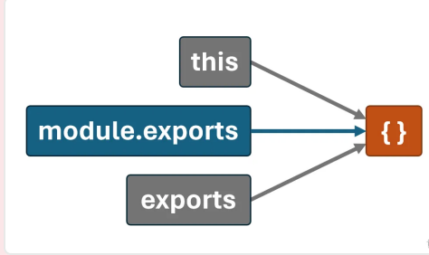

# 模块化

将程序⽂件依据⼀定规则拆分成多个⽂件，这种编码⽅式就是模块化的编码⽅式。拆分出来每个⽂件就是⼀个模块，模块中的数据都是私有的，模块之间互相隔离。同时也能通过⼀些⼿段，可以把模块内的指定
数据“交出去”，供其他模块使⽤。

模块化可有效解决全局污染问题、依赖混乱问题、数据安全问题

## 模块化规范

随着时间的推移，针对 JavaScript 的不同运⾏环境，相继出现了多种模块化规范，按时间排序，
分别为：

1. CommonJS （广泛应用于服务端）
2. ~~AMD~~
3. ~~CMD~~
4. ES6 模块化 （广泛应用于浏览器端）

## 导入与导出

模块化的核⼼思想就是：模块之间是隔离的，通过导⼊和导出进⾏数据和功能的共享

- **导出（暴露）**：模块公开其内部的⼀部分（如变量、函数等），使这些内容可以被其他模块使⽤。
- **导⼊（引⼊）**：模块引⼊和使⽤其他模块导出的内容，以重⽤代码和功能。 

## CommonJS

### 导出

在 CommonJS 标准中，导出数据有两种⽅式：

- 第⼀种⽅式： `module.exports = value`
- 第⼆种⽅式： `exports.name = value`

### 导入

在 CJS 模块化标准中，使⽤内置的 require 函数进⾏导⼊数据

```js
// 直接引⼊模块
const school = require('./school')
// 引⼊同时解构出要⽤的数据
const { name, slogan, getTel } = require('./school')
// 引⼊同时解构+重命名
const {name:stuName,motto,getTel:stuTel} = require('./student')
```

### 示例

```js title="student.js"
const name = '张三'
const motto = '相信明天会更好！'

function getTel (){
  return '13877889900'
}

function getHobby(){
  return ['抽烟','喝酒','烫头']
}

module.exports = {name,motto,getTel}

// console.log(arguments.callee.toString())


// exports.name = name
// exports.motto = motto
// exports.getTel = getTel
```

```js title="school.js"
const name = '尚硅谷'
const slogan = '让天下没有难学的技术！'

function getTel (){
  return '010-56253825'
}

function getCities(){
  return ['北京','上海','深圳','成都','武汉','西安']
}

module.exports = {name,slogan,getTel}

// this.c =789
// exports = {a:1}
// exports.b = 2
// module.exports.c = 3
// module.exports = {d:4}

// console.log(this)
// console.log(exports)
// console.log(module.exports)
// console.log(this === exports && exports === module.exports)

// exports.name = name
// exports.slogan = slogan
// exports.getTel = getTel

```

```js title="index.js"
const {name,slogan,getTel} = require('./school.js')
const {name:stuName,motto,getTel:stuTel} = require('./student.js')

console.log(name)
console.log(slogan)
console.log(getTel())

console.log(stuName)
console.log(motto)
console.log(stuTel())
```

1. 每个模块内部的： this 、 exports 、 modules.exports 在初始时，都指向同⼀
个空对象，该空对象就是当前模块导出的数据，如下图：



```js
// {}
console.log(this)
// {}
console.log(exports)
// {}
console.log(module.exports)
// true
console.log(this === exports && exports === module.exports)
```

2. ⽆论如何修改导出对象，最终导出的都是 module.exports 的值

```js
// 最终导出的是：{d:4}
this.c =789
exports = {a:1}
exports.b = 2
module.exports.c = 3
module.exports = {d:4}
```

3. `exports` 是对 `module.exports` 的初始引⽤，仅为了⽅便给导出象添加属性，所以不能使⽤ `exports = value` 的形式导出数据，但是可以使⽤ `module.exports = xxxx` 导出数据。

### 扩展理解

JS 模块在执⾏时，是被包裹在⼀个内置函数中执⾏的，所以每个模块都有⾃⼰的作⽤域，我
们可以通过如下⽅式验证这⼀说法：

```js
console.log(arguments.callee.toString())
```

内置函数的⼤致形式如下：

```js
function (exports, require, module, __filename, __dirname){
 /*********************/
}
```

## ES6模块

ES6 模块化规范是⼀个官⽅标准的规范，它是在语⾔标准的层⾯上实现了模块化功能，是⽬前最
流⾏的模块化规范，且浏览器与服务端均⽀持该规范。

### 初体验

```js title="student.js"
// 导出name
export const name = '张三'
// 导出motto
export const motto = '相信明天会更好！'
// 导出getTel
export function getTel (){
 return '13877889900'
}
function getHobby(){
 return ['抽烟','喝酒','烫头']
}
```


```js title="school.js"
// 导出name
export let name = {str:'尚硅⾕'}
// 导出slogan
export const slogan = '让天下没有难学的技术！'
// 导出name
export function getTel (){
 return '010-56253825'
}
function getCities(){
 return ['北京','上海','深圳','成都','武汉','⻄安']
}
```


```js title="index.js"
// 引⼊school模块暴露的所有内容
import * as school from './school.js'
// 引⼊student模块暴露的所有内容
import * as student from './student.js'
```


```html title="index.html"
<!DOCTYPE html>
<html>
  <head>
    <meta charset="UTF-8" />
    <title>index</title>
  </head>
  <body>
    <!-- 注意：type为module -->
    <script type="module" src="./index.js"></script>
  </body>
</html>
```

### Node 中运⾏ ES6 模块

- ⽅式⼀：将 JavaScript ⽂件后缀从 .js 改为 .mjs ，Node 则会⾃动识别 ES6 模块。
- ⽅式⼆：在 package.json 中设置 type 属性值为 module 。

### 导出

ES6 模块化提供 3 种导出⽅式：①分别导出、②统⼀导出、③默认导出

#### 分别导出

```js
export let name = {str:'尚硅⾕'}
// 导出slogan
export const slogan = '让天下没有难学的技术！'
// 导出getTel
export function getTel (){
 return '010-56253825'
}
```

#### 统一导出

```js
const name = {str:'尚硅⾕'}
const slogan = '让天下没有难学的技术！'
function getTel (){
 return '010-56253825'
}
function getCities(){
 return ['北京','上海','深圳','成都','武汉','⻄安']
}
// 统⼀导出了：name,slogan,getTel
export {name,slogan,getTel}
```

#### 默认导出

```js
const name = '张三'
const motto = '⾛⾃⼰的路，让别⼈五路可⾛！'
function getTel (){
 return '13877889900'
}
function getHobby(){
 return ['抽烟','喝酒','烫头']
}
//默认导出：name,motto,getTel
export default {name,motto,getTel}
```

#### 混合导出

上述多种导出⽅式，可以同时使⽤

```js
export const name = {str:'尚硅⾕'}
const slogan = '让天下没有难学的技术！'

function getTel (){
 return '010-56253825'
}
function getCities(){
 return ['北京','上海','深圳','成都','武汉','⻄安']
}
// 导出slogan ———— 统⼀导出
export {slogan}
// 导出getTel ———— 默认导出
export default getTel
```

### 导入

对于 ES6 模块化来说，使⽤何种导⼊⽅式，要根据导出⽅式决定。

#### 全部导入

可以将模块中的所有导出内容整合到⼀个对象中，是一种通用导入方式。

```js
import * as school from './school.js'
```


#### 命名导入

当使用分别导出、统⼀导出方式导出模块数据时，使用命名导入

```js
export const name = {str:'尚硅⾕'}
//分别导出
export const slogan = '让天下没有难学的技术！'
function getTel (){
 return '010-56253825'
}
function getCities(){
 return ['北京','上海','深圳','成都','武汉','⻄安']
}
//统⼀导出
export { getTel }
```

命名导入

```js
import { name,slogan,getTel } from './school.js'
```

导入并重命名

```js
import { name as myName,slogan,getTel } from './school
```

#### 默认导入

默认导出数据时，使用默认导入

```js
const name = '张三'
const motto = '⾛⾃⼰的路，让别⼈五路可⾛！'
function getTel (){
 return '13877889900'
}
function getHobby(){
 return ['抽烟','喝酒','烫头']
}
//使⽤默认导出的⽅式，导出⼀个对象，对象中包含着数据
export default { name,motto,getTel }
```

```js
//默认导出的名字可以修改，不是必须为student
import student from './student.js'
```

#### 混合导入

命名导⼊与默认导⼊可以混合使⽤

```js
//分别导出
export const name = {str:'尚硅⾕'}
const slogan = '让天下没有难学的技术！'
function getTel (){
 return '010-56253825'
}
function getCities(){
 return ['北京','上海','深圳','成都','武汉','⻄安']
}
// 统一导出
export { slogan }
//默认导出
export default getTel
```

混合使⽤时，默认导⼊的内容必须放在前⽅：

```js
import getTel,{name,slogan} from './school.js'
```

#### 动态导入（通用）

允许在运⾏时按需加载模块，返回值是⼀个 Promise

```js
const demo = async () => {
    // result是导出的对象数据
    const result = await import('./student.js')
    console.log(result.name)
}
demo()
```

import 可以不接收任何数据，例如只是让 mock.js 参与运⾏

```js title="mock.js"
const ret = 'hello';
console.log(ret);
```
```js
import './mock.js'
```

### 数据引用问题

思考1： 如下代码的输出结果是什么？

```js
function count (){
 let sum = 1
 function increment(){
 sum += 1
 }
 return {sum,increment}
}
const {sum,increment} = count()
console.log(sum) // 1
increment()
increment()
console.log(sum) // 1
```

思考2：使⽤ CommonJS 规范，编写如下代码，输出结果是什么？

```js
let sum = 1
function increment (){
 sum += 1
}
module.exports = {sum,increment}
```

```js
const {sum,increment} = require('./count.js')
console.log(sum) // 1
increment()
increment()
console.log(sum) // 1
```

思考3：使⽤ ES6 模块化规范，编写如下代码，输出结果是什么

```js
let sum = 1
function increment(){
 sum += 1
}
export {sum,increment}
```

```js
import {sum,increment} from './count.js'
console.log(sum) //1
increment()
increment()
console.log(sum) //3
```

es6模块导入的变量是地址引用，这在某些情况下会带来问题。使⽤原则：导出的常量，务必⽤ const 定义

## AMD（了解）

[查看示例代码](https://codesandbox.io/p/github/wmui/htmlcss/main?file=%2F6_AMD%2Findex.html%3A2%2C7)

[打开控制台查看结果](https://kt3xj5-3000.csb.app/6_AMD/)

## CMD（了解）

[查看示例代码](https://codesandbox.io/p/github/wmui/htmlcss/main?file=%2F7_CMD%2Findex.html)

[打开控制台查看结果](https://kt3xj5-3000.csb.app/6_CMD/)