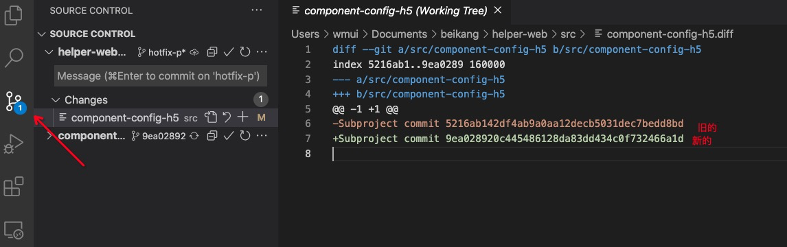

# Git版本控制

## 下载安装

[官方下载安装](https://git-scm.com/downloads)

## 配置用户信息

如果没有配置过则添加，如果配置过则覆盖（相当于修改）

```sh
git config --global user.eamil xxx@gmail.com
git config --global user.name xxx
```

## 管理项目

```sh
# 初始化Git仓库
git init

# 添加文件跟踪，新文件一定要先跟踪
git add <filename>  # 跟踪指定文件
git add . # 跟踪当前目录下所有文件

# 提交文件变更到仓库
git commit -m "message"

# 查看仓库中文件状态
git status
```

## 分支

```sh
# 创建分支
git branch <branchname>

# 切换到指定分支
git checkout <branchname>

# 查看有哪些分支
git branch

# 删除分支
git branch -d <branchname>

# 修改当前分支名字
git branch -m <branchname>
```
## 标签

标签是给某个commit节点起一个别名

```sh
# 添加标签
git tag v1.0.0

# 删除标签
git tag -d v1.0.0

# 查看本地所有标签
git tag

# 切换到指定标签
git checkout v1.0.0

# 给某个节点添加标签
git tag v1.0.0 <commitId>

# 添加标签并添加信息
git tag v1.0.0 -m "<tagInfo>" <commitId>
```

## 提交记录

```sh
# 查看所有提交记录
git log --oneline

# 版本回退，把head指针指向某个commit，暂存区内容不会丢失并检出
git reset --hard <commitId>

# 版本回退，把head指针指向某个commit，暂存区内容会丢失
git reset --hard <commitId>

# 取消回退
git reflog # 先查看之前的commitId
git reset --hard <commitId> # 回退到这个commitId

```

每个分支都有一个头指针，默认指向该分支的最新的commit

## 远程仓库

以github为例，演示远程仓库的相关操作

### 配置ssh

首次使用需要先配置ssh，这样才有权限推送

```sh
# 先到ssh目录下，查看是否已经有id_rsa和id_rsa.pub两个文件
cd ~/.ssh

# 如果没有，在用户目录下执行命令，创建id_rsa和id_rsa.pub
ssh-keygen -t rsa -C "xxx@gmail.com"

# 把id_rsa.pub的内容复制到github
https://github.com/settings/keys 
```

### 远程分支

首先在github上创建一个空的远程仓库，比如`https://github.com/wmui/gitdemo.git`

```sh
# git remote add 链接远程仓库，origin表示仓库名，可以自定义，相当于url的别名
git remote add origin <url>
```

```sh
# 查看远程分支，-r是--remotes的缩写
git branch -r
git ls-remote

# 推送分支到远程
git push origin master # 直接推送，后续推送重复该命令
git push -u origin master # 关联推送，后续推送可以直接使用 git push 推送
git push -f # 强制推送，当前分支落后远程分支，并想用落后的覆盖最新的（谨慎使用）

# 删除远程分支
git push -d origin master

# 修改远程分支，比如修改master为main
git branch -m main # 先修改本地分支
git push -d origin master # 然后删除远程分支
git push -u origin main # 最后推送新分支

# 拉取最新代码
git fetch # 仅拉取
git pull # 拉取并合并，相当于git fetch和git merge
```

### 远程标签

```sh
# 推送标签
git push origin v1.0.0 # 推送指定标签
git push origin --tags # 推送所有标签

# 删除标签
git push -d origin v1.0.0

# 查看远程标签
git ls-remote --tags
```

### 克隆远程仓库

```sh
git clone https://github.com/wmui/gitdemo.git
```

## 分支合并

当多人开发时，常会涉及到合并代码，假设有两个分支：master和hotfix

### merge

把hotfix的代码合并到master

```sh
# 获取最新的分支代码
git checkout master
git pull

# 无冲突合并
git merge hotfix
git push

# 如果有冲突，在master上解决完冲突后重新commit一次
git add .
git commit -m "fix merge"
git push
```

### rebase

rebase变基，基点默认是创建新分支时指向的那个commit。通过修改基点为最新的commit，可以使commit记录保持一条线，整体更加干净。

**注意：** rebase只是变基，合并还是需要merge。

```sh
# 获取最新的分支代码
git checkout master
git pull

# 把hotfix的基点指向最新的master
git checkout hotfix
git rebase master 

# 如果有冲突，在hotfix分支解决冲突，解决完commmit一次
git checkout master
git megre hotfix
git push
```

## 保存现场

把本次修改内容和最近一次commit之间的不同，作为现场进行保留。

常用于需要临时切换分支修改代码，比如要去修改某个bug，当前功能还在开发，这时候可以保留现场

```sh
# 保留现场
git add .
git stash

# 恢复现场
git stash pop
```

## 忽略文件

在项目目录下新建一个.gitignore文件，可以自定义不需要跟踪的文件，文件格式规范如下:

1. 所有的空行，或者以注释符号 ＃ 开头的行都会被 Git 忽略
2. 可以使用标准的glob模式匹配
3. 匹配模式最后跟斜杠(/)说明要忽略的是目录
4. 要忽略指定模式以外的文件或目录，可以在模式前加上叹号(!)取反

```sh
# 忽略所有 .md 结尾的文件
*.md

# 忽略public中的所有文件，但不忽略.gitkeep
public/*
!.gitkeep

# 仅仅忽略项目根目录下的 dist 文件，不包括 subdir/dist
/dist

# 忽略 build/ 目录下的所有文件
build/

# 会忽略 doc/notes.txt 但不包括 doc/server/arch.txt
doc/*.txt

# 忽略 doc 文件夹下的所有txt文件，包括子目录
doc/**/*.txt
```

如果修改`.gitignore`后发现无效，先执行`git rm -r --cached .`清除缓存

## 团队合作

略


## 子仓库

[git submodule](https://git-scm.com/book/zh/v2/Git-%E5%B7%A5%E5%85%B7-%E5%AD%90%E6%A8%A1%E5%9D%97) 是git提供的一个用于管理代码复用的解决方案，submodule表示子仓库

假设现在有A、B、C三个git仓库，C仓库是公共代码，A和B依赖于C:

### 初始化

```sh
# 分别在A、B仓库下执行下面命令，添加C子仓库
git submodule init
# 把c仓库中的内容，clone到当前项目的src/submodule-components
git submodule add https://github.com/wmui/c.git src/submodule-components
```

完成初初始化后会在跟目录下有一个`.gitsubmodule`文件

```js
[submodule "src/submodule-components"]
	path = src/submodule-components
	url = https://github.com/wmui/c.git
```

### 子仓库更新

1. C仓库的管理和普通git仓库一样，更新完后提交

2. 当submodule有更新，A仓库和B仓库`git pull`代码时，vscode会提示会有更新，这时候只要执行 `git submodule update --remote`  就可以更新到最新版

3. 吧更新完成后的项目推到远程

```sh
# A项目拉取代码
git pull

# 更新submodule
git submodule update --remote

# 推送
git add .
git commit -m "update submodule"
git push
```



### 克隆有子仓库的项目

```sh
git clone https://github.com/demo/a.git

# clone结束后，子模块是空的，这时候需要一次初始化
git submodule init && git submodule update
```

### 删除submodule

```sh
# 移除 .gitmodules
rm -rf  .gitmodules

# 移除子模块，并清除git缓存
git rm -rf src/submodule-components
git rm --cached src/submodule-components

# 如果git config中有submodule，删除submodule配置
cat .git/config

# 完成以上操作后，git commit修改，然后就可以重新添加submodule了
git commit -am "remove submodule"
```