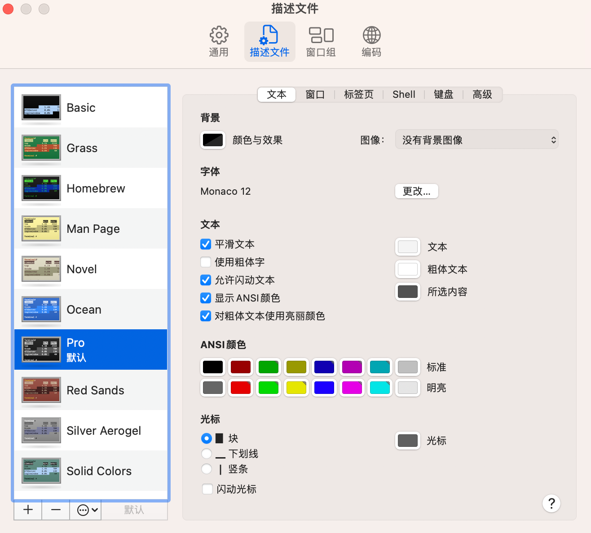
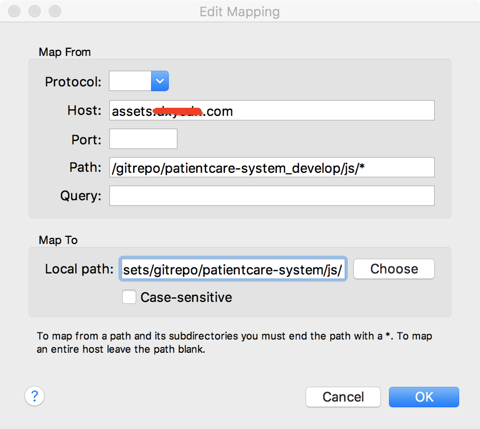

# Mac

Mac中常用软件和配置

## clash

[clash for windows](https://www.clashforwindows.net/clash-for-windows-download/)


## homebrew

tun模式下载homebrew

```sh
# Homebrew 需要 Apple Xcode 中的 Xcode 命令行工具
xcode-select --install

# 安装Homebrew
/bin/bash -c "$(curl -fsSL https://raw.githubusercontent.com/Homebrew/install/HEAD/install.sh)"
```

## zsh

```sh
# 下载zsh
brew install zsh

# 将 zsh 设置为系统默认 shell
chsh -s /bin/zsh

# 安装oh-my-zsh
sh -c "$(curl -fsSL https://raw.github.com/ohmyzsh/ohmyzsh/master/tools/install.sh)"

# 编辑配置文件，修改主题
code ~/.zshrc
ZSH_THEME="awesomepanda"

# 设置zshconfig别名
alias zshconfig="code ~/.zshrc"

# 设置代理
alias setproxy='export http_proxy=http://127.0.0.1:7890;export https_proxy=http://127.0.0.1:7890;' # 设置终端代理
alias disproxy='unset http_proxy https_proxy' # 取消终端代理
```

修改终端设置：默认描述文件改为pro



## mackup

```sh
brew install mackup

# 把常用软件配置，同步到icloud
mackup backup

# 恢复常用软件到本机
mackup restore
```

## Nginx

```sh
brew install nginx
brew services start nginx
brew services stop nginx
```

Mac上，默认使用的8080端口，而在window和linux上默认使用的80端口。可以通过修改nginx.conf文件修改端口号。

## charles

首先关闭代理软件，启动Charles，Charles会自动设置Mac的本地代理为8888端口。

这时候浏览器访问http类型的网站，可以在charles中看到相关请求（因为浏览器会自动走mac的代理）

### 安装https证书

`Help -> SSL Proxying -> Install Charles Root Certificate`

设置完成后关闭证书设置页面，就可以在电脑上抓https的包了，默认是全部抓取，在`Proxy -> SSL Proxy Settings`中可以设置抓取哪些域名

### iOS抓包

1. Help -> SSL Proxying -> save Charles Root Certificate 把证书保存到桌面
2. 把证书文件上传到服务器，用safari打开这个链接，回自动弹出下载证书
3. iphone中：设置 -> 通用 -> 描述文件，安装这个证书
4. 设置 -> 通用 -> 关于本机 -> 证书信任设置，信任这个证书
5. iphone中打开wifi设置，设置代理ip为当前电脑的ip，并且处于同一个局域网
6. 手机访问https网站，Charles会弹出收否允许代理，允许后可以看到相关代理

**注意：**不同版本的Charles的https证书可能是不一样的，因此手机的证书和电脑的证书必须是同一个才能抓包。

### map local

把代码中的远程地址访问，代理到本地访问



### map rewrite

把代码中的远程地址访问，代理到本地访问，支持正则表达式

```js
https://assets.xxx.com/dist/static/js/(.+).js

http://192.168.205.250:8082/dist/static/js/$1.js
```
